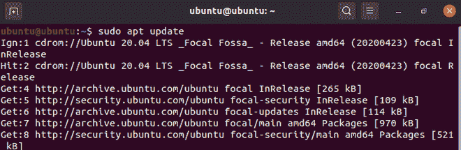
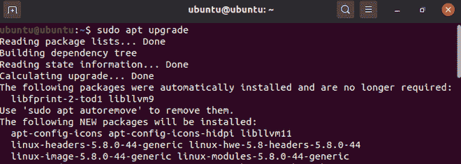
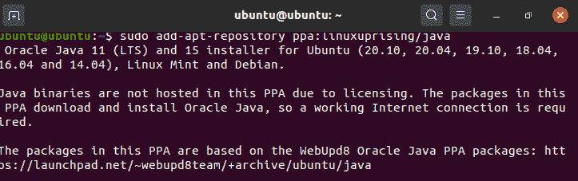
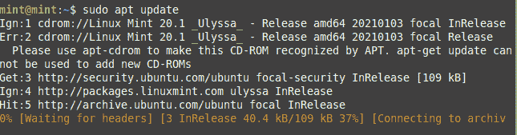
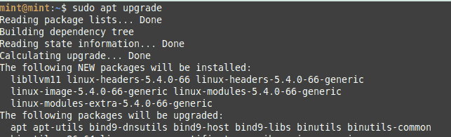
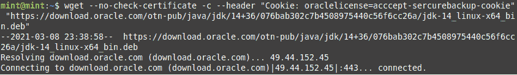

# 在 Ubuntu 和 Linux Mint 中安装 Java 14

> 原文:[https://www . geesforgeks . org/installing-Java-14 in-Ubuntu-and-Linux-mint/](https://www.geeksforgeeks.org/installing-java-14-in-ubuntu-and-linux-mint/)

JDK 是一个使用 Java 编程语言构建应用程序的开发环境。JDK 包括用于开发和测试程序的工具。这里我们将在 Linux 中安装 Java14。

### 在 Ubuntu 中安装:

在这里，我们将前往 PPA 存储库，在 ubuntu/LinuxMint 操作系统上安装 javajdk-14。PPA 是由软件开发商自己管理的最新版本的软件。让我们开始安装 javajdk-14。

更新 apt 管理器。

```java
# sudo apt update
```



apt 更新

**升级**

```java
# sudo apt upgrade
```



升级 ubuntu

为 java 二进制包添加 PPA 存储库。PPA 代表个人软件包档案库，这个档案库中有一些软件是不被 ubuntu 或其他 Linux 操作系统软件包管理器更新的。这些包直接从开发人员到用户。

```java
# sudo add-apt-repository ppa:linuxuprising/java
```



添加 PPA 存储库

安装并将 java14 设置为默认值:

```java
# sudo apt update
# sudo apt install oracle-java14-jdk oracle-java14-set-default
```

### 安装在铸币厂:

要安装 Debian 版本的 javajdk-14，您可以直接从 oracle 网站下载 Debian 软件包，并使用 apt 软件管理工具进行安装。首先更新和升级你的 apt 工具，然后下载软件包并使用 apt 安装它，之后你需要设置环境路径在系统的任何地方使用 java。

```java
# sudo apt update
```



薄荷 apt 更新

```java
 sudo apt upgrade
```



薄荷 apt 升级版

使用 wget 下载 Debian 包如果 wget 没有使用“apt install wget”安装，那么

```java
# wget --no-check-certificate -c --header  "Cookie: oraclelicense=accept-securebackup-cookie" "https://download.oracle.com/otn-pub/java/jdk/14+36/076bab302c7b4508975440c56f6cc26a/jdk-14_linux-x64_bin.deb"
```



wget deb 程序包

一个名为 jdk-14_linux-x64_bin.deb 的文件将被下载，现在您需要安装下载的。黛比套餐。

```java
# sudo apt install ./jdk-14_linux-x64_bin.deb
```

设置 java 环境路径以在系统的任何地方使用 java。

```java
# cat <<EOF | sudo tee /etc/profile.d/jdk14.sh
export JAVA_HOME=/usr/lib/jvm/jdk-14
export PATH=\$PATH:\$JAVA_HOME/bin
EOF
```

现在检查它是否成功安装在您的系统上

```java
# java --version
```