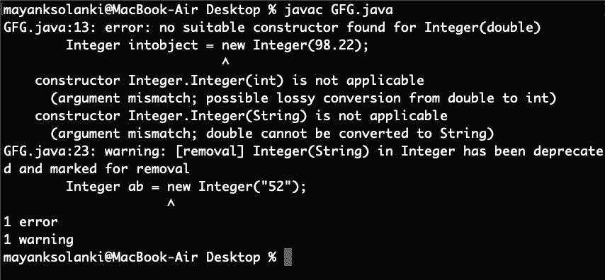

# Java 中的整型 intValue()方法

> 原文:[https://www . geesforgeks . org/integer-int value-method-in-Java/](https://www.geeksforgeeks.org/integer-intvalue-method-in-java/)

存在于 [java.lang 包](https://www.geeksforgeeks.org/java-lang-package-java/)中的[整数类](https://www.geeksforgeeks.org/java-lang-integer-class-java/)的 [*intValue()*](https://www.geeksforgeeks.org/integer-intvalue-method-in-java/) 是 java 中的一个内置方法，它将该整数的值作为 int 返回。

**语法:**

```
public int intValue()
```

**返回类型:**方法返回转换为整数类型后由对象表示的数值。

**抛出异常:** NA

现在，我们将提议实施涵盖各种场景的，如下所示:

*   对于正整数
*   对于负数
*   对于十进制值和字符串

**情况 1:** 为正整数

**示例:**

## Java 语言(一种计算机语言，尤用于创建网站)

```
// Java Program to Illustrate
// the Usage of intValue() method
// of Integer class

// Importing required class/es
import java.lang.*;

// Main class
public class GFG {

    // Main driver method
    public static void main(String[] args)
    {

        // Creating object of Integer class inside main()
        Integer intobject = new Integer(68);

        // Returns the value of this Integer as an int
        int i = intobject.intValue();

        // Printing the value above stored in integer
        System.out.println("The integer Value of i = " + i);
    }
}
```

**Output:** 

```
The integer Value of i = 68
```

**情况 2:** 为负数

**示例:**

## Java 语言（一种计算机语言，尤用于创建网站）

```
// Java program to illustrate the
// use of intValue() method of
// Integer class of java.lang package

// Importing required classes
import java.lang.*;

// Main class
public class GFG {

    // Main driver method
    public static void main(String[] args)
    {

        // Creating an object of Integer class
        Integer intobject = new Integer(-76);

        // Returns the value of this Integer as an int
        int i = intobject.intValue();

        // Printing the integer value above stored on
        // console
        System.out.println("The integer Value of i = " + i);
    }
}
```

**Output:** 

```
The integer Value of i = -76
```

**情况 3:** 为十进制值和字符串。

**示例:**

## Java 语言（一种计算机语言，尤用于创建网站）

```
// Java Program to illustrate
// Usage of intValue() method
// of Integer class of java.lang package

// Importing required classes
import java.lang.*;

// Main class
class GFG {

    // Main driver method
    public static void main(String[] args)
    {
        // Creating an object of Integer class
        Integer intobject = new Integer(98.22);

        // Using intValue() method
        int i = intobject.intValue();

        // Printing the value stored in above integer
        // variable
        System.out.println("The integer Value of i = " + i);

        // Creating another object of Integer class
        Integer ab = new Integer("52");

        int a = ab.intValue();

        // This time printing the value stored in "ab"
        System.out.println("The integer Value of ab = "
                           + a);
    }
}
```

**输出:**



> **注意:**给出十进制值时返回错误信息。对于一根弦来说，这很好。