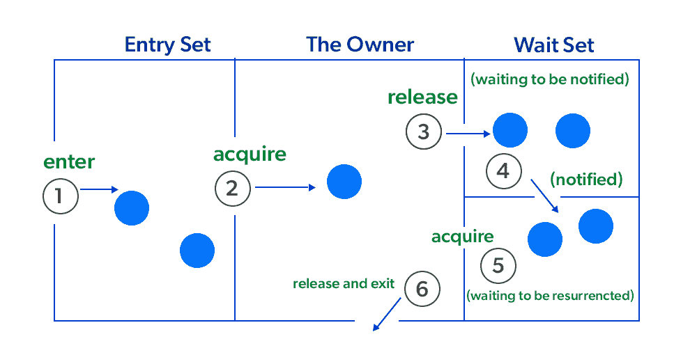

# Java 中的线程间通信

> 原文:[https://www . geesforgeks . org/线程间通信-java/](https://www.geeksforgeeks.org/inter-thread-communication-java/)

**先决条件:**[Java 多线程](https://www.geeksforgeeks.org/multithreading-in-java/)[Java 同步](https://www.geeksforgeeks.org/synchronized-in-java/)

Java 中的线程间通信是一种机制，其中一个线程在其关键部分暂停运行，另一个线程被允许进入(或锁定)要执行的同一关键部分。

> **注:**线程间通信在 Java 中也称为**合作。**

**什么是民调，它有什么** **问题？**

反复测试一个条件直到它变为真的过程称为轮询。轮询通常在循环的帮助下实现，以检查特定条件是否为真。如果是真的，就采取一定的行动。这浪费了许多 CPU 周期，并使实现效率低下。

例如，在一个经典的排队问题中，一个线程产生数据，另一个线程消耗数据。

【Java 多线程是如何处理这个问题的？

为了避免轮询，Java 使用了三种方法，即 **wait()，notifyAll()，和 notifyAll()。**所有这些方法作为 final 都属于 object class，这样所有的类都有它们。它们只能在同步块中使用。

*   **wait():** 它告诉调用线程放弃锁并进入睡眠状态，直到某个其他线程进入同一监视器并调用 notify()。
*   **notify():** 它在同一个对象上唤醒一个名为 wait()的单线程。应该注意的是，调用 notify()并不会放弃对资源的锁定。
*   **notifyAll():** 它唤醒同一对象上所有调用 wait()的线程。



**示例:**

一个简单的 Java 程序来演示这三种方法。请注意，这个程序可能只在离线 IDEs 中运行，因为它包含在几个点进行输入。

## Java 语言(一种计算机语言，尤用于创建网站)

```java
// Java program to demonstrate inter-thread communication
// (wait(), join() and notify())

import java.util.Scanner;

public class threadexample
{
    public static void main(String[] args) throws InterruptedException
    {
        final PC pc = new PC();

        // Create a thread object that calls pc.produce()
        Thread t1 = new Thread(new Runnable()
        {
            @Override
            public void run()
            {
                try
                {
                    pc.produce();
                }
                catch(InterruptedException e)
                {
                    e.printStackTrace();
                }
            }
        });

        // Create another thread object that calls
        // pc.consume()
        Thread t2 = new Thread(new Runnable()
        {
            @Override
            public void run()
            {
                try
                {
                    pc.consume();
                }
                catch(InterruptedException e)
                {
                    e.printStackTrace();
                }
            }
        });

        // Start both threads
        t1.start();
        t2.start();

        // t1 finishes before t2
        t1.join();
        t2.join();
    }

    // PC (Produce Consumer) class with produce() and
    // consume() methods.
    public static class PC
    {
        // Prints a string and waits for consume()
        public void produce()throws InterruptedException
        {
            // synchronized block ensures only one thread
            // running at a time.
            synchronized(this)
            {
                System.out.println("producer thread running");

                // releases the lock on shared resource
                wait();

                // and waits till some other method invokes notify().
                System.out.println("Resumed");
            }
        }

        // Sleeps for some time and waits for a key press. After key
        // is pressed, it notifies produce().
        public void consume()throws InterruptedException
        {
            // this makes the produce thread to run first.
            Thread.sleep(1000);
            Scanner s = new Scanner(System.in);

            // synchronized block ensures only one thread
            // running at a time.
            synchronized(this)
            {
                System.out.println("Waiting for return key.");
                s.nextLine();
                System.out.println("Return key pressed");

                // notifies the produce thread that it
                // can wake up.
                notify();

                // Sleep
                Thread.sleep(2000);
            }
        }
    }
}
```

**Output**

```java
producer thread running
Waiting for return key.
Return key pressed
Resumed
```