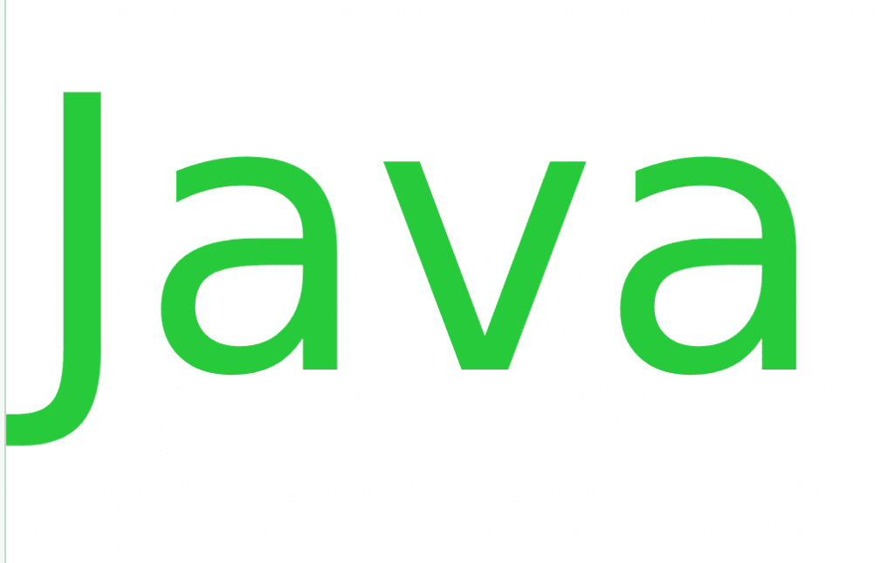

# 关于 Java 的有趣事实

> 原文:[https://www.geeksforgeeks.org/interesting-facts-about-java/](https://www.geeksforgeeks.org/interesting-facts-about-java/)

**[Java](https://www.geeksforgeeks.org/java/) :** 一种通用的高级编程语言。它是由太阳微系统公司开发的。它是由一个被称为绿色团队的小型工程师团队开发的。他们在 1991 年发明了这种语言。
 
**以下是一些关于 Java 的有趣事实:**

1.  爪哇的最初名称是“橡树”。孙的市场部发现名字已经注册了某电脑公司，就把名字改成了“Java”。
2.  Java 是一个偶然的机会制造出来的。大约在 1992 年，詹姆斯·高斯林在太阳实验室工作。他和他的团队当时正在建造一个机顶盒，这个机顶盒是从“清理”C++开始的，他们最终都使用了一种叫做 Java 或 Oak 的新语言。

3.  Java 是第二受欢迎的语言，在开发者中非常受欢迎。

4.  Java 没有指针的概念，因为向 Java 语言添加指针会损害安全性和健壮性，使这种语言更加复杂。

5.  在 Java 中，Final 关键字的含义不是最终的。它在 java 中有不同的含义。它可以是最终类、最终方法、最终字段或最终变量。

6.  95%的企业将 Java 作为他们的主要语言。它比 C 语言和其他语言要复杂得多。

7.  一年内，Java 被下载了十亿次。
8.  一个 Java 开发人员的工资中位数是 83，975.00 美元。做一名 Java 开发人员是值得的。
9.  今天，由于谷歌的安卓操作系统使用 Java 应用编程接口，Java 理性地运行在 10 亿以上。
10.  孙的主要技术基地是。由孙运营的合作网站的名称是。孙经营的一个新闻网站是。如果你想了解 Java 程序的相关新闻，只需登录 www.javaworld.com 即可。