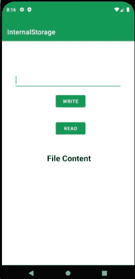
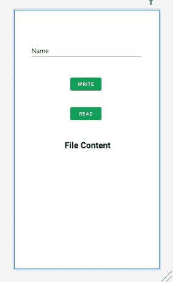
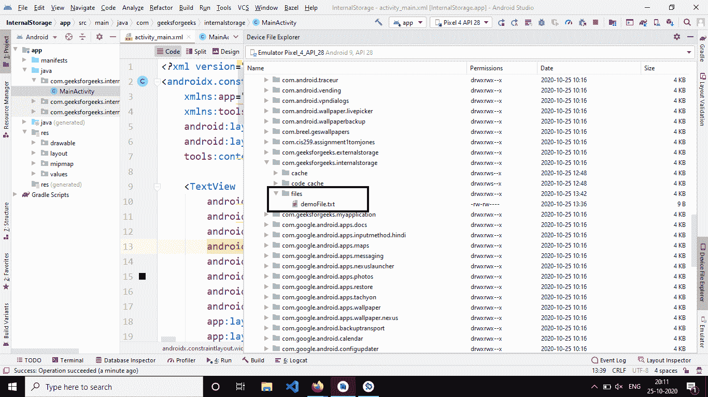

# 安卓内部存储，示例

> 原文:[https://www . geeksforgeeks . org/带示例的安卓内部存储/](https://www.geeksforgeeks.org/internal-storage-in-android-with-example/)

本文的目的是向用户展示如何使用内部存储。在本文中，我们将创建一个应用程序，该应用程序可以将数据写入文件并将其存储在内部存储器中，还可以从文件中读取数据，并使用 [TextView](https://www.geeksforgeeks.org/textview-widget-in-android-using-java-with-examples/) 将其显示在主活动上。在内部存储上保存和加载数据对于其他应用程序无法访问的应用程序来说是私有的。卸载应用程序后，该应用程序存储在内部的数据将被删除。要在 android 内部存储器中读写，我们有两种方法

*   **OpenFileOutput():** 用于创建和保存文件。此方法返回一个文件输出流实例。

> **语法:** OpenFileOutput(字符串文件名，int 模式)
> 
> **参数:**
> 
> **模式:**
> 
> 语境。模式 _ 私有:如果文件存在，那么它就在上面，否则会创建一个新文件。
> 
> 语境。如果文件存在，那么数据将被附加到文件的末尾。
> 
> **返回:**
> 
> 文件输出流对象

*   **OpenFileInput():** 用于从文件中读取数据，这将返回一个 FileInputStream 实例。

> **语法:**打开文件输入(字符串文件名)
> 
> **返回:**
> 
> fileinputstream object 档案 InputStream 物件

### 例子

下面给出了一个 GIF 示例，来了解一下在本文中要做什么。请注意，我们将使用 **Java** 语言来实现这个项目。



### 逐步实施

**第一步:创建新项目**

要在安卓工作室创建新项目，请参考[如何在安卓工作室创建/启动新项目](https://www.geeksforgeeks.org/android-how-to-create-start-a-new-project-in-android-studio/)。注意选择 **Java** 作为编程语言。

**步骤 2:使用 activity_main.xml 文件**

**activity_main.xml** 文件包含以下小部件

1.  一个[编辑文本](https://www.geeksforgeeks.org/edittext-widget-in-android-using-java-with-examples/)接受用户输入
2.  两个按钮，一个用于读取数据，另一个用于写入
3.  一个文本视图显示文件内容

下面是 **activity_main.xml** 文件的代码。

## 可扩展标记语言

```
<?xml version="1.0" encoding="utf-8"?>
<androidx.constraintlayout.widget.ConstraintLayout 
    xmlns:android="http://schemas.android.com/apk/res/android"
    xmlns:app="http://schemas.android.com/apk/res-auto"
    xmlns:tools="http://schemas.android.com/tools"
    android:layout_width="match_parent"
    android:layout_height="match_parent"
    tools:context=".MainActivity">

    <TextView
        android:id="@+id/textView2"
        android:layout_width="337dp"
        android:layout_height="28dp"
        android:text="  File Content "
        android:textAlignment="center"
        android:textColor="#000"
        android:textSize="24sp"
        android:textStyle="bold"
        app:layout_constraintBottom_toBottomOf="parent"
        app:layout_constraintLeft_toLeftOf="parent"
        app:layout_constraintRight_toRightOf="parent"
        app:layout_constraintTop_toTopOf="parent"
        app:layout_constraintVertical_bias="0.52" />

    <Button
        android:id="@+id/write_button"
        android:layout_width="wrap_content"
        android:layout_height="48dp"
        android:layout_marginStart="160dp"
        android:layout_marginEnd="159dp"
        android:layout_marginBottom="16dp"
        android:text="Write"
        app:layout_constraintBottom_toTopOf="@+id/read_button"
        app:layout_constraintEnd_toEndOf="parent"
        app:layout_constraintHorizontal_bias="0.0"
        app:layout_constraintStart_toStartOf="parent"
        app:layout_constraintTop_toTopOf="parent"
        app:layout_constraintVertical_bias="0.904" />

    <Button
        android:id="@+id/read_button"
        android:layout_width="wrap_content"
        android:layout_height="wrap_content"
        android:layout_marginStart="160dp"
        android:layout_marginEnd="158dp"
        android:layout_marginBottom="48dp"
        android:text="Read"
        app:layout_constraintBottom_toTopOf="@+id/textView2"
        app:layout_constraintEnd_toEndOf="parent"
        app:layout_constraintHorizontal_bias="0.0"
        app:layout_constraintStart_toStartOf="parent" />

    <EditText
        android:id="@+id/userInput"
        android:layout_width="319dp"
        android:layout_height="50dp"
        android:layout_marginStart="46dp"
        android:layout_marginTop="91dp"
        android:layout_marginEnd="46dp"
        android:ems="10"
        android:inputType="textPersonName"
        android:text="Name"
        app:layout_constraintEnd_toEndOf="parent"
        app:layout_constraintStart_toStartOf="parent"
        app:layout_constraintTop_toTopOf="parent" />

    <TextView
        android:id="@+id/content"
        android:layout_width="332dp"
        android:layout_height="306dp"
        android:layout_marginStart="33dp"
        android:layout_marginTop="21dp"
        android:layout_marginEnd="33dp"
        android:layout_marginBottom="6dp"
        android:text=""
        android:textAlignment="center"
        android:textColor="#000"
        app:layout_constraintBottom_toBottomOf="parent"
        app:layout_constraintEnd_toEndOf="parent"
        app:layout_constraintHorizontal_bias="0.461"
        app:layout_constraintStart_toStartOf="parent"
        app:layout_constraintTop_toBottomOf="@+id/textView2"
        app:layout_constraintVertical_bias="0.0" />

</androidx.constraintlayout.widget.ConstraintLayout>
```

**输出 UI:**



**步骤 3:使用 MainActivity.java 文件**

在**MainActivity.java**文件中，我们要做以下事情:

**初始化变量:**

## Java 语言(一种计算机语言，尤用于创建网站)

```
private String filename = "demoFile.txt";
read = findViewById(R.id.read_button);
write = findViewById(R.id.write_button);
userInput = findViewById(R.id.userInput);
fileContent = findViewById(R.id.content);
```

将要创建的文件是 DemoFile.txt，可以在**设备文件浏览器>数据>数据>应用包>文件**中找到



**读写方法:**

以下方法用于从内部数据中读取数据。

## Java 语言(一种计算机语言，尤用于创建网站)

```
private void readData()
{

    try 
    {
      FileInputStream fin = openFileInput(filename);
      int a;
      StringBuilder temp = new StringBuilder();
      while ((a = fin.read()) != -1) 
      {
        temp.append((char)a);
      }

      // setting text from the file.
      fileContent.setText(temp.toString());
      fin.close();
     }
    catch (IOException e) 
    {
      e.printStackTrace();
    }
  printMessage("reading to file " + filename + " completed..");
}
```

用于创建文件并将数据写入内部存储器的方法。

## Java 语言(一种计算机语言，尤用于创建网站)

```
private void writeData()
{
    try
    {
      FileOutputStream fos = openFileOutput(filename, Context.MODE_PRIVATE);
      String data = userInput.getText().toString();
      fos.write(data.getBytes());
      fos.flush();
      fos.close();
    }
    catch (IOException e) 
    {
      e.printStackTrace();
    }
    userInput.setText("");
    printMessage("writing to file " + filename + "completed...");
}
```

以下是**MainActivity.java**文件的完整代码。代码中添加了注释，以更详细地理解代码。

## Java 语言(一种计算机语言，尤用于创建网站)

```
import android.content.Context;
import android.os.Bundle;
import android.view.View;
import android.widget.Button;
import android.widget.EditText;
import android.widget.TextView;
import android.widget.Toast;
import androidx.appcompat.app.AppCompatActivity;
import java.io.FileInputStream;
import java.io.FileOutputStream;
import java.io.IOException;

public class MainActivity extends AppCompatActivity implements View.OnClickListener {

    // declare the variables
    Button read, write;
    EditText userInput;
    TextView fileContent;

    private String filename = "demoFile.txt";

    @Override
    protected void onCreate(Bundle savedInstanceState) {
        super.onCreate(savedInstanceState);
        setContentView(R.layout.activity_main);

        read = findViewById(R.id.read_button);
        write = findViewById(R.id.write_button);
        userInput = findViewById(R.id.userInput);
        fileContent = findViewById(R.id.content);

        read.setOnClickListener(this);
        write.setOnClickListener(this);
    }

    public void printMessage(String m) {
        Toast.makeText(this, m, Toast.LENGTH_LONG).show();
    }

    @Override
    public void onClick(View view) {
        Button b = (Button) view;

        // get the button text : in out case either read or
        // write depending on the button pressed.
        String b_text = b.getText().toString();

        switch (b_text.toLowerCase()) {
            case "write": {
                writeData();
                break;
            }
            case "read": {
                readData();
                break;
            }
        }
    }

    private void writeData() {

        try {
            FileOutputStream fos = openFileOutput(filename, Context.MODE_PRIVATE);
            String data = userInput.getText().toString();
            fos.write(data.getBytes());
            fos.flush();
            fos.close();
        } catch (IOException e) {
            e.printStackTrace();
        }
        userInput.setText("");
        printMessage("writing to file " + filename + "completed...");
    }

    private void readData() {
        try {
            FileInputStream fin = openFileInput(filename);
            int a;
            StringBuilder temp = new StringBuilder();
            while ((a = fin.read()) != -1) {
                temp.append((char) a);
            }

            // setting text from the file.
            fileContent.setText(temp.toString());
            fin.close();
        } catch (IOException e) {
            e.printStackTrace();
        }
        printMessage("reading to file " + filename + " completed..");
    }
}
```

### **输出**

<video class="wp-video-shortcode" id="video-504688-1" width="640" height="360" preload="metadata" controls=""><source type="video/mp4" src="https://media.geeksforgeeks.org/wp-content/uploads/20201025202131/internalstorage.mp4?_=1">[https://media.geeksforgeeks.org/wp-content/uploads/20201025202131/internalstorage.mp4](https://media.geeksforgeeks.org/wp-content/uploads/20201025202131/internalstorage.mp4)</video>