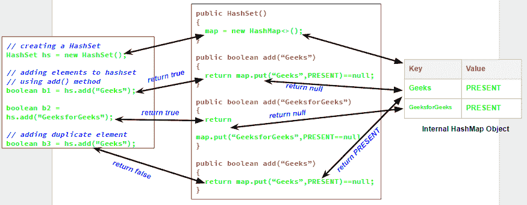

# Java 中 Set/HashSet 的内部工作

> 原文:[https://www . geesforgeks . org/internal-work-of-sethashset-in-Java/](https://www.geeksforgeeks.org/internal-working-of-sethashset-in-java/)

正如我们所知，集合是明确定义的不同对象的集合。集合的每个成员都称为集合的一个元素。所以换句话说，我们可以说一个**集合永远不会包含重复的元素**。但是在 java 中 [Set](https://www.geeksforgeeks.org/set-in-java/) 接口是如何实现像 [HashSet](https://www.geeksforgeeks.org/hashset-in-java/) 、 [LinkedHashSet](https://www.geeksforgeeks.org/linkedhashset-class-in-java-with-examples/) 、 [TreeSet](https://www.geeksforgeeks.org/treeset-class-java-examples/) 等类的。实现这种独特性。在这篇文章中，我们将讨论这种独特性背后隐藏的真相。

【HashSet 在 Java 内部是如何工作的？


我们将用一个例子来理解这一点。让我们看看下面这个程序的输出，它试图在 HashSet 中添加重复的元素。

```
// Java program to demonstrate
// internal working of HashSet

import java.util.HashSet;

class Test
{    
    public static void main(String args[]) 
    {
        // creating a HashSet
        HashSet hs = new HashSet();

        // adding elements to hashset
        // using add() method
        boolean b1 = hs.add("Geeks");
        boolean b2 = hs.add("GeeksforGeeks");

        // adding duplicate element
        boolean b3 = hs.add("Geeks");

        // printing b1, b2, b3
        System.out.println("b1 = "+b1);
        System.out.println("b2 = "+b2);
        System.out.println("b3 = "+b3);

        // printing all elements of hashset
        System.out.println(hs);

    }
}
```

输出:

```
b1 = true
b2 = true
b3 = false
[GeeksforGeeks, Geeks]

```

现在从输出中可以清楚地看到，当我们尝试使用 *add()* 方法向集合中添加一个重复的元素时，它返回 *false* ，并且元素没有添加到 hashset 中，因为它已经存在。现在问题来了， *add()* 方法如何检查集合是否已经包含指定元素。如果我们仔细看看 HashSet 类中的 *add()* 方法和默认构造函数，会更清楚。

```
// predefined HashSet class
public class HashSet
{
    // A HashMap object 
    private transient HashMap map;

    // A Dummy value(PRESENT) to associate with an Object in the Map
    private static final Object PRESENT = new Object();

    // default constructor of HashSet class
    // It creates a HashMap by calling 
    // default constructor of HashMap class
    public HashSet() {
        map = new HashMap<>();
    }

    // add method 
    // it calls put() method on map object
    // and then compares it's return value with null
    public boolean add(E e) {
        return map.put(e, PRESENT)==null;
    }

    // Other methods in Hash Set
} 
```

现在，您可以看到，每当我们创建一个 HashSet 时，它都会在内部创建一个 [HashMap](https://www.geeksforgeeks.org/java-util-hashmap-in-java/) ，如果我们使用 *add()* 方法将一个元素插入到这个 HashSet 中，它实际上会在内部创建的 HashMap 对象上调用 *put()* 方法，您指定的元素作为它的键，常量 object 作为它的值称为**“PRESENT”**。所以我们可以说**一套通过 HashMap** 在内部实现唯一性。现在整个故事围绕着[一个 HashMap 和 *put()* 方法是如何在](https://www.geeksforgeeks.org/internal-working-of-hashmap-java/)内部工作的。

正如我们在 [HashMap](https://www.geeksforgeeks.org/java-util-hashmap-in-java/) 中所知道的，每个键都是唯一的，当我们调用 *put(Key，Value)* 方法时，它会返回与该键相关联的前一个值，如果没有键的映射，则返回 *null* 。所以在 *add()* 方法中，我们用 *null* 值检查 map.put(key，value)方法的返回值。

1.  如果 map.put(key，value)返回 *null* ，那么语句“map.put(e，PRESENT) == null”将返回 *true* ，元素被添加到 HashSet(内部 HashMap)。
2.  如果 map.put(key，value)返回旧的键值，那么语句“map.put(e，PRESENT) == null”将返回 *false* ，元素不会添加到 HashSet(内部 HashMap)中。

由于 LinkedHashSet 扩展了 HashSet，所以它在内部使用 [super()](https://www.geeksforgeeks.org/super-keyword/) 调用 HashSet 的构造函数。类似地，创建[树集](https://www.geeksforgeeks.org/treeset-class-java-examples/)类的对象会在内部创建[导航地图](https://www.geeksforgeeks.org/navigablemap-interface-in-java-with-example/)的对象作为背景地图。

**相关文章:**[HashMap 在 Java 内部是如何工作的。](https://www.geeksforgeeks.org/internal-working-of-hashmap-java/)

本文由**高拉夫·米格拉尼**供稿。如果你喜欢 GeeksforGeeks 并想投稿，你也可以使用[contribute.geeksforgeeks.org](http://www.contribute.geeksforgeeks.org)写一篇文章或者把你的文章邮寄到 contribute@geeksforgeeks.org。看到你的文章出现在极客博客主页上，帮助其他极客。

如果你发现任何不正确的地方，或者你想分享更多关于上面讨论的话题的信息，请写评论。