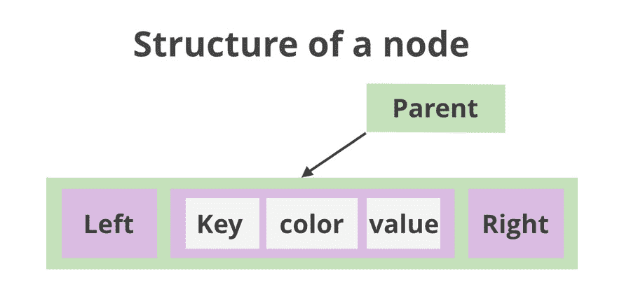
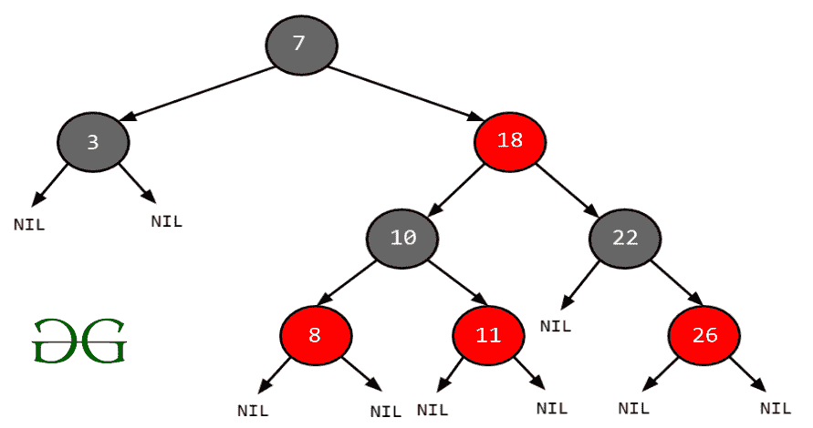
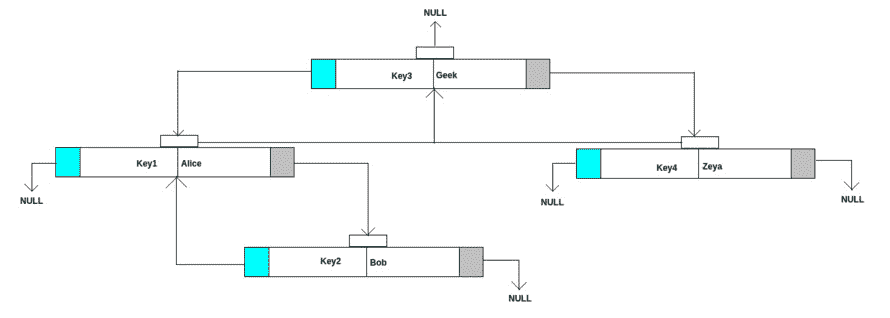

# Java 中树形图的内部工作

> 原文:[https://www . geeksforgeeks . org/内部工作的 java 树图/](https://www.geeksforgeeks.org/internal-working-of-treemap-in-java/)

[树形图](https://www.geeksforgeeks.org/treemap-in-java/)类就像 [HashMap](https://www.geeksforgeeks.org/java-util-hashmap-in-java/) 。[树形图](https://www.geeksforgeeks.org/treemap-in-java/)存储键值对。主要区别在于 TreeMap 以升序对键进行排序。根据使用的构造函数，树映射按照其键的顺序进行排序，或者由映射创建时提供的比较器进行排序。



**先决条件:**

在进一步讨论之前，让我们先看一下先决条件，主要包括在 TreeMap 情况下可用的构造函数

1.  ***树形图()*** 这个默认构造函数构造一个空的树形图
2.  ***树状图(地图地图)*** 它用地图中的条目创建一个树状图。
3.  ***树形图(比较器比较)*** 这是一个参数构造器，它使用*比较器*对象来构造一个空的基于树的图。它将通过使用比较器比较进行排序。
4.  ***树形图(SortedMap sortedMap)*** 可以用 [sortedMap](https://www.geeksforgeeks.org/sortedmap-java-examples/) 中的条目初始化为*树形图*。

插图:

```java
Input  : a = ["Alice", 1], b = ["Bob", 2]
Output : TreeMap = {"Alice" = 1, "Bob" = 2}

Input  : a = [1, "First"], b = [2, "Second"], c = [3, "Third"]
Output : TreeMap = {1 = "First", 2 = "Second", 3 = "Third"}
```

**概念:** [红黑树](https://www.geeksforgeeks.org/red-black-tree-set-1-introduction-2/)



红黑树是一种自平衡的二叉查找树树，其中每个节点都有一个额外的位，该位通常被解释为颜色(红色或黑色)。这些颜色用于确保树在插入和删除过程中保持平衡。尽管树的平衡并不完美，但它足以减少搜索时间并将其保持在 O(log n)时间左右，其中 n 是树中元素的总数。必须注意的是，由于每个节点只需要 1 位空间来存储颜色信息，这些类型的树显示出与经典(未着色)二叉查找树相同的内存占用。

1.  因为算法的名字暗示了树中每个节点的颜色不是黑色就是红色。
2.  根节点的颜色必须是黑色。
3.  红色节点不能有红色邻居节点。
4.  从根节点到 null 的所有路径应该由相同数量的黑节点组成。

上述特征导致节点具有某些特性，其结果如下:

1.  左边的元素总是小于父元素。
2.  自然排序是在对象的逻辑比较中计算的。
3.  右边的元素总是大于或等于父元素。

**语法:**声明一个树形图的对象或者简单地创建一个树形图

```java
Map<Key, Integer> treemap = new TreeMap<>();
```

**进场:**

1.  创建一个树形图。
2.  创建一些条目进入树形图。
3.  计算密钥{“密钥 1”}的哈希代码。它将生成为 118。
4.  打印用于循环遍历的树形图。

**实现:**实现红黑树展示 TreeMap 的内部工作

**例**

## Java 语言(一种计算机语言，尤用于创建网站)

```java
// Java Program to show Internal Working
// of TreeMap in Java

// Importing Map and TreeMap classes
// from java.util package
import java.util.Map;
import java.util.TreeMap;

// Standard Comparable
public class Key implements Comparable<Key> {

    // Custom input
    final int data = 118;
    private String key;

    // Constructor of this class
    public Key(String key)
    {
        // Super keyword refers immediate parent class
        // object
        super();

        // This keyword is a reference variable
        // referring to current object
        this.key = key;
    }

    // Print Key method
    public String printKey() { return this.key; }

    // Override compareTo method
    @Override public int compareTo(Key obj)
    {
        return key.compareTo(obj.key);
    }
}

// Main Class
class GFG {

    // Main driver method
    public static void main(String[] args)
    {
        // Initialize TreeMap
        // Declaring object of String type
        Map<Key, String> treemap = new TreeMap<>();

        // Adding the elements in object of TreeMap
        // Custom inputs
        treemap.put(new Key("Key1"), "Alice");
        treemap.put(new Key("Key4"), "Zeya");
        treemap.put(new Key("Key3"), "Geek");
        treemap.put(new Key("Key2"), "Bob");

        // Iterate over object elements using for-each loop
        for (Map.Entry<Key, String> entry :
             treemap.entrySet())

            // Print elements in TreeMap object
            System.out.println(
                "[" + entry.getKey().printKey() + " = "
                + entry.getValue() + "]");
    }
}
```

## Java 语言(一种计算机语言，尤用于创建网站)

```java
// Java Program to show Internal Working
// of TreeMap in Java

// Importing Map and TreeMap classes
// from java.util package
import java.util.Map;
import java.util.TreeMap;

// Standard Comparable
public class Key implements Comparable<Key> {

    // Custom input
    final int data = 118;
    private String key;

    // Constructor of this class
    public Key(String key)
    {
        // Super keyword refers immediate parent class
        // object
        super();

        // This keyword is a reference variable
        // referring to current object
        this.key = key;
    }

    // Print Key method
    public String printKey() { return this.key; }

    // Override compareTo method
    @Override public int compareTo(Key obj)
    {
        return key.compareTo(obj.key);
    }
}

// Main Class
class GFG {

    // Main driver method
    public static void main(String[] args)
    {
        // Initialize TreeMap
        // Declaring object of String type
        Map<Key, String> treemap = new TreeMap<>();

        // Adding the elements in object of TreeMap
        // Custom inputs
        treemap.put(new Key("Key1"), "Alice");
        treemap.put(new Key("Key4"), "Zeya");
        treemap.put(new Key("Key3"), "Geek");
        treemap.put(new Key("Key2"), "Bob");

        // Iterate over object elements using for-each loop
        for (Map.Entry<Key, String> entry :
             treemap.entrySet())

            // Print elements in TreeMap object
            System.out.println(
                "[" + entry.getKey().printKey() + " = "
                + entry.getValue() + "]");
    }
}
```

为了更好地理解上面的输出是如何生成的，输出解释以图片的形式表示，以便获得 TreeMap 节点的内部工作。



> 注意:
> 
> *   与哈希映射和链接哈希映射相比，树映射的性能较慢。
> *   树实现为 [containsKey()](https://www.geeksforgeeks.org/hashmap-containskey-method-in-java/) 、get()、put()和 remove()操作提供了保证的日志时间成本。