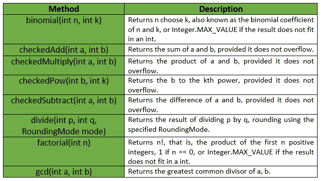
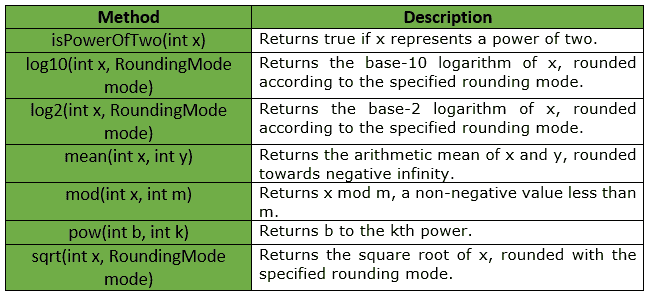

# IntMath 类|番石榴| Java

> 原文:[https://www.geeksforgeeks.org/intmath-class-guava-java/](https://www.geeksforgeeks.org/intmath-class-guava-java/)

**简介:** ***IntMath*** 用于对整数值进行数学运算。基本的独立数学函数根据所涉及的主要数值类型分为 IntMath、LongMath、DoubleMath 和 BigIntegerMath 类。这些类具有并行结构，但每个都只支持相关的函数子集。

**申报:**申报为*T3】类的是:*

```
@GwtCompatible(emulated = true)
public final class IntMath
   extends Object

```

下表显示了番石榴 IntMath Class 提供的一些方法:

**例外:**

*   **log2:***IllegalArgumentException*if x<= 0
*   **log10:***IllegalArgumentException*if x<= 0
*   **pow:**T2】IllegalArgumentExceptionif k<0
*   **sqrt :** *非法参数异常* if x < 0
*   **除:** *算术异常*如果 q == 0，或者如果 mode ==不必要且 a 不是 b 的整数倍
*   **修改:** *算术异常*如果 m < = 0
*   **gcd:***IllegalArgumentException*如果 a < 0 或 b < 0
*   **如果 a + b 在有符号整数运算中溢出，则检查 dd :** *算法异常*
*   **检查子管道:** *算法异常*如果 a–b 在有符号整数算法中溢出
*   **检查倍数:** *算术异常*如果 a * b 在有符号整数算术中溢出
*   **检查流量:** *算法异常*如果 b 到 k 次方在有符号整数算法中溢出
*   **阶乘:**T2【IllegalargumentExceptionif n<0
*   **二项式:***IllegalArgumentException*if n<0，k n

番石榴 IntMath Class 提供的其他一些方法有:


**例 1 :**

```
// Java code to show implementation of
// IntMath Class of Guava
import java.math.RoundingMode;
import com.google.common.math.IntMath;

class GFG {

    // Driver code
    public static void main(String args[])
    {

        // Creating an object of GFG class
        GFG obj = new GFG();

        // Function calling
        obj.examples();
    }

    private void examples()
    {

        try {

            // exception will be thrown as 80 is not
            // completely divisible by 3
            // thus rounding is required, and
            // RoundingMode is set as UNNESSARY
            System.out.println(IntMath.divide(80, 3,
                           RoundingMode.UNNECESSARY));
        }
        catch (ArithmeticException ex) {
            System.out.println("Error Message is : " + 
                                     ex.getMessage());
        }
    }
}
```

输出:

```
Error Message is : mode was UNNECESSARY, but rounding was necessary

```

**例 2 :**

```
// Java code to show implementation of
// IntMath Class of Guava
import java.math.RoundingMode;
import com.google.common.math.IntMath;

class GFG {

    // Driver code
    public static void main(String args[])
    {
        // Creating an object of GFG class
        GFG obj = new GFG();

        // Function calling
        obj.examples();
    }

    private void examples()
    {

        // As 120 is divisible by 4, so
        // no exception is thrown
        System.out.println(IntMath.divide(120, 4,
                        RoundingMode.UNNECESSARY));

        // To compute GCD of two integers
        System.out.println("GCD is : " + 
                             IntMath.gcd(70, 14));

        // To compute log to base 10
        System.out.println("Log10 is : " +
          IntMath.log10(1000, RoundingMode.HALF_EVEN));

        // To compute remainder
        System.out.println("modulus is : " +
                          IntMath.mod(125, 5));

        // To compute factorial
        System.out.println("factorial is : " +
                           IntMath.factorial(7));

        // To compute log to base 2
        System.out.println("Log2 is : " + 
               IntMath.log2(8, RoundingMode.HALF_EVEN));

        // To compute square root
        System.out.println("sqrt is : " +
                    IntMath.sqrt(IntMath.pow(12, 2),
                          RoundingMode.HALF_EVEN));
    }
}
```

输出:

```
30
GCD is : 14
Log10 is : 3
modulus is : 0
factorial is : 5040
Log2 is : 3
sqrt is : 12

```

**参考:**T2】谷歌番石榴