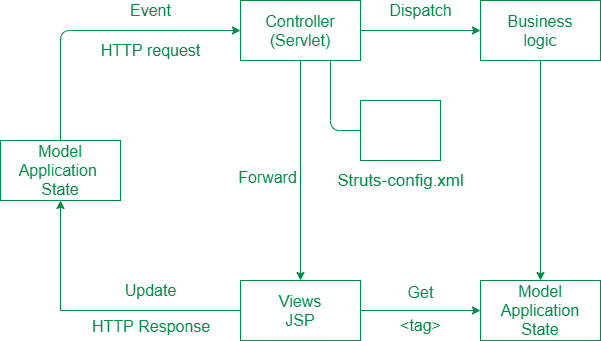

# Struts Web 框架的介绍和工作

> 原文:[https://www . geeksforgeeks . org/introduction-and-work-of-struts-web-framework/](https://www.geeksforgeeks.org/introduction-and-working-of-struts-web-framework/)

**Struts** 用于创建一个基于 servlet 和 JSP 的 web 应用程序。Struts 依赖于 MVC(模型视图控制器)框架。Struts 应用是一个真正的 web 应用。Struts 在构建 J2EE (Java 2 平台，企业版)应用程序时非常有用，因为 struts 利用了 J2EE 的设计模式。Struts 遵循这些 J2EE 设计模式，包括 MVC。

在 struts 中，复合视图管理其子视图的布局，并可以实现一个模板，使整个应用程序的持久外观和感觉更容易实现和定制。复合视图是通过使用其他可重用的子视图组成的，这样子视图中发生的微小变化就会在每个复合视图中自动更新。

Struts 由一组自己的定制标签库组成。Struts 基于面向模式的 MVC 框架，包含 JSP 定制标签库。Struts 还支持实用程序类。

**Struts 的特点:** Struts 具有以下特点:

*   Struts 鼓励良好的设计实践和建模，因为框架是用“久经考验”的设计模式设计的。
*   Struts 几乎很简单，所以很容易学习和使用。
*   它支持许多方便的功能，如输入验证和国际化。
*   它消除了很多复杂性，因为您可以使用 struts，而不是构建自己的 MVC 框架。
*   Struts 与 J2EE 集成得非常好。
*   Struts 拥有庞大的用户社区。
*   它具有灵活性和可扩展性，现有的 web 应用程序很容易适应 struts 框架。
*   Struts 提供了很好的标签库。
*   它允许将输入表单数据捕获到称为动作表单的 javabean 对象中。
*   它还以编程方式和声明方式移交标准错误处理。

**Struts 的工作:**

在初始化阶段，控制器对一个配置文件进行整改，并将其用于部署其他控制层对象。Struts 配置是由这些对象组合在一起形成的。struts 配置定义了应用程序的动作映射。
Struts 控制器 servlet 考虑动作映射，并将 HTTP 请求路由到框架中的其他组件。请求首先传递给一个动作，然后传递给 JSP。该映射帮助控制器将 HTTP 请求转变为应用程序动作。动作对象可以处理来自客户端(通常是网络浏览器)的请求并对其做出响应。动作对象可以访问应用程序控制器 servlet，也可以访问 servlet 的方法。在交付控件时，一个动作对象可以通过在 java servlets 共享的典型情况下建立一个或多个共享对象，包括 javabeans，来间接转发它们。