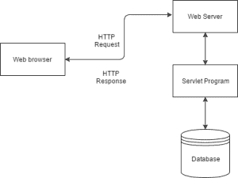
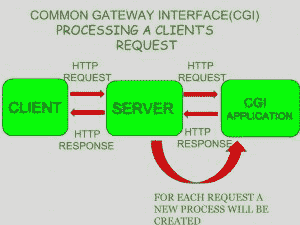

# Java servlet 介绍

> 原文:[https://www.geeksforgeeks.org/introduction-java-servlets/](https://www.geeksforgeeks.org/introduction-java-servlets/)

今天，我们都意识到创建动态网页的必要性，即能够根据时间改变网站内容或能够根据客户收到的请求生成内容的网页。如果你喜欢用 Java 编码，那么你会很高兴知道使用 Java 还有一种生成动态网页的方法，那就是 Java Servlet。但是在我们继续我们的主题之前，让我们首先了解服务器端扩展的需求。

Servlets 是运行在支持 Java 的 web 服务器或应用服务器上的 Java 程序。它们用于处理从 web 服务器获得的请求，处理请求，生成响应，然后将响应发送回 web 服务器。

Servlets 的属性如下:

*   Servlets 在服务器端工作。
*   Servlets 能够处理从 web 服务器获得的复杂请求。

Servlet 体系结构可以从图像本身描述如下:

Servlets 的执行基本上包括六个基本步骤:

1.  客户端将请求发送到 web 服务器。
2.  网络服务器接收请求。
3.  web 服务器将请求传递给相应的 servlet。
4.  servlet 处理请求，并以输出的形式生成响应。
5.  servlet 将响应发送回 web 服务器。
6.  网络服务器将响应发送回客户端，客户端浏览器将其显示在屏幕上。

现在让我们来讨论一下为什么我们需要服务器端扩展这个古怪的问题？

服务器端扩展只是用来创建动态网页的技术。实际上，为了提供动态网页的功能，网页需要一个容器或网络服务器。为了满足这一要求，独立的网络服务器提供商以**应用编程接口**的形式提供一些专有解决方案。
这些**API**允许我们构建可以在网络服务器上运行的程序。在这种情况下， **Java Servlet** 也是 **Java 平台企业版**的组件 API 之一，它为用 Java 创建动态 Web 应用程序设定了标准。

在学习某个东西之前，了解对那个东西的需求是很重要的，这并不是说这是创建动态网页的唯一可用技术。Servlet 技术类似于其他网络服务器扩展，如**通用网关接口** (CGI)脚本和**超文本预处理器** (PHP)。然而，Java Servlets 更容易被接受，因为它们解决了 **CGI** 的局限性，例如低性能和低程度的可扩展性。

**什么是 CGI？**

**CGI** 实际上是使用 **C** 或 **C++** 等任何编程语言编写的外部应用程序，负责处理客户端请求和生成动态内容。
在 CGI 应用中，当客户端请求访问动态网页时，Web 服务器执行以下操作:

*   它首先使用网址定位请求的网页*，即*所需的 CGI 应用程序。
*   然后，它会创建一个新的流程来服务客户端的请求。
*   在流程中调用 CGI 应用程序，并将请求信息传递给应用程序。
*   从 CGI 应用程序收集响应。
*   销毁进程，准备 HTTP 响应，并将其发送给客户端。

因此，在 **CGI** 中，服务器必须为每个请求创建和销毁进程。很容易理解，这种方法适用于处理很少的客户端，但是随着客户端数量的增加，服务器上的工作负载也会增加，因此处理请求所需的时间也会增加。

**Servlet 与 CGI 的区别**

<figure class="table">

| 小型应用程序 | CGI (Universal Gateway Interface) |
| --- | --- |
| Servlet are portable and efficient. | CGI is not portable |
| In Servlets, it is possible to share data. | In CGI, it is impossible to share data. |
| Servlet can communicate directly with web servers. | CGI cannot communicate directly with the web server. |
| 小型应用程序比公共网关接口便宜。 | 公共网关接口比 Servlets 贵。 |
| Servlet can handle these cookies. | CGI can't handle cookies. |

</figure>

**servlet 应用编程接口:**
servlet 由两个包构建而成:

*   javax.servlet(基本)
*   高级

这些包中存在的各种类和接口有:

<figure class="table">T38 T61T70】过滤器

| package | type | bag |
| --- | --- | --- |
| 小型应用程序 | joggle/interface | javax。Servlet。* |
| Servlet 请求 | joggle/interface | javax。Servlet。* |
| httpersvletrequest | joggle/interface | javax。servlet。http。* |
| httpersvletresponse | joggle/interface | javax。servlet。http。* |
| joggle/interface |

</figure>

**Java Servlet 的优势**

*   Servlet 比 CGI 快**，因为它不涉及为收到的每个新请求创建新的进程。**
*   **用 Java 编写的 Servlets 是独立于平台的。**
*   **消除了为每个请求创建一个**新进程**的开销，因为 Servlet 不会在单独的进程中运行。只有一个实例可以同时处理所有请求。这也节省了内存，并允许 Servlet 轻松管理客户端状态。**
*   **它是一个服务器端组件，所以 Servlet 继承了 Web 服务器提供的**安全性**。**
*   **为 Java Servlet 设计的 **API** 自动获得了 Java 平台的平台无关性、可移植性等优点。此外，它显然可以使用在**【JDBC】**等 Java 平台上创建的各种 API 来访问数据库。**

****Servlet 容器****

****Servlet 容器**，也称为 **Servlet 引擎**是一组集成的对象，为 Java Servlet 组件提供运行时环境。**

**简而言之，它是一个在网络服务器之上管理 Java Servlet 组件以处理网络客户端请求的系统。**

****Servlet 容器提供的服务:****

*   ****网络服务:**加载一个 Servlet 类。加载可以从本地文件系统、远程文件系统或其他网络服务进行。Servlet 容器提供了发送请求和响应的网络服务。**
*   ****对基于 MIME 的消息进行解码和编码:**提供对基于 MIME 的消息进行解码和编码的服务。**
*   ****管理 Servlet 容器:**管理 Servlet 的生命周期。**
*   ****资源管理**管理静态和动态资源，如 HTML 文件、Servlets 和 JSP 页面。**
*   ****安全服务:**处理资源访问的授权和认证。**
*   ****会话管理:**通过将**会话标识**附加到网址路径来维护会话。**

****合著者:**卡尔蒂克·塔克拉尔**