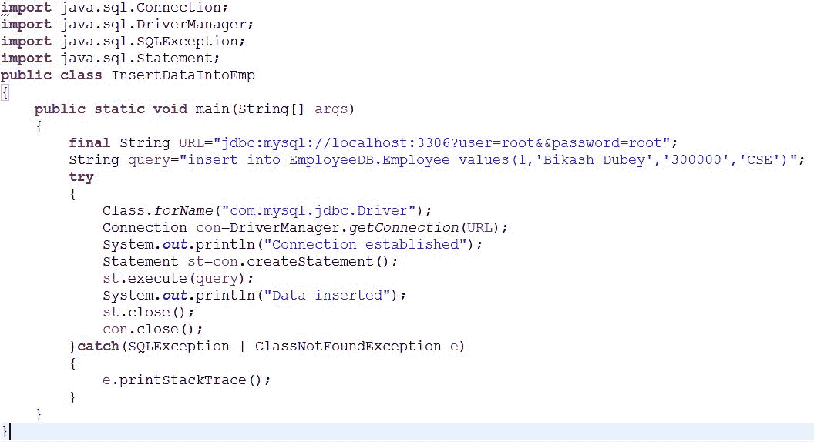
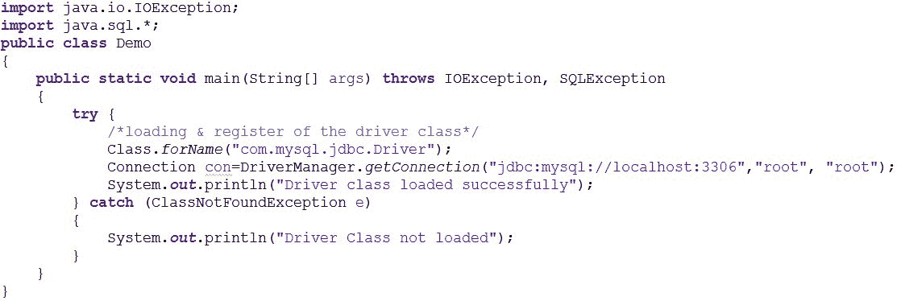
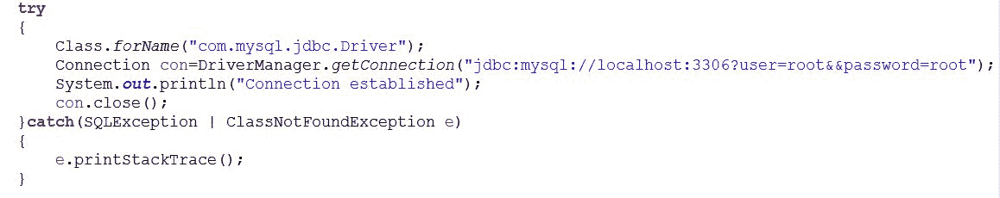

# Hibernate 框架介绍

> 原文:[https://www . geesforgeks . org/introduction-to-hibernate-framework/](https://www.geeksforgeeks.org/introduction-to-hibernate-framework/)

**先决条件:**T2】JDBC

**需要休眠框架**

冬眠是用来克服 JDBC 的局限性的，比如:

1.  JDBC code is dependent upon the Database software being used i.e. our persistence logic is dependent, because of using JDBC. Here we are inserting a record into Employee table but our query is Database software-dependent i.e. Here we are using MySQL. But if we change our Database then this query won’t work.

    

2.  如果与 JDBC 合作，在项目过程中更改数据库的成本非常高。
3.  JDBC 代码不是跨多个数据库软件的可移植代码。
4.  In JDBC, Exception handling is mandatory. Here We can see that we are handling lots of Exception for connection.

    

5.  与 JDBC 合作时，没有支持对象级关系。
6.  In JDBC, there occurs a Boilerplate problem i.e. For each and every project we have to write the below code. That increases the code length and reduce the readability.

    

为了克服上述问题，我们使用了 ORM 工具，也就是说，除了 Hibernate 框架什么都没有。通过使用 Hibernate，我们可以避免所有上述问题，并且我们可以享受一些额外的功能。

**关于 Hibernate 框架**

Hibernate 是一个框架，它提供了一些**抽象层**，这意味着程序员不用担心实现，Hibernate 在内部为您实现，比如**建立与数据库的连接，编写查询来执行 CRUD 操作等等**。
是一个 **java 框架**，用来开发持久化逻辑。持久性逻辑意味着存储和处理数据以供长期使用。更准确地说，Hibernate 是一个开源、非侵入性、轻量级的 java ORM(对象关系映射)框架，用于开发独立于数据库软件的对象，并在 JEE 的所有 java 中形成独立的持久性逻辑。

**框架**是指在 JDBC、Servlet 等一种或多种技术上提供抽象层，以简化或降低开发过程复杂性的特殊可安装软件。

**开源的意思是:**

*   Hibernate 框架对每个人都是免费的。
*   Hibernate 的源代码也可以在网上找到，我们也可以修改代码。

**轻质是指:**

*   Hibernate 体积小意味着安装包的体积不大。
*   Hibernate 不需要任何沉重的容器来执行。
*   它不需要 POJO 和 POJI 模型编程。
*   Hibernate 可以单独使用，也可以和其他 java 技术和框架一起使用。

**无创手段:**

*   Hibernate 应用开发的类是相对于 hibernate API 的松散耦合类，即 Hibernate 类不需要实现 Hibernate API 接口，也不需要从 Hibernate API 类扩展。

**Hibernate 框架支持的功能**

*   Hibernate 框架支持 **Auto DDL** 操作。在 JDBC，我们必须手动创建表，并为每一列声明数据类型。但是 Hibernate 可以在内部为你做 **DDL 操作**，比如创建表、删除表、修改表等等。
*   Hibernate 支持**自动主键生成**。这意味着在 JDBC，我们必须手动设置表的主键。但是 Hibernate 可以为你完成这个任务。
*   Hibernate 框架独立于数据库，因为它支持不特定于任何数据库的 **HQL (Hibernate 查询语言)**，而 JDBC 依赖于数据库。
*   在 Hibernate 中，**异常处理不是强制性的**，而在 JDBC 异常处理是强制性的。
*   Hibernate 支持**缓存**，而 JDBC 不支持缓存。
*   Hibernate 是一个 **ORM 工具**意味着它支持对象关系映射。虽然 JDBC 不是面向对象的，但是我们处理的是价值，也就是原始数据。在 hibernate 中，每条记录都表示为一个对象，但是在 JDBC，每条记录只不过是一个数据，它只不过是原始值。