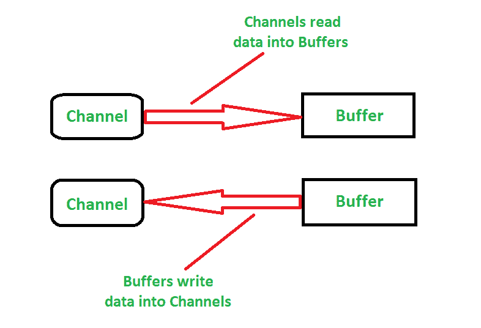
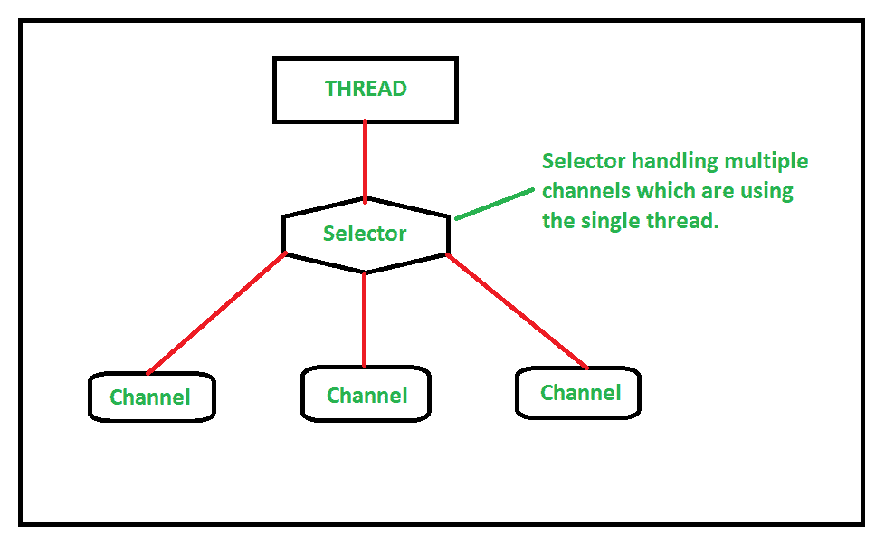

# Java NIO 介绍及示例

> 原文:[https://www . geesforgeks . org/introduction-to-Java-nio-with-examples/](https://www.geeksforgeeks.org/introduction-to-java-nio-with-examples/)

**[Java IO](https://www.geeksforgeeks.org/java-io-packag/)** (输入/输出)用于执行读写操作。 [java.io 包](https://www.geeksforgeeks.org/java-io-packag/)包含输入输出操作所需的所有类。而 Java NIO(新 IO)是从 JDK 4 引入的，用于实现高速 IO 操作。它是标准输入输出应用编程接口的替代品。

在本文中，我们将更多地了解 Java NIO。

**Java NIO(New Input/Output)** 是一个高性能的网络和文件处理 API 和结构，作为 Java 的替代 IO API。它是从 JDK 引进的。Java NIO 作为继标准 Java IO 之后的第二个 I/O 系统，增加了一些高级特性。它提供了与标准输入输出不同的输入输出工作方式。像包含 Java 输入和输出操作所需的所有类的 **Java.io** 包一样， [**java.nio 包**](https://www.geeksforgeeks.org/tag/java-nio-package/) 定义了在整个 NIO APIs 中使用的缓冲类。我们使用 **Java NIO** 主要有以下两个原因:

1.  **非阻塞 IO 操作:** Java NIO 执行非阻塞 IO 操作。这意味着它会读取准备好的数据。例如，一个线程可以请求一个通道从一个缓冲区中读取数据，并且该线程可以在这段时间内进行其他工作，并从它离开的前一点继续。同时，读取操作完成，这提高了整体效率。
2.  **面向缓冲区的方法:** Java NIO 的面向缓冲区的方法允许我们根据需要在缓冲区中来回移动。数据被读入缓冲区并缓存在那里。无论何时需要数据，都会从缓冲区中进一步处理。

Java NIO 包的主要工作是基于一些核心组件。它们是:

1.  <u>**缓冲区:**</u> 缓冲区在此包中可用于[原始数据类型](https://www.geeksforgeeks.org/data-types-in-java/)。Java NIO 是一个面向缓冲区的包。这意味着数据可以被写入缓冲器/从缓冲器读取，该缓冲器使用通道进一步处理。这里，缓冲区充当数据的容器，因为它保存原始数据类型，并提供其他 NIO 包的概述。这些缓冲区可以被填充、排空、翻转、倒带等。
2.  <u>**Channels:**</u> Channels are the new primitive I/O [abstraction](https://www.geeksforgeeks.org/abstraction-in-java-2/). A channel is a bit like stream used for communicating with the outside world. From the channel, we can read the data into a buffer or write from a buffer. Java NIO performs the non-blocking IO operations and the channels are available for these IO operations. The connection to different entities is represented by various channels which are capable of performing non-blocking I/O operation. The channels work as a medium or a gateway. The following image illustrates the channel and buffer interaction:

    

3.  <u>**Selectors:**</u> Selectors are available for non-blocking I/O operations. A selector is an object which monitors multiple channels for the events. As Java NIO performs the non-blocking IO operations, selectors and the selection keys with selectable channels defines the multiplexed IO operations. So, in simple words, we can say that the selectors are used to select the channels which are ready for the I/O operation. The following image illustrates the selector handling the channels:

    

Java NIO 提供了一种新的基于通道、缓冲区和选择器的 I/O 模型。因此，这些模块被认为是应用编程接口的核心。下表说明了用于 nio 系统的 Java.nio 包的列表以及使用它们的原因:

| 包裹 | 目的 |
| --- | --- |
| [java.nio 包](https://www.geeksforgeeks.org/tag/java-nio-package/) | 它提供了其他 NIO 包的概述。不同类型的缓冲区由这个 NIO 系统封装，在整个 NIO 应用编程接口中使用。 |
| java.nio.channels 包 | 它支持通道和选择器，这些通道和选择器代表到实体的连接，这些实体本质上是打开输入/输出连接的，并选择准备输入/输出的通道 |
| java.nio.channels.spi 包 | 它支持 java.io.channel 包的服务提供程序类。 |
| [java.nio.file 包](https://www.geeksforgeeks.org/tag/java-nio-file-package/) | 它为文件提供支持。 |
| java.nio.file.spi 包 | 它支持 java.io.file 包的服务提供程序类。 |
| java.nio.file.attribute 包 | 它提供对文件属性的支持。 |
| [java.nio.charset 包](https://www.geeksforgeeks.org/tag/java-nio-charset-package/) | 它定义字符集，并为新算法提供编码和解码操作。 |
| java.nio.charset.spi 包 | 它支持 java.nio.charset 包的服务提供程序类。 |

**为什么是 Java.nio.File，而 Java.io.File 已经存在了？**当 Java.io.File 已经存在的情况下，为什么还要迁移到 Java.nio.File，这是一个很常见的问题。旧的 Java.io.File 中缺少了一些东西，这导致了新的 Java.nio.File 的使用。以下是旧包中缺少的一些东西以及使用新包的原因:

1.  旧模块为符号链接提供了有限的支持。
2.  旧模块对文件属性和性能问题的支持有限。
3.  旧模块不能在所有平台上一致工作。
4.  文件复制、移动等基本操作缺少旧模块。

参考本文[了解 Java-IO 和 Java-NIO](https://www.geeksforgeeks.org/difference-between-java-io-and-java-nio/) 的区别