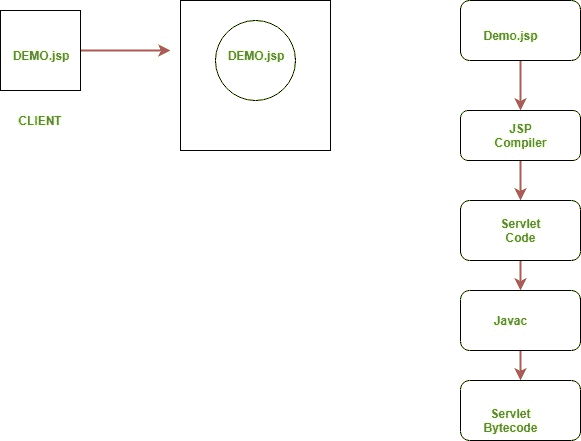

# JSP 简介

> 原文:[https://www.geeksforgeeks.org/introduction-to-jsp/](https://www.geeksforgeeks.org/introduction-to-jsp/)

<center>**Introduction**</center>

*   它代表 **Java 服务器页面**。
*   它是一种服务器端技术。
*   它用于创建 web 应用程序。
*   它用于创建动态网页内容。
*   在这种情况下，JSP 标签用于将 JAVA 代码插入到 HTML 页面中。
*   它是 Servlet 技术的高级版本。
*   它是一种基于网络的技术，帮助我们创建动态的和平台无关的网页。
*   在这种情况下，Java 代码可以插入到 HTML/ XML 页面中，或者两者都插入。
*   在处理客户端的请求之前，JSP 首先被 JSP 容器转换成 servlet。

<center>**JSP pages are more advantageous than Servlet:**</center>

*   它们易于维护。
*   不需要重新编译或重新部署。
*   JSP 可以访问 JAVA 的整个应用编程接口。
*   JSP 是 Servlet 的扩展版本。

<center>**Features of JSP**</center>

*   **在 JSP 中编码很容易** :-因为这只是在 HTML/XML 中添加 JAVA 代码。
*   **减少代码长度** :-在 JSP 中，我们使用动作标签、自定义标签等。
*   **连接数据库更容易**:-网站连接数据库更容易，可以轻松读写数据到数据库。
*   **制作互动网站** :-这样我们可以创建动态网页，帮助用户在实时环境中进行互动。
*   **便携、强大、灵活、易于维护** :-因为这些是独立于浏览器和服务器的。
*   **不重新部署，不重新编译** :-它是动态的，安全的，平台无关的，所以不需要重新编译。
*   **Extension to Servlet** :- as it has all features of servlets, implicit objects and custom tags

    <center>**JSP syntax**</center>

    Syntax available in JSP are following

    1.  **声明标签**:-用于声明变量。

        ```
        Syntax:- 
        <%!  Dec var  %>
        Example:-
        <%! int var=10; %>

        ```

    2.  **Java 脚本** :-它允许我们添加任意数量的 Java 代码、变量和表达式。

        ```
         Syntax:- 
        <% java code %>

        ```

    3.  **JSP 表达式** :-它计算表达式并将其转换为字符串。

        ```
         Syntax:- 
        <%= expression %> 
         Example:- 
        <% num1 = num1+num2 %> 

        ```

    4.  **JAVA Comments** :- It contains the text that is added for information which has to be ignored.

        ```
         Syntax:- 
        <% -- JSP Comments %>

        ```

        <center>**Process of Execution**</center>

        Steps for Execution of JSP are following:-
        *   创建 html 页面，从那里请求将被发送到服务器，如 try.html。
        *   接下来要处理的是用户的请求创建。new.jsp
        *   创建项目文件夹结构。
        *   创建 XML 文件，例如 my.xml。
        *   创建 WAR 文件。
        *   启动 Tomcat
        *   运行应用程序

        

        **Hello World 的例子**
        我们来做一个。html 文件和。jsp 文件

        ```
        demo.jsp
        <html>
        <head>
        <meta http-equiv="Content-Type" content="text/html; charset=ISO-8859-1">
        <title>Hello World - JSP tutorial</title>
        </head>
        <body>
            <%= "Hello World!" %>
        </body>
        </html>

        ```

        <center>**Advantages of using JSP**</center>

        *   它不需要高级的 JAVA 知识
        *   它能够处理异常
        *   易于使用和学习
        *   它可以标记易于使用和理解的内容
        *   隐式对象减少了代码的长度
        *   它适用于 JAVA 和非 JAVA 程序员

        <center>**Disadvantages of using JSP**</center>

        *   难以调试错误。
        *   首次访问会导致时间浪费
        *   它的输出是缺乏特性的 HTML。