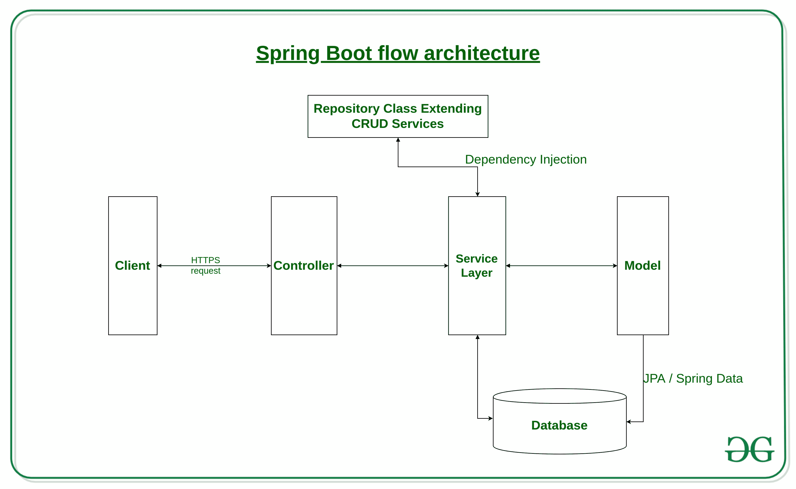

# Spring Boot 简介

> 原文:[https://www.geeksforgeeks.org/introduction-to-spring-boot/](https://www.geeksforgeeks.org/introduction-to-spring-boot/)

Spring 被广泛用于创建可扩展的应用程序。对于 web 应用程序，Spring 提供了
Spring MVC，这是 Spring 的一个广泛使用的模块，用于创建可扩展的 web 应用程序。
但是 spring 项目的主要**缺点是配置非常耗时，对于新开发人员来说可能有点难以承受。**如果您是春季新手，让应用程序做好生产准备需要一些时间。

对此的解决方案是 Spring Boot 。Spring Boot 建在春天的顶端，包含了春天的所有特征。并且正成为开发人员的最爱，因为它是一个快速生产就绪的环境，使开发人员能够直接专注于逻辑，而不是纠结于配置和设置。

Spring Boot 是一个基于微服务的框架，在其中制作一个生产就绪的应用程序只需要很少的时间。
Spring Boot 的先决条件是基础知识 Spring 框架。
要修改弹簧框架的概念[请阅读本文。](https://www.geeksforgeeks.org/introduction-to-spring-framework/)

### Spring Boot 的特色

Spring Boot 是建立在传统的弹簧框架之上的。因此，它提供了 spring 的所有特性，而且比 spring 更容易使用。

*   **It allows to avoid heavy configuration of XML which is present in spring:**
    Unlike the [Spring MVC Project](https://www.geeksforgeeks.org/spring-mvc-with-jsp-view/), in spring boot everything is auto-configured. We just need to use proper configuration for utilizing a particular functionality.

    **例如:**如果我们想使用 [hibernate(ORM)](https://www.geeksforgeeks.org/introduction-to-hibernate-framework/) 那么我们可以只在模型/实体类上面添加 **@Table 标注**(后面会讨论)，并添加 **@Column 标注**将其映射到数据库中的表和列

*   **提供 REST 端点的轻松维护和创建:**
    在 Spring Boot 创建 [REST API](https://www.geeksforgeeks.org/rest-api-introduction/) 非常容易。控制器类上的注释 **@RestController** 和**@ request mapping(/EndPoint)**就可以了。
*   **It includes embedded Tomcat-server:**

    与 [Spring MVC 项目](https://www.geeksforgeeks.org/spring-mvc-with-jsp-view/)需要手动添加和安装 tomcat 服务器不同，Spring Boot 自带了一个[嵌入式 Tomcat 服务器](https://www.geeksforgeeks.org/embedding-tomcat-server-in-maven-project/)，这样应用程序就可以托管在上面了。

*   **部署非常容易，war 和 jar 文件可以在 tomcat 服务器中轻松部署:**
    **war** 或 **jar** 文件可以直接部署在 Tomcat 服务器上，Spring Boot 提供了将我们的项目转换成 war 或 jar 文件的设施。此外，Tomcat 的实例也可以在云上运行。
*   **Microservice Based Architecture:**
    Microservice, as the name suggests is the name given to a module/service which focuses on a single type of feature, exposing an API(application peripheral interface).

    让我们考虑一个医院管理系统的例子。

    *   在单片系统的情况下，将有一个包含所有特征的单一代码，这些特征很难大规模维护。
    *   但是在基于微服务的系统中，每个功能可以被分成更小的子系统，如处理患者注册的服务、处理数据库管理的服务、处理计费的服务等。

    基于微服务的系统可以很容易地迁移，因为只需要改变一些服务，这也使得调试和部署变得容易。此外，每个服务都可以集成，并且可以用适合它们的不同技术来实现。

### Spring Boot 的演变

1.  2012 年 10 月，客户迈克·扬斯特罗姆(Mike Yongstrom)向吉拉提出请求，要求启动 Spring 框架，以便快速启动，Spring Boot 就此诞生。因此在 2013 年初，Spring Boot 诞生了。
2.  2014 年 4 月，Spring Boot **1.0** 创建，随后是各种版本。
3.  Spring Boot**1.1**2014 年 6 月，
4.  **1.2**2015 年 3 月，
5.  **1.3**2016 年 12 月，
6.  **1.4**2017 年 1 月及
7.  2017 年 2 月 Spring Boot **1.5** 。

### Spring Boot 建筑

要了解 Spring Boot 的建筑，让我们首先看看它呈现的不同层次和类别。

*   **Spring Boot 的层数:**Spring Boot 主要有四层:
    *   **表示层:**顾名思义，由视图(即前端部分)组成
    *   **数据访问层:**数据库上的 CRUD(创建、检索、更新、删除)操作就属于这一类。
    *   **服务层:**由服务类组成，使用数据访问层提供的服务。
    *   **集成层:**它由不同的网络服务组成(互联网上可用的任何服务，并使用 [XML](https://www.geeksforgeeks.org/html-and-xml-gq/) 消息系统)。
*   然后我们有实用程序类、验证程序类和视图类。
*   类提供的所有服务都在相应的类中实现，并通过实现对这些接口的依赖来检索。

**Spring Boot 流量架构**:

*   由于 spring boot 使用了 Spring 类 Spring 数据的所有特性/模块， [Spring MVC](https://www.geeksforgeeks.org/spring-mvc-with-jsp-view/) 等。所以架构和 spring MVC 差不多，除了 Spring boot 中不需要 **DAO** 和 **DAOImpl 类**之外。
*   创建一个数据访问层只需要一个存储库类，它实现了包含类的 CRUD 操作。
*   客户端发出 https 请求(PUT/GET)
*   然后，它到达控制器，当请求处理它时，控制器用该路由映射，并在需要时调用服务逻辑。
*   业务逻辑在服务层执行，服务层可能对来自数据库的数据执行逻辑，这些数据通过 JPA 与模型/实体类进行映射
*   最后，如果没有错误发生，响应中会返回一个 JSP 页面。

### 设置 Spring Boot:

1.  从[甲骨文官方网站](https://www.oracle.com/technetwork/java/javase/downloads/index.html)设置[爪哇 JDK](https://www.geeksforgeeks.org/setting-environment-java/) 。
2.  下载并设置 [STS(弹簧工具套件)](https://spring.io/tools3/sts/all)。
3.  开始一个新的春季项目
    *   单击文件->新建-> Spring 启动项目
    *   填写适当的细节，并添加相关性和完成。
    *   编辑应用程序属性。
    *   将主文件作为 Java 应用程序运行。