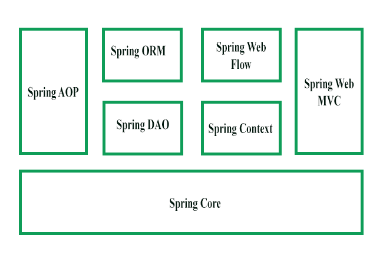

# 弹簧骨架介绍

> 原文:[https://www . geesforgeks . org/introduction-to-spring-framework/](https://www.geeksforgeeks.org/introduction-to-spring-framework/)

#### 介绍

在企业 Java bean(EJB)出现之前，Java 开发人员需要使用 Java Beans 来创建 Web 应用程序。尽管 JavaBeans 帮助开发了用户界面(UI)组件，但它们无法提供服务，如事务管理和安全性，而这些是开发健壮和安全的企业应用程序所必需的。EJB 的出现被视为这个问题的解决方案。EJB 扩展了 Java 组件，如 Web 和企业组件，并提供了有助于企业应用程序开发的服务。然而，使用 EJB 开发企业应用程序并不容易，因为开发人员需要执行各种任务，例如创建 Home 和 Remote 接口以及实现生命周期回调方法，这导致了为 EJB 提供代码的复杂性。由于这种复杂性，开发人员开始寻找更简单的方法来开发企业应用程序。

Spring 框架已经成为所有这些复杂问题的解决方案。该框架使用各种新技术，如面向方面编程(AOP)、普通旧 Java 对象(POJO)和依赖注入(DI)来开发企业应用程序，从而消除了使用 EJB 开发企业应用程序时所涉及的复杂性。Spring 是一个开源的轻量级框架，允许 Java EE 7 开发人员构建简单、可靠和可扩展的企业应用程序。这个框架主要侧重于提供各种方法来帮助您管理业务对象。与经典的 Java 框架和应用程序编程接口相比，它使网络应用程序的开发变得更加容易，例如 Java 数据库连接(JDBC)、Java 服务器页面(JSP)和 Java Servlet。

Spring 框架可以被认为是子框架的集合，也称为层，比如 Spring AOP。春季对象关系映射。春网流，春网 MVC。您可以在构建网络应用程序时单独使用这些模块中的任何一个。这些模块也可以组合在一起，以便在网络应用程序中提供更好的功能。

#### 弹簧框架的特点

Spring 框架的特性，如 IoC、AOP 和事务管理，使其在框架列表中独一无二。Spring 框架的一些最重要的特性如下:

*   **IoC 容器:**
    指在运行时使用 DI 或 IoC 模式在类中隐式提供对象引用的核心容器。这种模式可以替代服务定位器模式。IoC 容器包含处理应用程序对象配置管理的汇编代码。
    Spring 框架提供了两个包，即 org.springframework.beans 和 org.springframework.context，这有助于提供 IoC 容器的功能。
*   **数据访问框架:**
    允许开发人员使用持久性 API，如 JDBC 和 Hibernate，将持久性数据存储在数据库中。它有助于解决开发人员的各种问题，例如如何与数据库连接交互、如何确保连接关闭、如何处理异常以及如何实现事务管理。它还使开发人员能够轻松编写代码来访问整个应用程序中的持久性数据。
*   **Spring MVC 框架:**
    允许你基于 MVC 架构构建 Web 应用。用户发出的所有请求首先通过控制器，然后被分派到不同的视图，即不同的 JSP 页面或 Servlets。Spring MVC 框架的表单处理和表单验证功能可以很容易地与所有流行的视图技术集成，如 ISP、Jasper Report、FreeMarker 和 Velocity。
*   **事务管理:**
    帮助处理应用程序的事务管理，而不影响其代码。该框架为应用服务器管理的全局事务和使用 JDBC Hibernate、Java 数据对象(JDO)或其他数据访问 API 管理的本地事务提供了 Java 事务 API (JTA)。它使开发人员能够在 Spring 的声明性和编程性事务管理的基础上对广泛的事务进行建模。
*   **Spring Web Service:**
    基于 Java 类生成 Web 服务端点和定义，但是在应用程序中很难管理它们。为了解决这个问题，Spring Web Service 提供了基于分层的方法，这些方法由可扩展标记语言(XML)解析(读取和操作 XML 的技术)分别管理。Spring 为将传入的 XML 消息请求传输到一个对象和开发人员在两台机器之间轻松分发 XML 消息(对象)提供了有效的映射。
*   **JDBC 抽象层:**
    帮助用户轻松高效地处理错误。当在网络应用程序中实现这个抽象层时，可以减少 JDBC 编程代码。该层处理异常，如驱动程序未找到。所有的 SQLExceptions 都被转换为 DataAccessException 类。Spring 的数据访问异常不是 JDBC 特有的，因此数据访问对象(DAO)不仅限于 JDBC。
*   **Spring 测试上下文框架:**
    为 Spring 应用程序提供单元和集成测试工具。此外，Spring TestContext 框架提供了特定的集成测试功能，例如测试设备的上下文管理和缓存 DI，以及带有默认回滚语义的事务测试管理。

#### 弹簧框架的演变

Spring 框架于 2004 年首次发布。之后有了重大的修改，比如 Spring 2.0 提供了 XML 名称空间和 AspectJ 支持，Spring 2.5 提供了注释驱动的配置，Spring 3.0 提供了基于 Java 的@Configuration 模型。spring 框架的最新版本是 4.0。它是在支持 Java 8 和 Java EE 7 技术的情况下发布的。尽管您仍然可以将 Spring 用于旧版本的 java，但最低要求仅限于 Java SE 6。Spring 4.0 还支持 java EE 7 技术，如 Java 消息服务(JMS) 2.0、Java 持久性 API (JPA) 2.1、Bean 验证 1.1、servlet 3.1 和 JCache。

#### Spring 框架架构

Spring 框架由七个模块组成，如上图所示。这些模块是 Spring Core、Spring AOP、Spring Web MVC、Spring DAO、Spring ORM、Spring 上下文和 Spring Web 流。这些模块提供了不同的平台来开发不同的企业应用；例如，可以使用 Spring Web MVC 模块来开发基于 MVC 的应用程序。

#### 弹簧框架模块

*   **Spring Core 模块:**
    Spring Core 模块是 Spring 框架的核心组件，提供了 IoC 容器 Spring 容器有两种类型的实现，即 bean 工厂和应用上下文。Bean 工厂是使用 org . spring framework . bean . factory . bean factory 接口定义的，充当 bean 的容器。Bean 工厂容器允许您从程序逻辑中分离依赖关系的配置和规范。在 Spring 框架中，Bean 工厂充当负责实例化应用程序对象的中央 IoC 容器。它还配置和组装这些对象之间的依赖关系。豆工厂接口有许多实现。XmlBeanFactory 类是 BeanFactory 接口最常见的实现。这允许您表达组成应用程序的对象，并移除应用程序对象之间的相互依赖关系。
*   **Spring AOP 模块:**
    类似于面向对象编程(OOP)，将应用分解为对象的层次结构，AOP 将程序分解为方面或关注点。Spring AOP 模块允许您在 Spring AOP 中的 Spring 应用程序中实现关注点或方面，这些方面是用@Aspect 注释的常规 Spring beans 或常规类。这些方面有助于应用程序的事务管理、日志记录和故障监控。例如，在银行操作中需要进行交易管理，例如将金额从一个帐户转移到另一个帐户。Spring AOP 模块提供了一个可以应用于交易 API 的交易管理抽象层。
*   **Spring ORM 模块:**
    Spring ORM 模块用于访问应用程序中数据库的数据。它提供了用 JDO、Hibernate 和 iBatis 操作数据库的 API。Spring ORM 支持 DAO，它提供了一种构建以下基于 DAO 的 ORM 解决方案的便捷方式:
    *   简单的声明性事务管理
    *   透明异常处理
    *   线程安全的轻量级模板类
    *   DAO 支持类
    *   资源管理
*   **Spring Web MVC 模块:**
    Spring 的 Web MVC 模块实现了创建 Web 应用的 MVC 架构。它将 Web 应用程序的模型和视图组件的代码分开。在 Spring MVC 中，当从浏览器生成一个请求时，它首先转到 DispatcherServlet 类(Front Controller)，该类使用一组处理程序映射将请求分派给控制器(SimpleFormController 类或 AbstractWizardformController 类)。控制器提取并处理嵌入在请求中的信息，并将结果以模型对象的形式发送给 DispatcherServlet 类。最后，DispatcherServlet 类使用视图解析器类将结果发送到视图，视图将这些结果显示给用户。
*   **Spring Web Flow Module:**
    The Spring Web Flow module is an extension of the Spring Web MVC module. Spring Web MVC framework provides form controllers, such as class SimpleFormController and AbstractWizardFormController class, to implement predefined workflow. The Spring Web Flow helps in defining XML file or Java Class that manages the workflow between different pages of a Web application. The Spring Web Flow is distributed separately and can be downloaded through [http://www.springframework.org](http://www.springframework.org) website.
    The following are the advantages of Spring Web Flow:
    *   通过在 XML 文件中定义 Web 流，可以清楚地提供应用程序不同用户界面之间的流。
    *   Web 流定义帮助您将一个应用程序分割成不同的模块，并在多种情况下重用这些模块。

    Spring Web Flow 生命周期可以自动管理

*   **Spring Web DAO 模块:**
    Spring 框架中的 DAO 包通过使用 JDBC、Hibernate 或 JDO 等数据访问技术提供 DAO 支持。本模块通过消除提供繁琐的 JDBC 编码的需要引入了 JDBC 抽象层。它还提供编程和声明性事务管理类。Spring DAO 包支持异构 Java 数据库连接和 O/R 映射，这有助于 Spring 使用多种数据访问技术。为了方便快捷地访问数据库资源，Spring 框架提供了抽象的 DAO 基类。Spring 框架支持的每种数据访问技术都有多种实现。例如，在 JDBC，JdbcDaoSupport 类及其方法用于访问数据源实例和预配置的 JdbcTemplate 实例。您需要简单地扩展 JdbcDaoSupport 类，并在应用程序上下文配置中提供到实际数据源实例的映射，以访问基于 DAO 的应用程序。
*   **Spring 应用上下文模块:**
    Spring 应用上下文模块基于 Core 模块。application context org . spring framework . context . application context 是 BeanFactory 的一个接口。该模块从 org.springframework.beans 包中派生出它的特性，并且还支持国际化(I18N)、验证、事件传播和资源加载等功能。应用程序上下文实现消息源接口，并向应用程序提供消息功能。

#### 如何下载和安装 Spring 框架

1.  For Downloading Spring Repository you need to visit [https://repo.spring.io/release/org/springframework/spring/](https://repo.spring.io/release/org/springframework/spring/). In this website, you will find different spring framework releases. You have to click on latest framework release. Here you will find three files which are:
    *   spring-framework-5 . 1 . 4 . RElease-dist . zip
    *   spring-framework-5 . 1 . 4 . RElease-docs . zip
    *   spring-framework-5 . 1 . 4 . RElease-schema . zip

    现在你必须点击“spring-framework-5 . 1 . 4 . release-dist . zip”以便下载。

2.  对于安装，您需要提取 c 盘中的“spring-framework-5 . 1 . 4 . release-dist . zip”文件。现在您可以在 spring 框架中运行您的应用程序了。