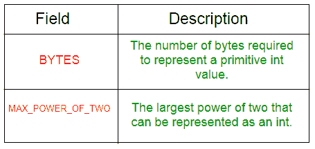
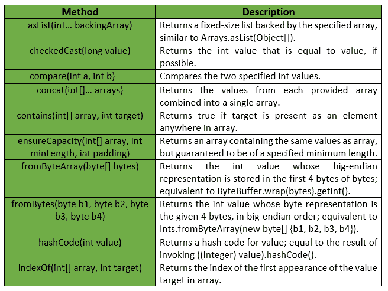
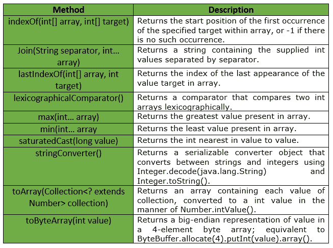

# Ints 类|番石榴|爪哇

> 原文:[https://www.geeksforgeeks.org/ints-class-guava-java/](https://www.geeksforgeeks.org/ints-class-guava-java/)

**int**是一个用于图元类型 int 的实用程序类。它提供了与 int 原语相关的**静态实用方法，这些方法在 Integer 或 Arrays 中都找不到。**

****申报:****

```java
@GwtCompatible(emulated=true)
public final class Ints
extends Object 
```

**下表显示了番石榴 Ints 类的字段摘要:

Ints 类提供的一些方法有:

**例外:****

*   **如果值大于整数，则**检查 cast:***IllegalArgumentException*。最大值或小于整数。最小值**
*   ****min:***IllegalArgumentException*若阵为空。**
*   ****max:***IllegalArgumentException*如果数组为空。**
*   ****from bytearray:***IllegalArgumentException*如果字节少于 4 个元素。**
*   ****确保容量:** *如果最小长度或填充值为负，则显示“异常”。***
*   ****to array:***NullPointerException*如果集合或其任何元素为空。**

**下表显示了番石榴 Ints 类提供的一些其他方法:

下面给出了一些示例，显示了番石榴 Ints 类的方法的实现:
**示例 1 :****

```java
// Java code to show implementation
// of Guava Ints.asList() method

import com.google.common.primitives.Ints;
import java.util.*;

class GFG {
    // Driver method
    public static void main(String[] args)
    {
        int arr[] = { 5, 10, 15, 20, 25 };

        // Using Ints.asList() method which wraps
        // the primitive integer array as List of
        // integer Type
        List<Integer> myList = Ints.asList(arr);

        // Displaying the elements
        System.out.println(myList);
    }
}
```

**输出:**

```java
[5, 10, 15, 20, 25] 
```

****例 2 :****

```java
// Java code to show implementation
// of Guava Ints.toArray() method

import com.google.common.primitives.Ints;
import java.util.*;

class GFG {
    // Driver method
    public static void main(String[] args)
    {
        List<Integer> myList = Arrays.asList(5, 10, 15, 20, 25);

        // Using Ints.toArray() method which
        // converts a List of Integer to an
        // array of int
        int[] arr = Ints.toArray(myList);

        // Displaying the elements
        System.out.println(Arrays.toString(arr));
    }
}
```

**输出:**

```java
[5, 10, 15, 20, 25] 
```

****例 3 :****

```java
// Java code to show implementation
// of Guava Ints.concat() method

import com.google.common.primitives.Ints;
import java.util.*;

class GFG {
    // Driver method
    public static void main(String[] args)
    {
        int[] arr1 = { 5, 10, 15 };
        int[] arr2 = { 20, 25 };

        // Using Ints.concat() method which
        // combines arrays from specified
        // arrays into a single array
        int[] arr = Ints.concat(arr1, arr2);

        // Displaying the elements
        System.out.println(Arrays.toString(arr));
    }
}
```

**输出:**

```java
[5, 10, 15, 20, 25] 
```

****例 4 :****

```java
// Java code to show implementation
// of Guava Ints.contains() method

import com.google.common.primitives.Ints;

class GFG {
    // Driver method
    public static void main(String[] args)
    {
        int[] arr = { 5, 10, 15, 20 };

        // Using Ints.contains() method which
        // checks if element is present in array
        // or not
        System.out.println(Ints.contains(arr, 10));
        System.out.println(Ints.contains(arr, 17));
    }
}
```

**输出:**

```java
true
false 
```

****例 5 :****

```java
// Java code to show implementation
// of Guava Ints.min() method

import com.google.common.primitives.Ints;

class GFG {
    // Driver method
    public static void main(String[] args)
    {
        int[] arr = { 5, 10, 15, 20 };

        // Using Ints.min() method
        System.out.println(Ints.min(arr));
    }
}
```

**输出:**

```java
5 
```

****例 6 :****

```java
// Java code to show implementation
// of Guava Ints.max() method

import com.google.common.primitives.Ints;

class GFG {
    // Driver method
    public static void main(String[] args)
    {
        int[] arr = { 5, 10, 15, 20 };

        // Using Ints.max() method
        System.out.println(Ints.max(arr));
    }
}
```

**输出:**

```java
20 
```