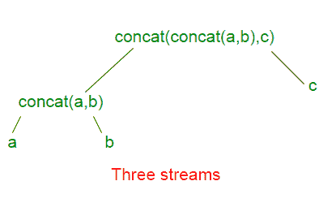

# Java 中的 IntStream concat()

> 哎哎哎:# t0]https://www . geeksforgeeks . org/intstream-concat-Java/

**IntStream concat()** 方法创建一个串联流，其中元素是第一个流的所有元素，后跟第二个流的所有元素。如果两个输入流都是有序的，则结果流是有序的；如果两个输入流中的任何一个是并行的，则[并行](https://www.geeksforgeeks.org/parallel-data-processing-java-set-1/)。

**语法:**

```
static IntStream concat(IntStream a,  IntStream b)

Where, IntStream is a sequence of primitive int-valued elements,
a represents the first stream,
b represents the second stream and
the function returns the concatenation of
the two input IntStreams.

```

对 IntStream.concat(IntStream a，IntStream b)的调用可以看作是形成了一棵二叉树。所有输入流的连接是在根。单个输入流在叶子上。下面给出了 3 个数据流 a、b 和 c 的例子


每个额外的输入流给树增加一层深度，并增加一层间接到达所有其他流。

**注意:**int stream . concat()方法返回的元素是有序的。例如，以下两行返回相同的结果:

```
IntStream.concat(IntStream.concat(stream1, stream2), stream3);
IntStream.concat(stream1, IntStream.concat(stream2, stream3));

```

但是下面两个的结果是不同的。

```
IntStream.concat(IntStream.concat(stream1, stream2), stream3); 
IntStream.concat(IntStream.concat(stream2, stream1), stream3);

```

**例 1 :**

```
// Implementation of IntStream.concat()
// method in Java 8 with 2 IntStreams
import java.util.*;
import java.util.stream.IntStream;
import java.util.stream.Stream;

class GFG {

    // Driver code
    public static void main(String[] args)
    {
        // Creating two IntStreams
        IntStream stream1 = IntStream.of(2, 4, 6);
        IntStream stream2 = IntStream.of(1, 3, 5);

        // concatenating both the Streams
        // with IntStream.concat() function
        // and displaying the result
        IntStream.concat(stream1, stream2)
            .forEach(element -> System.out.println(element));
    }
}
```

**Output:**

```
2
4
6
1
3
5

```

**例 2 :**

```
// Implementation of IntStream.concat()
// method in Java 8 with 2 IntStreams
import java.util.*;
import java.util.stream.IntStream;
import java.util.stream.Stream;

class GFG {

    // Driver code
    public static void main(String[] args)
    {
        // Creating two IntStreams
        IntStream stream1 = IntStream.of(2, 4, 6);
        IntStream stream2 = IntStream.of(1, 2, 4);

        // concatenating both the Streams
        // with IntStream.concat() function
        // and displaying distinct elements
        // in the concatenated IntStream
        IntStream.concat(stream1, stream2).distinct().
        forEach(element -> System.out.println(element));
    }
}
```

**Output:**

```
2
4
6
1

```