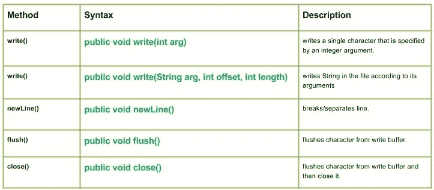

# Java 中的 Java.io.BufferedWriter 类方法

> 原文:[https://www . geesforgeks . org/io-bufferedwriter-class-methods-Java/](https://www.geeksforgeeks.org/io-bufferedwriter-class-methods-java/)

[](https://media.geeksforgeeks.org/wp-content/uploads/io.BufferedWriter-class-methods.jpg)

Bufferreader 类将文本写入字符输出流，缓冲字符。因此，提供了单个数组、字符和字符串的高效写入。需要指定缓冲区大小，如果不是，它采用默认值。
输出被写入器立即设置为基础字符或字节流。
**类申报**

```java
public class BufferedWriter
   extends Writer
```

**施工人员**

*   **缓冲区写入器(写入器输出)**:创建使用默认大小输出缓冲区的缓冲字符输出流。
*   **BufferedWriter(Writer out，int size):** 使用给定大小的输出缓冲区创建新的缓冲字符输出流。

**方法:**

*   **write():Java . io . bufferedwriter . write(int arg)**写入由整数参数指定的单个字符。
    **语法:**

```java
public void write(int arg)
Parameters : 
arg : integer that specifies the character to write          
Return :
Doesn't return any value.
```

*   **实施:**

## Java 语言（一种计算机语言，尤用于创建网站）

```java
//Java program illustrating use of write(int arg) method

import java.io.*;
public class NewClass
{
    public static void main(String[] args)
    {
        //initializing FileWriter
        FileWriter geek_file;
        try
        {
            geek_file = new FileWriter("ABC.txt");

            // Initialing BufferedWriter
            BufferedWriter geekwrite = new BufferedWriter(geek_file);
            System.out.println("Buffered Writer start writing :)");

            // Use of write() method to write the value in 'ABC' file
            // Printing E
            geekwrite.write(69);

            // Printing 1
            geekwrite.write(49);

            // Closing BufferWriter to end operation
            geekwrite.close();
            System.out.println("Written successfully");
        }
        catch (IOException except)
        {
            except.printStackTrace();
        }

    }
}
```

*   **注意:**在给定的输出中，你看不到它在文件上的动作。在设备中的任何编译器上运行此代码。它会创建一个新文件“ABC”，并在其中写入“E 1”。

```java
Output : 
Buffered Writer start writing :)
Written successfully
```

*   **write():Java . io . bufferedwriter . write(String arg，int offset，int length)** 按照 Java Code 中提到的 String 的参数在文件中写入 String。
    **语法:**

```java
public void write(String arg, int offset, int length)
Parameters : 
arg : String to be written
offset : From where to start reading the string
length : No. of characters of the string to write          
Return :
Doesn't return any value.
```

*   **实施:**

## Java 语言（一种计算机语言，尤用于创建网站）

```java
//Java program illustrating use of write(String arg, int offset, int length) method

import java.io.*;
public class NewClass
{
    public static void main(String[] args)
    {
        //Initializing a FileWriter
        FileWriter geek_file;
        try
        {
            geek_file = new FileWriter("ABC.txt");

            // Initializing a BufferedWriter
            BufferedWriter geekwrite = new BufferedWriter(geek_file);
            System.out.println("Buffered Writer start writing :)");
            String arg = "Hello Geeks";
            int offset = 6;
            geekwrite.write(arg,offset,arg.length()-offset);

            // Closing Buffer
            geekwrite.close();
            System.out.println("Written successfully");
        }
        catch (IOException except)
        {
            except.printStackTrace();
        }

    }
}
```

*   **注意:**在给定的输出中，你看不到它在文件上的动作。在设备中的任何编译器上运行此代码。它创建了一个新的文件“ABC”，并在其中写下“极客”。在这里，

```java
arg = Hello Geeks
offset = 6
length = arg.length So, when we minus offset : 6, it will write 'Geeks' only in the file.
```

*   输出:

```java
Buffered Writer start writing :)
Written successfully                                                   
```

*   **newLine():Java . io . bufferedwriter . newLine()**换行/分隔线。
    **语法:**

```java
public void newLine()       
Return :
Doesn't return any value.
```

*   **实施:**

## Java 语言（一种计算机语言，尤用于创建网站）

```java
//Java program explaining use of newLine() method

import java.io.*;
public class NewClass
{
    public static void main(String[] args)
    {
        //initializing FileWriter
        FileWriter geek_file;
        try
        {
            geek_file = new FileWriter("ABC.txt");

            // Initialing BufferedWriter
            BufferedWriter geekwrite = new BufferedWriter(geek_file);
            System.out.println("Buffered Writer start writing :)");

            // Use of write() method to write the value in 'ABC' file
            // Printing "GEEKS"
            geekwrite.write("GEEKS");

            // For next line
            geekwrite.newLine();

            // Printing "FOR"
            geekwrite.write("FOR");

             // For next line
            geekwrite.newLine();

            // Printing "GEEKS"
            geekwrite.write("FOR");

            // Closing BufferWriter to end operation
            geekwrite.close();
            System.out.println("Written successfully");
        }
        catch (IOException except)
        {
            except.printStackTrace();
        }

    }
}
```

*   **注意:**在给定的输出中，你看不到它在文件上的动作。在设备中的任何编译器上运行此代码。它会创建一个新文件“ABC”并编写 write
    | GEEKS |
    | FOR |
    | GEEKS |在这里，newLine()方法在 GEEKS 之后换行，FOR 写在下一行
    输出:

```java
Buffered Writer start writing :)
Written successfully
```

*   **flush():Java . io . bufferedwriter . flush()**从写缓冲区中刷新字符。
    **语法:**

```java
public void flush()    
Return :
Doesn't return any value.
```

*   **close():Java . io . bufferedwriter . close()**从写缓冲区中刷新字符，然后将其关闭。
    **语法:**

```java
public void close()    
Return :
Doesn't return any value.
```

*   **实施冲水()，关闭()方法:**

## Java 语言（一种计算机语言，尤用于创建网站）

```java
//Java program illustrating use of flush(), close() method

import java.io.*; //BufferedWriter, FileWriter, IOException
public class NewClass
{
    public static void main(String[] args)
    {
        FileWriter geek_file; //initializing FileWriter
        try
        {
            geek_file = new FileWriter("ABC.txt");
            // Initialing BufferedWriter
            BufferedWriter geekwrite = new BufferedWriter(geek_file);
            System.out.println("Buffered Writer start writing :)");
            // Use of write() method to write the value in 'ABC' file

            geekwrite.write(69); // Printing E
            geekwrite.newLine(); // For next line
            geekwrite.write(49); // Printing 1

            // flush() method : flushing the stream
            geekwrite.flush();
            // close() method : closing BufferWriter to end operation
            geekwrite.close();
            System.out.println("Written successfully");
        }
        catch (IOException except)
        {
            except.printStackTrace();
        }

    }
}
```

*   **注意:**在文件上看不到它的动作。在设备中的任何编译器上运行此代码。它会创建一个新文件‘ABC’，并在其中写入
    | E |
    | 1 |
    。这里，flush()方法刷新流，close()方法关闭编写器。

```java
Output : 
Buffered Writer start writing :)
Written successfully
```

*   本文由 **莫希特·古普塔供稿🙂** 。如果你喜欢 GeeksforGeeks 并想投稿，你也可以使用[write.geeksforgeeks.org](https://write.geeksforgeeks.org)写一篇文章或者把你的文章邮寄到 review-team@geeksforgeeks.org。看到你的文章出现在极客博客主页上，帮助其他极客。
    如果发现有不正确的地方，或者想分享更多关于上述话题的信息，请写评论。