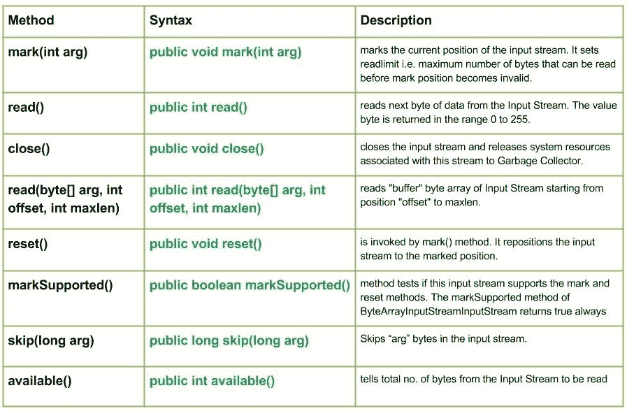

# Java 中的 Java . io . bytearrainputstream 类

> 哎哎哎:# t0]https://www . geeksforgeeks . org/io-bytearray input stream-class-Java/

[](https://media.geeksforgeeks.org/wp-content/uploads/io.ByteArrayInputStream-class-in-Java.jpg)

**Java . io . BytearrainputStream**类包含所有缓冲区，包含要从输入流中读取的字节。字节数组输入流类方法没有输入输出异常。即使在关闭流之后，也可以调用这个类的方法，这对类方法没有影响。

**申报:**

```
public class ByteArrayInputStream
   extends InputStream
```

**字段**

*   **受保护字节[] buf:** 由流的创建者提供的字节数组。
*   **受保护的 int 计数:**比输入流缓冲区中最后一个有效字符大一的索引。
*   **受保护的 int 标记:**流中当前标记的位置。
*   **受保护的 int pos:** 这是要从输入流缓冲区读取的下一个字符的索引。

**施工人员:**

*   **字节数组输入流(字节[]缓冲区):**创建字节数组输入流以使用缓冲区数组–“缓冲区”。
*   **字节数组输入流(字节[] buf，int 偏移量，int 长度):**创建字节数组输入流，使用“缓冲区”的某个部分，即缓冲区数组

**方法:**

*   **mark(int arg):Java . io . bytearrainputstream . mark(int arg)**标记输入流的当前位置。它设置 readlimit，即在标记位置无效之前可以读取的最大字节数。
    **语法:**

```
public void mark(int arg)
Parameters :
arg : integer specifying the read limit of the input Stream
Return : 
void
```

*   **read():Java . io . BytearrainputStream . read()**从输入流中读取下一个字节的数据。值字节在 0 到 255 的范围内返回。如果因为已经到达流的末尾而没有字节可用，则返回值-1。方法不阻止
    T3】语法:

```
public int read()
Parameters :
------
Return : 
Reads next data else, -1 i.e. when end of file is reached.
Exception :
->  IOException : If I/O error occurs.
```

*   **close():Java . io . BytearrainputStream . close()**关闭输入流，并将与该流相关联的系统资源释放给垃圾收集器。
    **语法:**

```
public void close()
Parameters :
------
Return : 
void
Exception :
->  IOException : If I/O error occurs.
```

*   **read(byte[] buffer，int offset，int maxlen):Java . io . bytearrainputstream . read(byte[]buffer，int offset，int maxlen)** 从位置“offset”到 maxlen 读取 InputStream 的“buffer”字节数组。
    **语法:**

```
public int read(byte[] buffer, int offset, int maxlen)
Parameters :
arg : array whose number of bytes to be read
offset : starting position in buffer from where to read
maxlen : maximum  no. of bytes to be read
Return : 
 reads number of bytes and return to the buffer else, -1 i.e. when end of file is reached.
Exception :
->  IOException : If I/O error occurs.
->  NullPointerException : if arg is null.
```

*   **reset():通过 mark()方法调用 Java . io . BytearrainputStream . reset()**。它将输入流重新定位到标记的位置。
    **语法:**

```
public void reset()
Parameters :
----
Return : 
void
Exception :
->  IOException : If I/O error occurs.
```

*   **MarkSupported():Java . io . BytearrainputStream . MarkSupported()**方法测试此输入流是否支持标记和重置方法。ByteArrayInputStreamInputStream 的 markSupported 方法始终返回 true
    **语法:**

```
public boolean markSupported()
Parameters :
-------
Return : 
true if input stream supports the mark() and reset() method  else,false
```

*   **跳过(长参数):Java . io . Bytearrainputstream . skip(长参数)**跳过输入流中的**参数**字节。
    **语法:**

```
public long skip(long arg)
Parameters :
arg : no. of bytes to be skipped
Return : 
skip bytes.
Exception :
->  IOException : If I/O error occurs.
```

*   **available():Java . io . Bytearrainputstream . available()**告知要读取的输入流的字节总数
    **语法:**

```
public int available()
Parameters :
-----------
Return : 
total no. of bytes to be read
Exception :
-----------
```

**解释 ByteArrayInputStream 类方法的 Java 程序:**

## Java 语言(一种计算机语言，尤用于创建网站)

```
// Java program illustrating the working of ByteArrayInputStream method
// mark(), read(), skip(), available()
// markSupported(), close(), reset()

import java.io.*;

public class NewClass
{
    public static void main(String[] args) throws Exception
    {
        byte[] buffer = {71, 69, 69, 75, 83};       
        ByteArrayInputStream geek = null;
        try
        {
            geek = new ByteArrayInputStream(buffer);

            // Use of available() method : telling the no. of bytes to be read
            int number = geek.available();
            System.out.println("Use of available() method : " + number);      

            // Use of read() method : reading and printing Characters one by one
            System.out.println("\nChar : "+(char)geek.read());
            System.out.println("Char : "+(char)geek.read());
            System.out.println("Char : "+(char)geek.read());

            // Use of mark() :
            geek.mark(0);

            // Use of skip() : it results in skipping 'k' from "GEEKS"
            geek.skip(1);
            System.out.println("skip() method comes to play");
            System.out.println("mark() method comes to play");
            System.out.println("Char : "+(char)geek.read());

            // Use of markSupported
            boolean check = geek.markSupported();
            System.out.println("\nmarkSupported() : " + check);
            if(geek.markSupported())
            {
                // Use of reset() method : repositioning the stream to marked positions.
                geek.reset();
                System.out.println("\nreset() invoked");
                System.out.println("Char : "+(char)geek.read());
                System.out.println("Char : "+(char)geek.read());
            }
            else
            {
                System.out.println("reset() method not supported.");
            }

            System.out.println("geek.markSupported() supported reset() : "+check);

        }
        catch(Exception except)
        {
            // in case of I/O error
            except.printStackTrace();
        }
        finally
        {
            // releasing the resources back to the GarbageCollector when closes
            if(geek!=null)
            {
                // Use of close() : closing the file and releasing resources
                geek.close();
            }
        }
    }
}
```

**输出:**

```
Use of available() method : 5

Char : G
Char : E
Char : E
skip() method comes to play
mark() method comes to play
Char : S

markSupported() : true

reset() invoked
Char : K
Char : S
geek.markSupported() supported reset() : true
```

**下一篇:** [io。Java 中的字节数组输出流()类](https://www.geeksforgeeks.org/io-bytearrayoutputstream-class-java/)

本文由**莫希特·古普塔供稿🙂**。如果你喜欢 GeeksforGeeks 并想投稿，你也可以使用[write.geeksforgeeks.org](https://write.geeksforgeeks.org)写一篇文章或者把你的文章邮寄到 review-team@geeksforgeeks.org。看到你的文章出现在极客博客主页上，帮助其他极客。
如果你发现任何不正确的地方，或者你想分享更多关于上面讨论的话题的信息，请写评论。