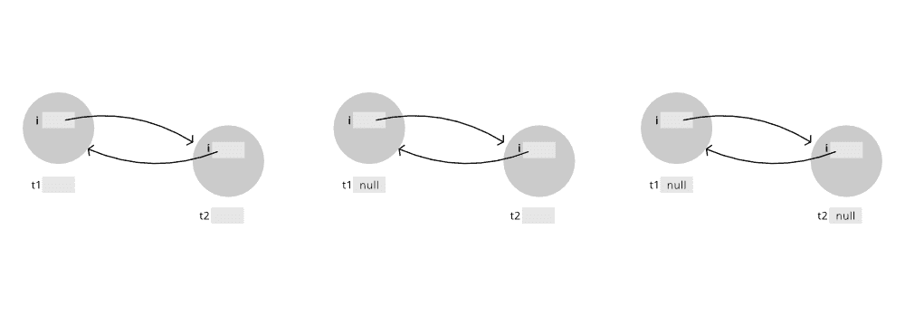

# 爪哇岛隔离岛

> 原文:[https://www.geeksforgeeks.org/island-of-isolation-in-java/](https://www.geeksforgeeks.org/island-of-isolation-in-java/)

在 Java 中，对象销毁由[垃圾收集器](https://www.geeksforgeeks.org/garbage-collection-java/)模块处理，没有任何引用的对象都有资格进行垃圾收集。垃圾收集器能够识别这种类型的对象。现在让我们讨论隔离岛到底代表什么，如下:

*   对象 1 引用对象 2，对象 2 引用对象 1。任何其他对象都不会引用对象 1 或对象 2。那是一座孤岛。
*   基本上，隔离岛是一组对象，这些对象相互引用，但不被应用程序中的任何活动对象引用。严格来说，即使是一个单一的未被引用的对象也是一个孤岛。

**示例:**

## Java 语言(一种计算机语言，尤用于创建网站)

```java
// Java Program to Illustrate Island of Isolation

// Main class
public class GFG {

    GFG i;

    // Method 1
    // Main driver method
    public static void main(String[] args)
    {

        // Creating object of class inside main() method
        GFG t1 = new GFG();
        GFG t2 = new GFG();

        // Object of t1 gets a copy of t2
        t1.i = t2;

        // Object of t2 gets a copy of t1
        t2.i = t1;

        // Till now no object eligible
        // for garbage collection
        t1 = null;

        // Now two objects are eligible for
        // garbage collection
        t2 = null;

        // Calling garbage collector
        System.gc();
    }

    // Method 2
    // overriding finalize() Method
    @Override protected void finalize() throws Throwable
    {
        // Print statement
        System.out.println("Finalize method called");
    }
}
```

**输出:**


**输出说明:**

*   在析构对象之前，垃圾收集器最多只能对该对象调用一次 finalize 方法。这是因为在上面的示例中 finalize()方法被调用了两次是因为两个对象都有资格进行垃圾收集。这是因为在执行 t2=null 之后，我们没有任何对 t1 和 t2 对象的外部引用。
*   我们所拥有的只是它们彼此的内部引用(在 Test 类的实例变量 I 中)。我们不可能同时调用两个对象的实例变量。因此，在**'*****T2 . I = T1*****'**之前，不能再次调用任何对象



*   这两个对象都有外部引用 t1 和 t2。
*   **t1 =空:**两个对象都可以分别通过 t2.i 和 t2 到达。
*   **t2 =空:**无法到达任何对象。

> 现在，这两个对象都有资格作为**进行垃圾收集，我们没有办法称它们为**。这就是俗称的**孤岛。**

本文由**高拉夫·米格拉尼**供稿。如果你喜欢 GeeksforGeeks 并想投稿，你也可以使用[write.geeksforgeeks.org](http://www.write.geeksforgeeks.org)写一篇文章或者把你的文章邮寄到 review-team@geeksforgeeks.org。看到你的文章出现在极客博客主页上，帮助其他极客。如果你发现任何不正确的地方，或者你想分享更多关于上面讨论的话题的信息，请写评论。