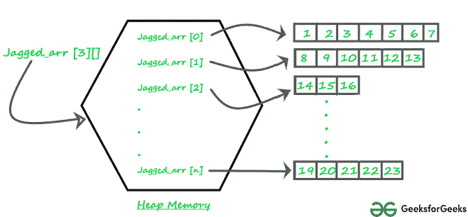

# Java 中的锯齿状数组

> 原文:[https://www.geeksforgeeks.org/jagged-array-in-java/](https://www.geeksforgeeks.org/jagged-array-in-java/)

**先决条件:**[Java 中的数组](https://www.geeksforgeeks.org/arrays-in-java/)

锯齿状的[数组](https://en.wikipedia.org/wiki/Jagged_array)是一个数组的数组，这样成员数组可以有不同的大小，也就是说，我们可以创建一个二维数组，但是每行的列数是可变的。这些类型的数组也称为 Jagged 数组。

**内存中锯齿状数组的图形表示:**



**锯齿状 _ 阵列**

**锯齿状数组的声明和初始化:**

```
Syntax: data_type array_name[][] = new data_type[n][];  //n: no. of rows
             array_name[] = new data_type[n1] //n1= no. of columns in row-1
             array_name[] = new data_type[n2] //n2= no. of columns in row-2
             array_name[] = new data_type[n3] //n3= no. of columns in row-3
                                   .
                                   .
                                   .
             array_name[] = new data_type[nk]  //nk=no. of columns in row-n
```

**可选，初始化交错数组的方法:**

```
                    int arr_name[][] = new int[][]  {
                                  new int[] {10, 20, 30 ,40},
                                  new int[] {50, 60, 70, 80, 90, 100},
                                  new int[] {110, 120}
                                      };

                              OR                                     

                    int[][] arr_name = {
                          new int[] {10, 20, 30 ,40},
                          new int[] {50, 60, 70, 80, 90, 100},
                          new int[] {110, 120}
                              };

                              OR                                     

                    int[][] arr_name = {
                           {10, 20, 30 ,40},
                           {50, 60, 70, 80, 90, 100},
                           {110, 120}
                              };
```

以下是演示上述概念的 Java 程序。

## Java 语言(一种计算机语言，尤用于创建网站)

```
// Program to demonstrate 2-D jagged array in Java
class Main {
    public static void main(String[] args)
    {
        // Declaring 2-D array with 2 rows
        int arr[][] = new int[2][];

        // Making the above array Jagged

        // First row has 3 columns
        arr[0] = new int[3];

        // Second row has 2 columns
        arr[1] = new int[2];

        // Initializing array
        int count = 0;
        for (int i = 0; i < arr.length; i++)
            for (int j = 0; j < arr[i].length; j++)
                arr[i][j] = count++;

        // Displaying the values of 2D Jagged array
        System.out.println("Contents of 2D Jagged Array");
        for (int i = 0; i < arr.length; i++) {
            for (int j = 0; j < arr[i].length; j++)
                System.out.print(arr[i][j] + " ");
            System.out.println();
        }
    }
}
```

**Output**

```
Contents of 2D Jagged Array
0 1 2 
3 4 
```

下面是另一个例子，其中第 I 行有 I 列，即第一行有 1 个元素，第二行有两个元素，以此类推。

## Java 语言(一种计算机语言，尤用于创建网站)

```
// Another Java program to demonstrate 2-D jagged
// array such that first row has 1 element, second
// row has two elements and so on.
class Main {
    public static void main(String[] args)
    {
        int r = 5;

        // Declaring 2-D array with 5 rows
        int arr[][] = new int[r][];

        // Creating a 2D array such that first row
        // has 1 element, second row has two
        // elements and so on.
        for (int i = 0; i < arr.length; i++)
            arr[i] = new int[i + 1];

        // Initializing array
        int count = 0;
        for (int i = 0; i < arr.length; i++)
            for (int j = 0; j < arr[i].length; j++)
                arr[i][j] = count++;

        // Displaying the values of 2D Jagged array
        System.out.println("Contents of 2D Jagged Array");
        for (int i = 0; i < arr.length; i++) {
            for (int j = 0; j < arr[i].length; j++)
                System.out.print(arr[i][j] + " ");
            System.out.println();
        }
    }
}
```

**Output**

```
Contents of 2D Jagged Array
0 
1 2 
3 4 5 
6 7 8 9 
10 11 12 13 14 
```

本文由**拉胡尔·阿格沃尔**供稿。如果你喜欢极客博客并想投稿，你也可以写一篇文章并把你的文章邮寄到 review-team@geeksforgeeks.org。看到你的文章出现在极客博客主页上，帮助其他极客。
如发现任何不正确的地方，请写评论，或者您想分享更多关于上述话题的信息