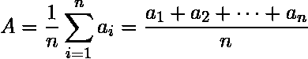

# Java 8 |收集器平均值(带示例)

> 原文:[https://www . geesforgeks . org/Java-8-collectors-averaging int-in-Java-with-examples/](https://www.geeksforgeeks.org/java-8-collectors-averagingint-in-java-with-examples/)

**采集者平均积分(到功能<？super T > mapper)** 方法用于查找参数中传递的整数的平均值。此方法返回一个收集器，该收集器生成应用于输入元素的整数值函数的算术平均值。如果没有元素作为输入元素传递，则此方法返回 0。

该方法计算[算术平均值](https://www.geeksforgeeks.org/progressions-ap-gp-hp-and-practice-problems/)的公式为:

<center></center>

**语法:**

```java
public static 
   <T> Collector<T, ?, Double> 
     averagingInt(ToIntFunction<? super T> mapper)

```

哪里，

*   **接口收集器< **T、A、R** >** :一种将输入元素累加到一个可变结果容器中的可变约简操作，可选地在所有输入元素都被处理之后将累加的结果转换为最终表示。还原操作可以顺序执行，也可以并行执行。
    *   **T:** 归约运算的输入元素类型。
    *   **A:** 还原操作的可变累加类型。
    *   **R:** 归约运算的结果类型。
*   **Double:**Double 类在对象中包装一个基元类型 Double 的值。类型为 double 的对象包含类型为 Double 的单个字段。
*   **to function:**表示产生整数值结果的函数。

**参数:**该方法采用强制参数**映射器**，类型为**到功能**。它是一个从流中提取整型值的函数。

以下是说明 averagingInt()方法的示例:

**程序 1:**

```java
// Java code to show the implementation of
// Collectors averagingInt(ToIntFunction mapper) function

import java.util.stream.Collectors;
import java.util.stream.Stream;

class GFG {

    // Driver code
    public static void main(String[] args)
    {

        // creating a string stream with numbers
        Stream<String> s = Stream.of("3", "4", "5");

        // using Collectors averagingInt(ToIntFunction mapper)
        // method to find arithmetic mean of inputs given
        double ans = s
                         .collect(Collectors
                                      .averagingInt(
                                          num -> Integer.parseInt(num)));

        // displaying the result
        System.out.println(ans);
    }
}
```

**Output:**

```java
4.0

```

**程序 2:** 当没有输入元素作为参数传递给 averagingInt()方法时。

```java
// Java code to show the implementation of
// Collectors averagingInt(ToIntFunction mapper) function

import java.util.stream.Collectors;
import java.util.stream.Stream;

class GFG {

    // Driver code
    public static void main(String[] args)
    {
        // creating a empty string stream
        Stream<String> s = Stream.of();

        // using Collectors averagingInt(ToIntFunction mapper)
        // method to find arithmetic mean of inputs given
        double ans = s
                         .collect(Collectors
                                      .averagingInt(
                                          num -> Integer.parseInt(num)));

        // displaying the result
        System.out.println(ans);
    }
}
```

**Output:**

```java
0.0

```

**程序 3:**

```java
// Java code to show the implementation of
// Collectors averagingInt(ToIntFunction mapper) function

import java.util.stream.Collectors;
import java.util.stream.Stream;

class GFG {

    // Driver code
    public static void main(String[] args)
    {
        // creating a string stream
        Stream<String> s = Stream.of("7", "8", "9", "10");

        // using Collectors averagingInt(ToIntFunction mapper)
        // method to find arithmetic mean of inputs given
        double ans = s
                         .collect(Collectors
                                      .averagingInt(
                                          num -> Integer.parseInt(num)));

        // displaying the result
        System.out.println(ans);
    }
}
```

**Output:**

```java
8.5

```