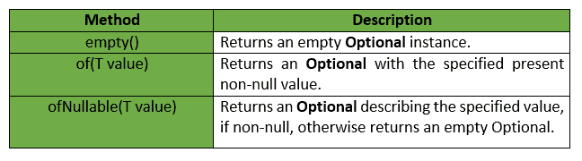
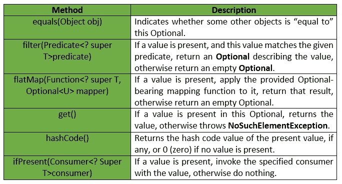
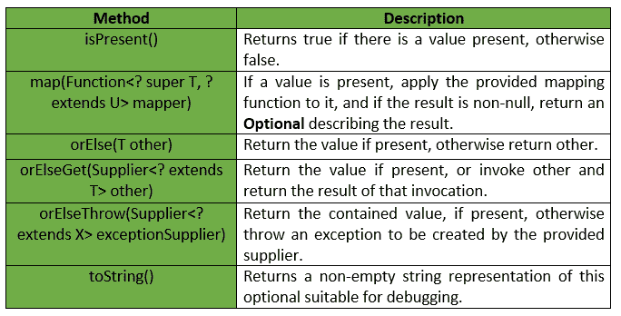
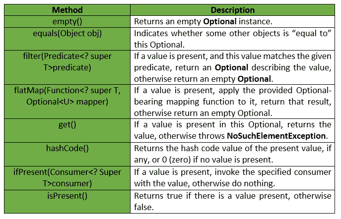
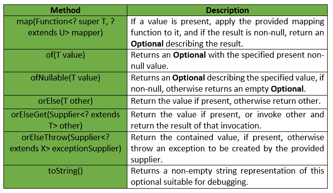

# Java 8 可选类

> 原文:[https://www.geeksforgeeks.org/java-8-optional-class/](https://www.geeksforgeeks.org/java-8-optional-class/)

Java 可选类:每个 Java 程序员都熟悉 [NullPointerException](https://www.geeksforgeeks.org/null-pointer-exception-in-java/) 。它会让你的代码崩溃。而且不使用太多的空值检查很难避免。
Java 8 在 java.util 包中引入了一个新的类 Optional。它可以在不使用太多空检查的情况下帮助编写一个整洁的代码。通过使用可选，我们可以指定要返回的替代值或要运行的替代代码。这使得代码更易读，因为隐藏的事实现在对开发人员来说是可见的。

```java
// Java program without Optional Class
public class OptionalDemo{  
    public static void main(String[] args) {  
        String[] words = new String[10];  
        String word = words[5].toLowerCase();  
        System.out.print(word);  
    }  
}
```

输出:

```java
Exception in thread "main" java.lang.NullPointerException
```

为了避免异常终止，我们使用可选类。在下面的示例中，我们使用了可选。因此，我们的程序可以在不崩溃的情况下执行。

上述程序使用可选类

```java
// Java program with Optional Class
import java.util.Optional;  
public class OptionalDemo{  
    public static void main(String[] args) {  
        String[] words = new String[10];  
        Optional<String> checkNull = 
                      Optional.ofNullable(words[5]);  
        if (checkNull.isPresent()) {  
            String word = words[5].toLowerCase();  
            System.out.print(word);  
        } else  
            System.out.println("word is null");  
    }  
}  
```

输出:

```java
word is null
```

**先决条件:** [Java 8 可选类](https://www.geeksforgeeks.org/java-8-optional-class/)

可选是一个容器对象，它可以包含也可以不包含非空值。您必须导入 ***java.util 包*** 才能使用该类。如果存在一个值， **isPresent()** 将返回 true， **get()** 将返回该值。提供了依赖于包含值存在与否的其他方法，例如 **orElse()** ，如果值不存在，则返回默认值；以及 **ifPresent()** ，如果值存在，则执行一个代码块。这是一个基于 ***值的*** 类，即它们的实例是:

*   Final 和不可变的(尽管可能包含对可变对象的引用)。
*   仅基于 equals()而不是基于引用等式(==)被视为相等。
*   没有可访问的构造函数。

**静态方法:**静态方法是 Java 中不需要创建类的对象就可以调用的方法。它们由类名本身或对该类的对象的引用来引用。
**语法:**

```java
public static void geek(String name)
{
 // code to be executed....
}

// Must have static modifier in their declaration.
// Return type can be int, float, String or user-defined data type.

```

**要点:**由于静态方法属于类，因此可以在不创建类对象的情况下调用它们。下面给出了一些关于静态方法的要点:

*   静态方法与它们所在的类相关联，也就是说，即使不创建类的实例，也可以调用它们。
*   它们的设计目标是在从同一类创建的所有对象之间共享。
*   静态方法不能被覆盖。但是可以重载，因为它们是由编译器在编译时使用静态绑定解析的。

下表列出了可选类提供的静态方法:


**实例方法:**实例方法是指在调用之前需要创建其类的对象的方法。要调用实例方法，我们必须创建一个定义它的类的对象。
**语法:**

```java
public void geek(String name)
{
 // code to be executed....
}
// Return type can be int, float String or user defined data type.

```

**要点:**实例方法可以在它们所在的同一个类中调用，也可以从同一个包或其他包中定义的不同类中调用，具体取决于提供给所需实例方法的访问类型。下面给出了一些关于实例方法的要点:

*   实例方法属于类的对象，而不是类，也就是说，它们可以在创建类的对象后被调用。
*   从该类创建的每个对象都有自己的该类实例方法的副本。
*   它们可以被重写，因为它们是在运行时使用动态绑定解析的。

下表为可选类提供的实例方法列表:



**具体方法:**一个具体的方法意味着，该方法有**完整的定义**，但是它可以在继承的类中被覆盖。如果我们把这个方法**做成最终的**，那么它就不能被覆盖。将方法或类声明为“final”意味着它的实现已经完成。必须重写抽象方法。 ***具体方法如果不是最终的，可以在继承的类中被覆盖。*** 下表为可选类提供的具体方法列表:





以下是一些例子:

**例 1 :**

```java
// Java program to illustrate
// optional class methods
import java.util.Optional;

class GFG {

    // Driver code
    public static void main(String[] args)
    {

        // creating a string array
        String[] str = new String[5];

        // Setting value for 2nd index
        str[2] = "Geeks Classes are coming soon";

        // It returns an empty instance of Optional class
        Optional<String> empty = Optional.empty();
        System.out.println(empty);

        // It returns a non-empty Optional
        Optional<String> value = Optional.of(str[2]);
        System.out.println(value);
    }
}
```

输出:

```java
Optional.empty
Optional[Geeks Classes are coming soon]

```

**例 2 :**

```java
// Java program to illustrate
// optional class methods
import java.util.Optional;

class GFG {

    // Driver code
    public static void main(String[] args)
    {

        // creating a string array
        String[] str = new String[5];

        // Setting value for 2nd index
        str[2] = "Geeks Classes are coming soon";

        // It returns a non-empty Optional
        Optional<String> value = Optional.of(str[2]);

        // It returns value of an Optional.
        // If value is not present, it throws
        // an NoSuchElementException
        System.out.println(value.get());

        // It returns hashCode of the value
        System.out.println(value.hashCode());

        // It returns true if value is present,
        // otherwise false
        System.out.println(value.isPresent());
    }
}
```

输出:

```java
Geeks Classes are coming soon
1967487235
true

```

**参考:** [Java 8 可选类](https://docs.oracle.com/javase/8/docs/api/java/util/Optional.html)

本文由[**loginakanksha**](https://auth.geeksforgeeks.org/profile.php?user=loginakanksha)**Sahil Bansal**供稿。如果你喜欢 GeeksforGeeks 并想投稿，你也可以使用[contribute.geeksforgeeks.org](http://www.contribute.geeksforgeeks.org)写一篇文章或者把你的文章邮寄到 contribute@geeksforgeeks.org。看到你的文章出现在极客博客主页上，帮助其他极客。

如果你发现任何不正确的地方，或者你想分享更多关于上面讨论的话题的信息，请写评论。