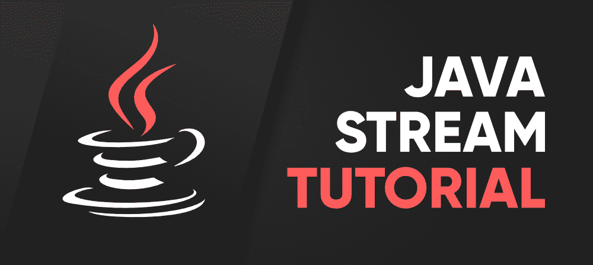
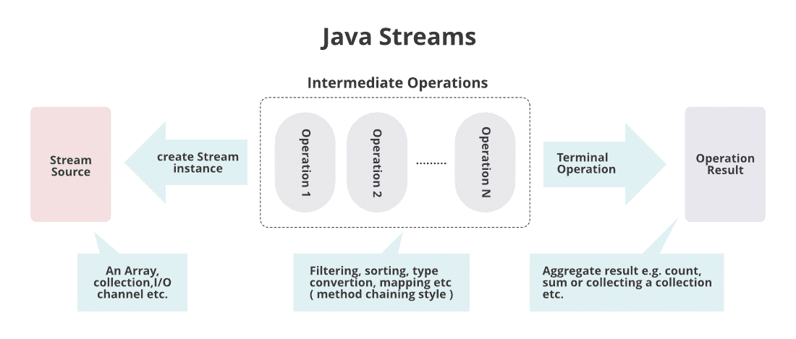
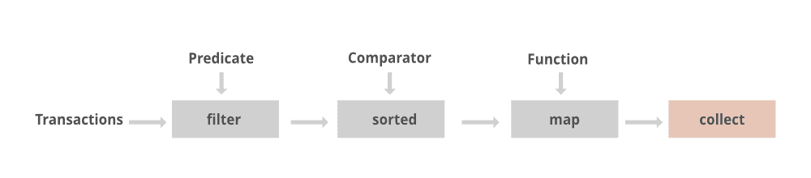
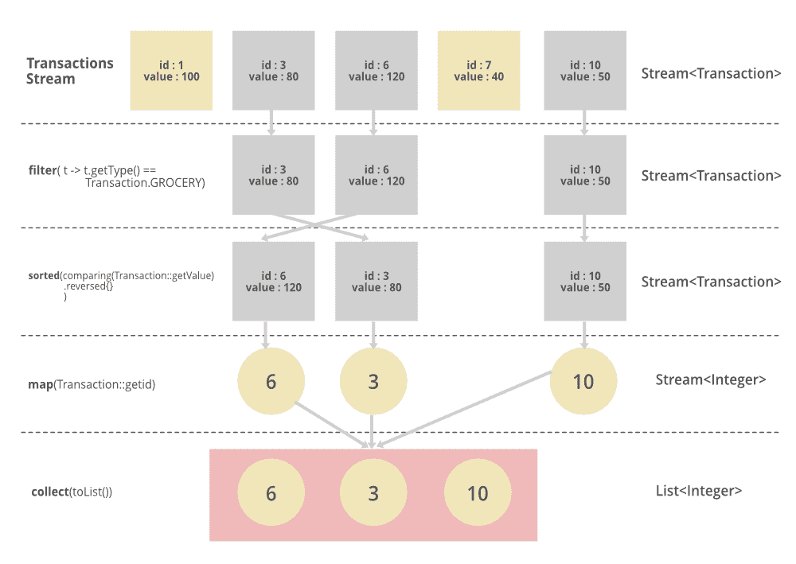

# Java 8 流教程

> 原文:[https://www.geeksforgeeks.org/java-8-stream-tutorial/](https://www.geeksforgeeks.org/java-8-stream-tutorial/)

在 Java 8 中引入了流应用编程接口，用于处理对象集合。一个 ***流是一个支持各种方法*** 的对象序列，这些方法可以被流水线化以产生期望的结果。在继续之前，让我们讨论一下集合和流之间的区别，以便理解为什么引入这个概念。



> **注:**
> 
> *   如果我们想将一组对象表示为一个实体，那么我们应该选择 [**集合**](https://www.geeksforgeeks.org/collections-in-java-2/) 。
> *   但是如果我们想处理集合中的对象，那么我们应该选择流。

如果我们想使用 stream 的概念，那么 stream()就是要使用的方法。流可用作接口。

```
Stream s = c.stream();
```

在上面的前置标签中，“c”指的是集合。所以在集合上，我们调用 ***stream()方法*** ，同时，我们将其存储为 stream 对象。从今以后，我们用这种方式获得流对象。

> **注意:**流存在于名为**的 java 实用程序包中**

现在让我们从流中涉及的基本组件开始。它们如下所示:

*   元素序列
*   来源
*   聚合操作
*   管道铺设
*   内部迭代

**Java 流的特点？**

*   流不是数据结构，而是从集合、数组**、**或输入/输出通道中获取输入。
*   流不改变原始的数据结构，它们只根据流水线方法提供结果。
*   每个中间操作都被延迟执行，并作为结果返回一个流，因此各种中间操作可以被流水线化。终端操作标记流的结尾并返回结果。

在继续讨论这个概念之前，考虑一个例子，其中我们有一个整数数组列表，我们假设我们应用一个过滤器，从插入的对象中只得到偶数。



**流在内部是如何工作的？**

*在溪流中，*

*   为了从对象中过滤掉，我们有一个名为 ***过滤器()*** 的函数
*   为了强加一个条件，我们确实有一个谓词逻辑，它只不过是一个功能接口。这里函数接口可以用随机表达式代替。因此，我们可以直接将条件检入我们的谓词。
*   为了收集元素，我们将使用***collectors . tolist()***来收集所有需要的元素。
*   最后，我们将这些元素存储在一个列表中，并在控制台上显示输出。

**例**

## Java 语言(一种计算机语言，尤用于创建网站)

```
// Java Program to illustrate FILTER & COLLECT Operations

// Importing input output classes
import java.io.*;

// Importing utility class for List and ArrayList classes
import java.util.*;

// Importing stream classes
import java.util.stream.*;

// Main class
public class GFG {

    // Main driver method
    public static void main(String[] args)
    {

        // Creating an ArrayList object of integer type
        ArrayList<Integer> al = new ArrayList<Integer>();

        // Inserting elements to ArrayList class object
        // Custom input integer numbers
        al.add(2);
        al.add(6);
        al.add(9);
        al.add(4);
        al.add(20);

        // First lets print the collection
        System.out.println("Printing the collection : "
                           + al);

        // Printing new line for better output readability
        System.out.println();

        // Stream operations
        // 1\. Getting the stream from this collection
        // 2\. Filtering out only even elements
        // 3\. Collecting the required elements to List
        List<Integer> ls
            = al.stream()
                  .filter(i -> i % 2 == 0)
                  .collect(Collectors.toList());

        // Print the collection after stream operation
        // as stored in List object
        System.out.println(
            "Printing the List after stream operation : "
            + ls);
    }
}
```

**Output**

```
Printing the collection : [2, 6, 9, 4, 20]

Printing the List after stream operation : [2, 6, 4, 20]
```

**输出解释:**在我们的集合对象中，我们使用 add()操作输入元素。在通过流处理存储它们的对象之后，我们在流的谓词中强加一个条件，只获得偶数元素，我们按照我们的要求获得对象中的元素。因此，流以这种方式帮助我们处理过度处理的集合对象。

**流上的各种核心操作？**


大致有三种类型的操作在流上执行，即如上图所示:

1.  中间操作
2.  终端操作
3.  短路操作

让我们在这里借助一个例子来讨论仅在一定深度的流中的中间操作，以便通过理论方法来计算其他操作。因此，中间操作有以下三种类型:

*   **操作 1:** 过滤()方法
*   **操作 2:** 地图()方法
*   **操作 3:** 排序()方法

这三个都将在下面讨论，因为它们几乎在大多数场景中都是并行的，并且通过在下面的干净 java 程序中实现它们来提供更好的理解。正如我们在上面的例子中已经研究过的，我们试图过滤处理过的对象可以解释为在流上操作的 filter()操作。稍后，从处理对象的过滤元素开始，我们使用 Collectors 将元素收集回列表，我们已经在 Collectors.toList()方法的帮助下为其导入了一个名为 ***的特定包。这在 streams 中被称为 collect()操作，所以这里我们不再单独讨论它们。***

**示例:**

## Java 语言(一种计算机语言，尤用于创建网站)

```
// Java program to illustrate Intermediate Operations
// in Streams

// Importing required classes
import java.io.*;
import java.util.*;
import java.util.stream.*;

// Main class
class Test {

    // Main driver method
    public static void main(String[] args)
    {

        // Creating an integer Arraylist to store marks
        ArrayList<Integer> marks = new ArrayList<Integer>();

        // These are marks of the students
        // Considering 5 students so input entries
        marks.add(30);
        marks.add(78);
        marks.add(26);
        marks.add(96);
        marks.add(79);

        // Printing the marks of the students before grace
        System.out.println(
            "Marks of students before grace : " + marks);

        // Now we want to grace marks by 6
        // using the streams to process over processing
        // collection

        // Using stream, we map every object and later
        // collect to List
        // and store them
        List<Integer> updatedMarks
            = marks.stream()
                  .map(i -> i + 6)
                  .collect(Collectors.toList());

        // Printing the marks of the students after grace
        System.out.println(
            "Marks of students  after grace : "
            + updatedMarks);
    }
}
```

**Output**

```
Marks of students before grace : [30, 78, 26, 96, 79]
Marks of students  after grace : [36, 84, 32, 102, 85]
```

> **注意:**对于每一个对象如果有急迫性要做一些操作不管是平方、双精度还是除此之外的任何操作我们只需要使用 map()函数操作否则尽量使用 filter()函数操作。

现在，极客们，你们很清楚“为什么”流被引入，但是你们应该想知道“在哪里”使用它。答案很简单，因为我们在日常生活中确实经常使用它们。因此，用更简单的话来说，极客可以直接把 p 放在集合概念适用的地方，流概念也可以应用在那里。

### 真实的例子

**示例 1:** 一般来说，在日常世界中，每当从数据库中提取数据时，我们更有可能使用集合，因此 streams 概念本身必须应用于处理已处理的数据。



现在我们将讨论实时例子来关联我们生活中的数据流。这里我们将采用最广泛使用的方式，即:

1.  杂货店里的小溪
2.  移动网络中的数据流

**示例 2:** 杂货店中的溪流



上面提供的图像是以如下流的形式实现的:

```
List<Integer> transactionsIds = 
    transactions.stream()
                .filter(t -> t.getType() == Transaction.GROCERY)
                .sorted(comparing(Transaction::getValue).reversed())
                .map(Transaction::getId)
                .collect(toList());
```

**示例 3:** 移动网络中的流

同样，我们可以采用另一个广泛使用的概念，那就是我们对手机号码的处理。在这里，我们将不会提出列表，只是简单地演示如何在移动网络中由全球各种服务提供商调用流概念。

> 集合可以容纳任意数量的对象，所以让‘mobile number’成为一个集合，让它容纳各种移动号码，比如它容纳 100+个号码作为对象。假设现在只有一家名为“Airtel”的运营商，如果一个国家的州与州之间有任何迁移，我们应该向该运营商发送消息。因此，这里应用了流概念，就好像在处理所有移动号码时，我们将使用流的 filter()方法操作来寻找该载波。通过这种方式，我们能够传递信息，而不需要寻找所有的手机号码，然后传递信息，如果这样做的话，我们会觉得不切实际，因为现在我们已经来不及传递了。这样这些中间操作即 filter()，collect()，map()在现实世界中就有帮助了。处理变得超级简单，这是当今数字世界的必然。

希望现在用户已经意识到 java 中流的力量，就好像我们必须做同样的任务，我们需要映射到每个对象，增加代码长度，降低代码的最优性。通过使用流，我们能够在一行中处理对象本身，而不考虑对象中包含的元素。

> **注意:**过滤、排序、映射，可以连接在一起形成管道。