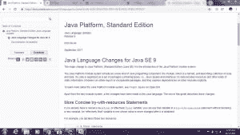
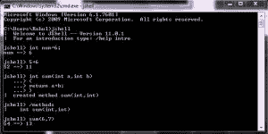

# Java 9 特性附示例

> 原文:[https://www . geesforgeks . org/Java-9-功能-带示例/](https://www.geeksforgeeks.org/java-9-features-with-examples/)

Java 是一种通用的高级编程语言，由太阳微系统公司开发。它是并发的、基于类的、面向对象的，并且被特别设计成具有尽可能少的实现依赖。Java 旨在遵循“在任何地方写一次运行”(WORA)原则，即 Java 旨在独立于平台。

详细了解 Java 编程语言，点击这里。

与任何其他软件一样，Java 在发展和改进的过程中也有许多不同的版本，每次重大升级都会增加新的功能。
Java 9 是 Java 8 的重大升级，为我们开发者带来了很多功能。Java 9 于 2019 年 7 月 27 日发布。在本文中，我们将详细研究 Java 9 的特性:

### 1.改进的 Javadoc

Java 9 更新附带了一个更新的 Java 文档。我们不再需要使用谷歌来找到正确的文档。新的 Javadoc 附带了在 API 文档本身中的搜索权限。此外，Javadoc 输出符合 HTML5。每个 Javadoc 页面都包含类或接口来自哪个 JDK 模块的信息。


### 2.集合的工厂方法(如列表、地图、集合和地图。条目):

很多时候，您希望在您的 Java 程序中创建一个集合(例如，列表或集合)，并用一些元素填充它。这会导致重复编码，在重复编码中，您实例化集合，然后调用几个“add”。在 Java 9 中，增加了几个所谓的收集工厂方法。
列表和集合接口有“of()”方法创建一个空的或非空的不可变列表或集合对象如下所示:
**空列表示例:**

```java
List immutableList = List.of();

```

**非空列表示例:**

```java
List immutableList = List.of("one", "two", "three");

```

Map 有两组方法:of()方法和 ofEntries()方法来创建一个不可变 Map 对象和一个不可变 Map。分别录入对象。
**空图示例:**

```java
jshell> Map emptyImmutableMap = Map.of()
emptyImmutableMap ==> {}

```

**非空地图示例:**

```java
jshell> Map nonemptyImmutableMap = Map.of(1, "one", 2, "two", 3, "three")
nonemptyImmutableMap ==> {2=two, 3=three, 1=one}

```

### 3.互动的爪哇 REPL

甲骨文公司推出了一款名为“jshell”的新工具。它代表 Java Shell，也被称为 REPL(读取评估打印循环)。许多语言已经有了一个交互式的读-评估-打印-循环，Java 现在也加入了这个俱乐部。它用于执行和测试任何 Java 构造，如类、接口、枚举、对象、语句等。非常容易。您可以从控制台启动 jshell，直接开始键入和执行 Java 代码。jshell 的即时反馈使其成为探索 API 和尝试语言特性的绝佳工具。


### 4.流应用编程接口改进:

在 Java SE 9 中，甲骨文公司为 java.util.Stream 接口增加了四种有用的新方法。由于 Stream 是一个接口，所有这些新实现的方法都是默认方法。它允许您在集合上创建声明性的转换管道。有四个新方法被添加到流接口:dropWhile、takeWhile、ofNullable。iterate 方法获得一个新的重载，允许您提供一个关于何时停止迭代的谓词。

### 5.接口中的私有方法:

在 Java 8 中，我们可以使用默认和静态方法在接口中提供方法实现。然而，我们不能在接口中创建私有方法。为了避免冗余代码和更多的可重用性，甲骨文公司在 Java SE 9 接口中引入了私有方法。从 Java SE 9 开始，我们也可以使用“private”关键字在接口中编写私有和私有静态方法。

```java
public interface Card{

  private Long createCardID(){
    // Method implementation goes here.
  }

  private static void displayCardDetails(){
    // Method implementation goes here.
  }

}

```

### 6.多分辨率图像应用编程接口:

在 Java SE 9 中，甲骨文公司引入了一个新的多分辨率图像应用编程接口。这个应用编程接口中的重要接口是多分辨率图像。它在 java.awt.image 包中提供。多分辨率图像封装了一组具有不同高度和宽度的图像，并允许我们根据需求查询它们。

### 7.Java(9)平台模块系统:

java 9 特性的一大变化是模块系统。甲骨文公司在拼图项目中引入了以下功能:

*   模块化 JDK
*   模块化 Java 源代码
*   模块化运行时映像
*   封装 Java 内部应用程序接口
*   Java 平台模块系统

在 Java SE 9 版本之前，我们使用 Monolithic Jars 来开发基于 Java 的应用程序。这种架构有很多限制和缺点。为了避免所有这些缺点，Java SE 9 附带了模块系统。

### 8.工艺应用编程接口的改进:

Java SE 9 在过程应用编程接口方面有所改进。他们增加了几个新的类和方法来简化操作系统进程的控制和管理。
工艺应用编程接口中的两个新接口:

*   java.lang.ProcessHandle
*   java.lang.ProcessHandle.Info

### 9.HTTP/2 客户端

Java 9 提供了一种执行 HTTP 调用的新方法。由于现有的或传统的 HTTP 客户端应用编程接口有许多问题(如支持 HTTP/1.1 协议，不支持 HTTP/2 协议和网络套接字，仅在阻塞模式下工作)和许多性能问题。)，他们正在用新的 HTTP 客户端替换这个 HTTP 连接 API。他们将在“java.net.http”包下引入新的 HTTP 2 Client API。它支持 HTTP/1.1 和 HTTP/2 协议。它支持同步(阻塞模式)和异步模式。它支持使用网络套接字接口的异步模式。

```java
HttpClient client = HttpClient.newHttpClient();

HttpRequest req =
   HttpRequest.newBuilder(URI.create("http://www.google.com"))
              .header("User-Agent", "Java")
              .GET()
              .build();

HttpResponse resp = client.send(req, HttpResponse.BodyHandler.asString());

```

### 10.其他 Java 9 特性:

*   垃圾收集器的改进
*   堆栈跟踪应用编程接口
*   过滤传入的序列化数据
*   不推荐使用 applet api
*   独立字符串连接
*   增强的方法句柄
*   平台日志应用编程接口和服务
*   紧凑字符串
*   纳斯霍恩解析器应用编程接口
*   Javadoc 搜索

_ _ _ _ _ _ _ _ _ _ _ _ _ _ _ _ _ _ _ _ _ _ _ _ _ _ _ _ _ _ _ _ _ _ _ _ _ _ _ _ _ _ _ _ _ _ _ _ _ _ _ _ _ _ _ _ _ _ _ _ _ _ _ _ _ _ _ _ _ _ _ _ _ _ _ _ _ _ _ _ _ _ _ _ _ _ _ _ _ _ _ _ _ _ _ _ _ _ _ _
注意事项:Java SE 9 已到达支持的终点。Java SE 9 的用户应该切换到 Java SE 10 或更高版本。

了解更多 Java 的有用链接:
1。[维基百科](https://en.wikipedia.org/wiki/Java_version_history#Java_9)
2。[甲骨文文档](https://docs.oracle.com/javase/9/whatsnew/toc.htm#JSNEW-GUID-C23AFD78-C777-460B-8ACE-58BE5EA681F6)