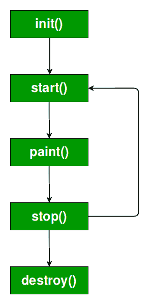
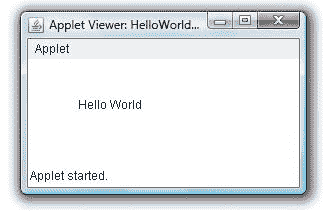

# Java 小程序基础知识

> 原文:[https://www.geeksforgeeks.org/java-applet-basics/](https://www.geeksforgeeks.org/java-applet-basics/)

让我们先了解一下图形用户界面支持多少个软件包:

1.  抽象窗口工具包
2.  摇摆

**制作 GUI 应用的回溯:**
Java 于 1996 年 1 月 23 日(JDK 1.0)上线，当时只支持 CUI(字符用户界面)应用。但是在 1996 年，微软的 VB(Visual Basic)被优先用于图形用户界面编程。所以着急的 Java 开发人员(即 7 天之内)已经从操作系统(OS)中给出了对 GUI 的支持。现在，像按钮等组件。依赖于平台(即每个平台都有不同大小、形状的按钮)。但是他们做了所有平台的这些组件的交集，并给出了一个包含这些交集的小库，它在 AWT(抽象窗口工具包)技术中是可用的，但是它没有对话框等高级功能。

现在要运行 Applet，java 需要一个浏览器，当时只有微软的“Internet Explorer”，但微软相信垄断。所以“SUN Micro-System”(开发 Java 的公司)与其他被称为“网景”(开发 Java Script)的公司签约，现在的“网景”公司也被称为“Mozilla Firefox”，我们都知道它是一个浏览器。现在，这两家公司开发了一种叫做“SWING”的技术，好处是 SWING 组件是由 Java 自己生产的。因此，现在它是独立于平台的，并且还增加了一些 AWT 技术中没有的附加功能。所以我们可以说，与 AWT 技术相比，SWING 要先进得多。

**什么是小程序？**
小程序是一个可以嵌入网页的 Java 程序。它在网络浏览器内部运行，在客户端工作。applet 是使用 APPLET 或 OBJECT 标记嵌入到 HTML 页面中的，并托管在网络服务器上。
用小程序让网站更有活力，更有娱乐性。

**重要点:**

1.  所有小程序都是[*Java . applet . applet*](https://docs.oracle.com/javase/7/docs/api/java/applet/Applet.html)类的子类(直接或间接)。
2.  小程序不是独立的程序。相反，它们在网络浏览器或小程序浏览器中运行。JDK 提供了一个名为 applet viewer 的标准 applet viewer 工具。
3.  一般来说，applet 的执行不会从 main()方法开始。
4.  小程序窗口的输出不由 *System.out.println()* 执行。而是用各种 AWT 方法处理，比如*拉绳()*。

**小程序的生命周期:**



理解上图所示各种方法的调用顺序非常重要。当一个小程序开始时，按以下顺序调用下列方法:

1.  init()
2.  开始( )
3.  油漆( )

当 applet 被终止时，会发生以下方法调用序列:

1.  停止( )
2.  销毁( )

让我们更仔细地看看这些方法。

**1。init( ) :** 第一个被调用的方法是 **init( )** 方法。这是您应该初始化变量的地方。这个方法在小程序运行期间只被调用一次**。**

****2。start( ) :** 在 **init( )** 之后调用 **start( )** 方法。它也被调用来在小程序停止后重新启动它。请注意， **init( )** 被调用一次，即在第一次加载小程序时，而 **start( )** 在每次小程序的 HTML 文档显示在屏幕上时被调用。因此，如果用户离开网页并返回，小程序将在 **start( )** 继续执行。**

****3。paint( ) :** 每次必须重新绘制基于 AWT 的小程序的输出时，都会调用 **paint( )** 方法。出现这种情况有几个原因。例如，运行小程序的窗口可能会被另一个窗口覆盖，然后被打开。或者小程序窗口可以最小化，然后恢复。
**paint( )** 也是在小程序开始执行的时候调用。不管是什么原因，只要小程序必须重绘输出，就会调用 **paint( )** 。
**绘制()**方法有一个类型为[图形](https://docs.oracle.com/javase/7/docs/api/java/awt/Graphics.html)的参数。该参数将包含图形上下文，描述小程序运行的图形环境。每当需要输出到 applet 时，就使用这个上下文。
注意:这是上面提到的所有方法中唯一的方法，是参数化的。它的原型是
公共空漆(Graphics g)
，其中 g 是 Graphics 类的对象引用。**

**现在**问题出现了:****

****Q.** 在 paint()方法的原型中，我们已经创建了一个对象引用，但没有创建它的对象。但是怎么可能不创建对象就创建对象引用呢？**

****Ans。**每当我们在参数中传递对象引用时，对象将由其调用者自己提供。在这种情况下，paint()方法的调用方是 browser，因此它将提供一个对象。当我们在普通的 Java 程序中创建一个非常基本的程序时，也会发生同样的事情。例如:**

```java
public static void main(String []args){}
```

**在这里，我们创建了一个对象引用，但没有创建它的对象，但它仍然运行，因为它是调用者，即 JVM 将为它提供一个对象。**

****4。stop( ) :** 当网络浏览器离开包含小程序的 HTML 文档时，例如，当它转到另一个页面时，会调用 **stop( )** 方法。调用 **stop( )** 时，小程序可能正在运行。您应该使用 **stop( )** 在小程序不可见时挂起不需要运行的线程。如果用户返回页面，当调用 **start( )** 时，可以重新启动它们。**

****5。destroy( ) :** 当环境确定您的小程序需要从内存中完全移除时，会调用 **destroy( )** 方法。此时，您应该释放 applet 可能正在使用的任何资源。**停止()**方法总是在**破坏()**之前调用。**

****创建 HelloWorld 小程序:**
让我们从 Hello World 小程序开始:**

## **Java 语言(一种计算机语言，尤用于创建网站)**

```java
// A Hello World Applet
// Save file as HelloWorld.java

import java.applet.Applet;
import java.awt.Graphics;

// HelloWorld class extends Applet
public class HelloWorld extends Applet
{
    // Overriding paint() method
    @Override
    public void paint(Graphics g)
    {
        g.drawString("Hello World", 20, 20);
    }

}
```

****说明:****

1.  **上面的 java 程序以两个导入语句开始。第一个 import 语句从 applet 包中导入 Applet 类。您创建的每个基于 AWT 的(抽象窗口工具包)小程序都必须是小程序类的子类(直接或间接)。第二条语句从 AWT 包导入[图形](https://docs.oracle.com/javase/7/docs/api/java/awt/Graphics.html)类。**
2.  **程序的下一行声明了类 HelloWorld。此类必须声明为公共类，因为它将被程序外的代码访问。在 HelloWorld 内部，声明 **paint( )** 。这个方法是由 AWT 定义的，必须被 applet 覆盖。**
3.  ****paint( )** 里面是对*drawl()*的调用，它是 [Graphics](https://docs.oracle.com/javase/7/docs/api/java/awt/Graphics.html) 类的成员。此方法输出从指定的 X，Y 位置开始的字符串。它有以下一般形式:**

```java
void drawString(String message, int x, int y)
```

**这里，message 是从 x，y 开始输出的字符串。在 Java 窗口中，左上角是位置 0，0。调用小程序中的*drawl()*会导致从位置 20，20 开始显示消息“Hello World”。**

**注意小程序没有 **main( )** 方法。与 Java 程序不同，小程序不会在 **main( )** 开始执行。事实上，大多数小程序甚至没有 **main( )** 方法。相反，当小程序的类名被传递给小程序查看器或网络浏览器时，小程序开始执行。**

****运行 HelloWorld Applet :**
输入 HelloWorld.java 的源代码后，按照编译 java 程序的相同方式进行编译(使用 *javac* 命令)。但是，用 *java* 命令运行 HelloWorld 会产生错误，因为它不是一个应用程序。**

```java
java HelloWorld

Error: Main method not found in class HelloWorld, 
please define the main method as:
   public static void main(String[] args)
```

**运行小程序有两种标准方式:**

1.  **在兼容 Java 的网络浏览器中执行小程序。**
2.  **使用小程序查看器，如标准工具小程序查看器。小程序查看器在窗口中执行您的小程序。这通常是测试小程序最快最简单的方法。**

**接下来将描述这些方法中的每一种。**

****1。使用支持 java 的网络浏览器:**要在网络浏览器中执行小程序，我们必须编写一个简短的 HTML 文本文件，其中包含一个加载小程序的标签。为此，我们可以使用 APPLET 或 OBJECT 标签。使用 APPLET，下面是执行 HelloWorld 的 HTML 文件:**

```java
<applet code="HelloWorld" width=200 height=60>
</applet>
```

**宽度和高度语句指定小程序使用的显示区域的尺寸。APPLET 标签包含其他几个选项。创建这个 html 文件后，您可以使用它来执行 applet。**

****注意:** Chrome 和 Firefox 不再支持 NPAPI(Java 小程序所需的技术)。在此参考**

****2。使用 appletviewer :** 这是运行 applet 最简单的方法。要使用小程序查看器执行 HelloWorld，您也可以执行前面显示的 HTML 文件。例如，如果前面的 HTML 文件与
RunHelloWorld.html 一起保存，那么下面的命令行将运行 HelloWorld:**

```java
appletviewer RunHelloWorld.html
```

****

****3。带有 java 源文件的 appletviewer:**如果您在包含 applet 标记的 Java 源代码文件的头部包含注释，那么您的代码将记录有必要的 HTML 语句的原型，您只需用 Java 源代码文件启动 APPLET viewer，就可以运行编译后的 APPLET。如果使用此方法，HelloWorld 源文件如下所示:**

## **Java 语言(一种计算机语言，尤用于创建网站)**

```java
// A Hello World Applet
// Save file as HelloWorld.java

import java.applet.Applet;
import java.awt.Graphics;

/*
<applet code="HelloWorld" width=200 height=60>
</applet>
*/

// HelloWorld class extends Applet
public class HelloWorld extends Applet
{
    // Overriding paint() method
    @Override
    public void paint(Graphics g)
    {
        g.drawString("Hello World", 20, 20);
    }

}
```

**使用这种方法，首先编译 HelloWorld.java 文件，然后简单地运行下面的命令来运行 applet:**

```java
appletviewer HelloWorld
```

****为了证明上述观点，即油漆被反复调用。****

**为了证明这一点，我们先来研究一下小程序中的“状态栏”是什么:
“状态栏”在小程序的左下方窗口中是可用的。要使用状态栏并在其中写入内容，我们使用方法 showStatus()，其原型为
公共 void showStatus(String)
默认情况下，状态栏显示“Applet Started”
默认背景颜色为白色。**

**为了证明 paint()方法被反复调用，下面是代码:**

**注意:这段代码是关于 Netbeans IDE 的。**

## **Java 语言(一种计算机语言，尤用于创建网站)**

```java
//code to illustrate paint 
//method gets called again
//and again

import java.applet.*;// used
//to access showStatus()
import java.awt.*;//Graphic
//class is available in this package
import java.util.Date;// used 
//to access Date object
public class GFG extends Applet
{
public void paint(Graphics g)
{
Date dt = new Date();
super.showStatus("Today is" + dt);
//in this line, super keyword is
// avoidable too.
}
}
```

**注:-这里我们可以看到，如果屏幕最大化或最小化，我们将获得一个更新的时间。这说明 paint()被反复调用。**

**【HTML 上小程序的特性**

*   **显示 web 应用程序的动态网页。**
*   **播放声音文件。**
*   **显示文档**
*   **播放动画**

****对 Java 小程序的限制****

**出于安全原因，对 Java 小程序施加了以下限制:**

1.  **applet 无法加载库或定义本机方法。**
2.  **applet 通常不能在执行主机上读取或写入文件。**
3.  **小程序无法读取某些系统属性。**
4.  **小程序无法建立网络连接，除非连接到它来自的主机。**
5.  **小程序无法在执行它的主机上启动任何程序。**

**本文由**克里希纳·巴蒂亚和帕万·戈帕尔·拉亚帕蒂**供稿，并由 [<u>苏里亚·普里</u>](https://auth.geeksforgeeks.org/user/Surya%20Priy/articles) 进一步完善。如果你喜欢 GeeksforGeeks，想投稿，也可以使用[<u>【contribute.geeksforgeeks.org】</u>](http://www.contribute.geeksforgeeks.org/)写一篇文章，或者把文章邮寄到 contribute@geeksforgeeks.org。看到你的文章出现在极客博客主页上，帮助其他极客。**