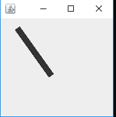

# Java 小程序|使用 drawLine()方法画线

> 原文:[https://www . geesforgeks . org/Java-applet-draw-a-line-use-draw line-method/](https://www.geeksforgeeks.org/java-applet-draw-a-line-using-drawline-method/)

本文将解释在 Java 中使用 paint 绘制线条的代码。这使用了 drawLine()方法。

**语法:**

```java
drawLine(int x1, int y1, int x2, int y2)
```

**参数:**draw line 方法采用四个参数:

*   **x1**–取第一点的 x 坐标。
*   **y1**–取第一点的 y 坐标。
*   **x2**–取第二个点的 x 坐标。
*   **y2**–取第二个点的 y 坐标

**结果:**此方法将绘制一条从(x1，y1)坐标到(x2，y2)坐标的直线。

以下程序说明了上述问题:

**示例:**

```java
// Java program to draw a line in Applet

import java.awt.*;
import javax.swing.*;
import java.awt.geom.Line2D;

class MyCanvas extends JComponent {

    public void paint(Graphics g)
    {

        // draw and display the line
        g.drawLine(30, 20, 80, 90);
    }
}

public class GFG1 {
    public static void main(String[] a)
    {

        // creating object of JFrame(Window popup)
        JFrame window = new JFrame();

        // setting closing operation
        window.setDefaultCloseOperation(JFrame.EXIT_ON_CLOSE);

        // setting size of the pop window
        window.setBounds(30, 30, 200, 200);

        // setting canvas for draw
        window.getContentPane().add(new MyCanvas());

        // set visibility
        window.setVisible(true);
    }
}
```

**输出:**


**注意:**以上函数是 java.awt 包的一部分，属于 java.awt.Graphics 类。此外，这些代码可能无法在联机编译器中运行，请使用脱机编译器。x1、x2、y1 和 y2 坐标可以由程序员根据需要进行更改。