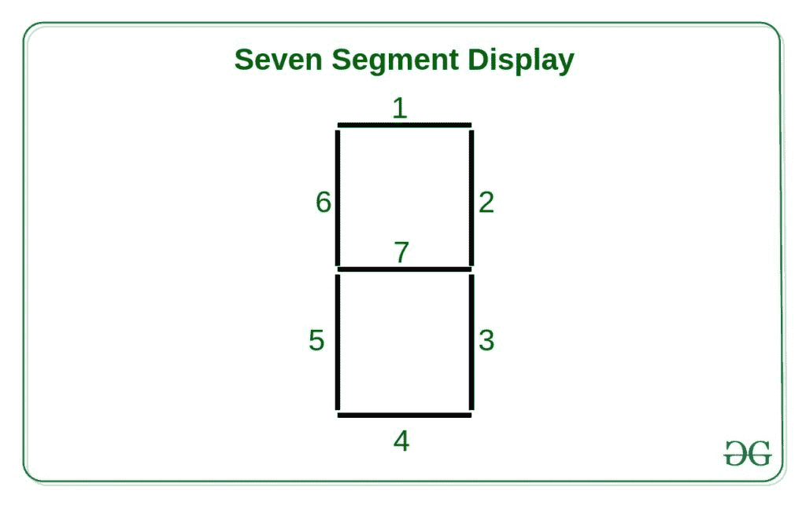

# Java 小程序|如何显示数字钟

> 原文:[https://www . geesforgeks . org/Java-applet-如何显示数字时钟/](https://www.geeksforgeeks.org/java-applet-how-to-display-a-digital-clock/)

在本文中，我们将以 1 秒钟的延迟来制作 applet 窗口的动画。想法是显示每个实例的系统时间。



**方法:**
这里使用 Java Applet 库创建了 6 个七段显示，以 HH:MM:SS 格式打印系统时间。七段显示器的每一段，编号如下，可以用不同的组合来表示数字 0-9。

我们有 6 个七段显示屏，用于以 HH:MM:SS 模式显示时间。编号如下的每个片段可以用不同的组合来表示数字 0-9。

我们可以假设每个单独的段为 1 位，因此(0-9) 10 个数字可以组成 10 种不同的组合。
例如，如果我们想要显示 0，我们应该点亮片段 0、1、2、3、4、5。所以这个组合将使数字(2^0 | 2^1 | 2^2 | 2^3 | 2^4 | 2^5) = 63。


下面是上述方法的实现:

## Java 语言(一种计算机语言，尤用于创建网站)

```
// Java program to illustrate
// digital clock using Applets

import java.applet.Applet;
import java.awt.*;
import java.util.*;

public class digitalClock extends Applet {

    @Override
    public void init()
    {
        // Applet window size
        this.setSize(new Dimension(800, 400));
        setBackground(Color.white);
        new Thread() {
            @Override
            public void run()
            {
                while (true) {
                    repaint();
                    delayAnimation();
                }
            }
        }.start();
    }

    // Animating the applet
    private void delayAnimation()
    {
        try {

            // Animation delay is 1000 milliseconds
            Thread.sleep(1000);
        }
        catch (InterruptedException e) {
            e.printStackTrace();
        }
    }

    // Function that receive segment combination value
    // for each digit, position of the display
    public void display(int val, int pos, Graphics g)
    {

        // lit-up the i-th segment

        // 0-th segment
        if ((val & 1) != 0)
            g.fillRect(pos, 150, 5, 50);

        // 1-st segment
        if ((val & 2) != 0)
            g.fillRect(pos, 145, 50, 5);

        // 2-nd segment
        if ((val & 4) != 0)
            g.fillRect(pos + 45, 150, 5, 50);

        // 3-rd segment
        if ((val & 8) != 0)
            g.fillRect(pos + 45, 200, 5, 50);

        // 4-th segment
        if ((val & 16) != 0)
            g.fillRect(pos, 250, 50, 5);

        // 5-th segment
        if ((val & 32) != 0)
            g.fillRect(pos, 200, 5, 50);

        // 6-th segment
        if ((val & 64) != 0)
            g.fillRect(pos + 5, 200, 40, 5);
    }

    // Paint the applet
    @Override
    public void paint(Graphics g)
    {
        // Combination values of different digits
        int[] digits
            = new int[] { 63, 12, 118,
                          94, 77, 91,
                          123, 14, 127,
                          95 };

        // Get the system time
        Calendar time = Calendar.getInstance();

        int hour = time.get(Calendar.HOUR_OF_DAY);
        int minute = time.get(Calendar.MINUTE);
        int second = time.get(Calendar.SECOND);

        // Deciding AM/PM
        int am = 1;
        if (hour > 12) {
            hour -= 12;
            am = 0;
        }

        // Display hour

        // tens digit
        display(digits[hour / 10], 150, g);
        // units digit
        display(digits[hour % 10], 225, g);

        // Display minute

        // tens digit
        display(digits[minute / 10], 325, g);
        // units digit
        display(digits[minute % 10], 400, g);

        // Display second

        // tens digit
        display(digits[second / 10], 500, g);
        // units digit
        display(digits[second % 10], 575, g);

        // Display AM/PM
        if (am == 1)
            g.drawString("am", 650, 250);
        else
            g.drawString("pm", 650, 250);

        // Display ratio signs
        g.fillRect(300, 175, 5, 5);
        g.fillRect(300, 225, 5, 5);

        g.fillRect(475, 175, 5, 5);
        g.fillRect(475, 225, 5, 5);
    }
}
```

**输出:**

<video class="wp-video-shortcode" id="video-295472-1" width="640" height="360" preload="metadata" controls=""><source type="video/mp4" src="https://media.geeksforgeeks.org/wp-content/uploads/20190401143212/digitalclock1.mp4?_=1">[https://media.geeksforgeeks.org/wp-content/uploads/20190401143212/digitalclock1.mp4](https://media.geeksforgeeks.org/wp-content/uploads/20190401143212/digitalclock1.mp4)</video>