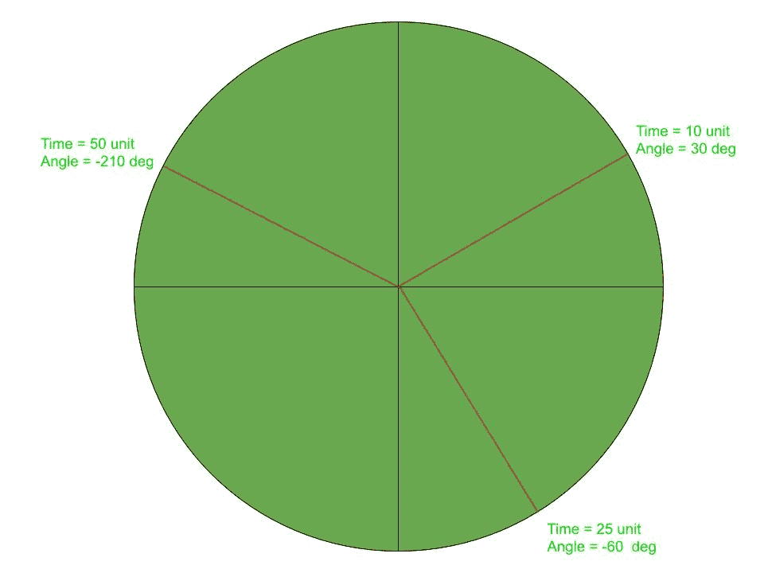

# Java 小程序|如何显示模拟时钟

> 原文:[https://www . geesforgeks . org/Java-applet-如何显示模拟时钟/](https://www.geeksforgeeks.org/java-applet-how-to-display-an-analog-clock/)

在本文中，我们将制作小程序窗口的动画，以显示延迟为 1 秒的**模拟时钟**。想法是显示每个实例的系统时间。

[](https://media.geeksforgeeks.org/wp-content/uploads/20190521195021/analogClock1.jpg)

**进场:**
时钟的每一只指针都将以 1 秒的延迟动画化，保持一端在中心。另一端的位置可以由系统时间导出。时钟的指针在每一秒钟内形成的角度在整个旅程中会有所不同。这就是为什么不同的实例与水平线成不同的角度。

**如何跑:**

```
1\. Save the file as analogClock.java 
   and run the following commands.
2\. javac analogClock.java
3\. appletviewer analogClock.java

```

下面是上述方法的实现:

**程序:**

```
// Java program to illustrate
// analog clock using Applets

import java.applet.Applet;
import java.awt.*;
import java.util.*;

public class analogClock extends Applet {

    @Override
    public void init()
    {
        // Applet window size & color
        this.setSize(new Dimension(800, 400));
        setBackground(new Color(50, 50, 50));
        new Thread() {
            @Override
            public void run()
            {
                while (true) {
                    repaint();
                    delayAnimation();
                }
            }
        }.start();
    }

    // Animating the applet
    private void delayAnimation()
    {
        try {

            // Animation delay is 1000 milliseconds
            Thread.sleep(1000);
        }
        catch (InterruptedException e) {
            e.printStackTrace();
        }
    }

    // Paint the applet
    @Override
    public void paint(Graphics g)
    {
        // Get the system time
        Calendar time = Calendar.getInstance();

        int hour = time.get(Calendar.HOUR_OF_DAY);
        int minute = time.get(Calendar.MINUTE);
        int second = time.get(Calendar.SECOND);

        // 12 hour format
        if (hour > 12) {
            hour -= 12;
        }

        // Draw clock body center at (400, 200)
        g.setColor(Color.white);
        g.fillOval(300, 100, 200, 200);

        // Labeling
        g.setColor(Color.black);
        g.drawString("12", 390, 120);
        g.drawString("9", 310, 200);
        g.drawString("6", 400, 290);
        g.drawString("3", 480, 200);

        // Declaring variables to be used
        double angle;
        int x, y;

        // Second hand's angle in Radian
        angle = Math.toRadians((15 - second) * 6);

        // Position of the second hand
        // with length 100 unit
        x = (int)(Math.cos(angle) * 100);
        y = (int)(Math.sin(angle) * 100);

        // Red color second hand
        g.setColor(Color.red);
        g.drawLine(400, 200, 400 + x, 200 - y);

        // Minute hand's angle in Radian
        angle = Math.toRadians((15 - minute) * 6);

        // Position of the minute hand
        // with length 80 unit
        x = (int)(Math.cos(angle) * 80);
        y = (int)(Math.sin(angle) * 80);

        // blue color Minute hand
        g.setColor(Color.blue);
        g.drawLine(400, 200, 400 + x, 200 - y);

        // Hour hand's angle in Radian
        angle = Math.toRadians((15 - (hour * 5)) * 6);

        // Position of the hour hand
        // with length 50 unit
        x = (int)(Math.cos(angle) * 50);
        y = (int)(Math.sin(angle) * 50);

        // Black color hour hand
        g.setColor(Color.black);
        g.drawLine(400, 200, 400 + x, 200 - y);
    }
}
```

**输出:**

<video class="wp-video-shortcode" id="video-308743-1" width="640" height="358" preload="metadata" controls=""><source type="video/mp4" src="https://media.geeksforgeeks.org/wp-content/uploads/20190514184622/analogClock1.mp4?_=1">[https://media.geeksforgeeks.org/wp-content/uploads/20190514184622/analogClock1.mp4](https://media.geeksforgeeks.org/wp-content/uploads/20190514184622/analogClock1.mp4)</video>