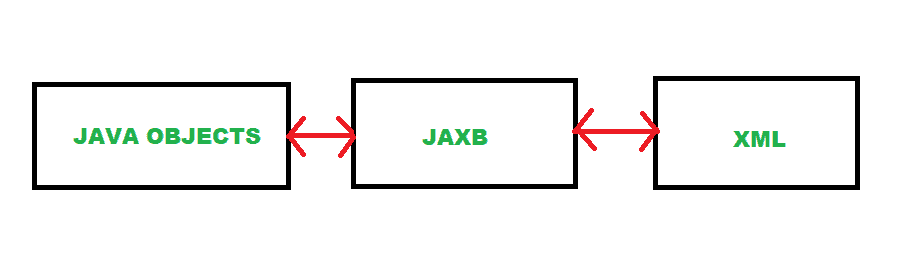

# 面向 XML 绑定的 Java 架构(JAXB ) | Set-1

> 原文:[https://www . geesforgeks . org/Java-architecture-for-XML-binding-JAXB-set-1/](https://www.geeksforgeeks.org/java-architecture-for-xml-binding-jaxb-set-1/)

面向 XML 绑定的 Java 架构(JAXB)定义了一个用于在 XML 文档中读写 Java 对象的应用编程接口。JAXB 为 Java 开发人员提供了一种高效且标准的 XML 和 Java 代码之间的映射方式。JAXB 使开发人员更容易用 XML 和网络服务技术扩展他们的应用程序。起初，JAXB 是作为一个单独的项目开发的，但它最终在 Java 6 中成为了 JDK 的一部分。



面向 XML 绑定函数的 Java 体系结构

### JAXB 的应用

JAXB 框架有助于执行以下操作:

*   将 XML 内容更改为 Java 表示形式。
*   访问和更新 Java 表示
*   将 Java 表示更改为 XML 内容。

### JAXB 注释

JAXB 使用注释来指示中心元素。可以在 java 类中用于 JAXB 操作的一些基本 JAXB 注释是:

| 注释 | 描述 |
| --- | --- |
| **@XmlRootElement** | 必须要求在 JAXB 中使用对象的注释。它定义了 XML 内容的根元素。 |
| **@XmlType** | 它将类映射到 XML 模式类型。这是可选的。我们使用@ XmlType(proorder = {“按顺序排列的属性列表”})注释来定义 XML 文件中元素的特定顺序。 |
| **@ xmlttransient** | 要将一个对象排除在继承层次结构的映射之外，只需要用@ XmlTransient 对其进行注释。 |
| **@XmlAttribute** | 这将创建对象属性作为属性。 |
| @ XML element | 它用于定义 XML 文件中的元素。如果您想为该元素指定一个特定的名称，可以使用@ xmlelelement(name =“Age”)。 |

**与 JAXB 相关的两个基本概念是:**

1.  **编组:**将 java 对象转换为 xml
2.  **解组:**将 xml 转换为 java 对象

### 编组的

下面是将 Java 对象转换为 XML(编组)的分步算法:

1.  首先创建要封送的 Java 对象。
2.  创建 JAXBContext 对象并初始化封送拆收器对象。
3.  要获得格式化的 xml 输出，可以将 JAXB _ FORMATTTED _ OUTPUT 设置为真(这个步骤是可选的)。
4.  通过向文件类提供文件位置作为参数来创建 xml 文件对象
5.  在封送拆收器对象上调用封送方法，并将创建的 XML 文件对象传递给封送方法。
6.  现在创建了 XMl 文件。

**示例**:首先让我们创建一个具有全名、学生学位、学生标记属性的学生对象，然后按照上面的步骤将该对象转换为 XML Schema。

创建具有全名、学生学位、学生标记属性的 StudentMarks 类。

```java
import java.util.ArrayList;

import javax.xml.bind.annotation.XmlElement;
import javax.xml.bind.annotation.XmlRootElement;

// Below annotation defines root element of XML file
@XmlRootElement
public class Student {

    private String FullName;
    private String StudentDegree;
    private String StudentMarks;
    public String getFullName()
    {
        return FullName;
    }
    // Sets element of xml with element name is "Student Name"
    @XmlElement(name = "Student Name")
    public void setFullName(String fullName)
    {
        FullName = fullName;
    }
    public String getStudentDegree()
    {
        return StudentDegree;
    }
    @XmlElement(name = "Student Degree")
    public void setStudentDegree(String studentDegree)
    {
        StudentDegree = studentDegree;
    }
    public String getStudentMarks()
    {
        return StudentMarks;
    }
    @XmlElement(name = "Student Marks")
    public void setStudentMarks(String studentMarks)
    {
        StudentMarks = studentMarks;
    }
}
```

**主类:JAVAObjToXml.java**，将学生对象转换为 XML Schema。

```java
import java.io.File;
import java.util.ArrayList;

import javax.xml.bind.JAXBContext;
import javax.xml.bind.JAXBException;
import javax.xml.bind.Marshaller;

public class JAVAObjToXml {
    public static void main(String[] args)
    {

        // creating Student object
        Student student = new Student();
        student.setFullName("Aman Singh");
        student.setStudentDegree("Degree");
        student.setStudentMarks("688/900");

        try {

            // Create JAXB context and initializing Marshaller
            JAXBContext context = JAXBContext.newInstance(Student.class);
            Marshaller marshaller = context.createMarshaller();

            // For formatted output of xml
            marshaller.setProperty(Marshaller.JAXB_FORMATTED_OUTPUT, Boolean.TRUE);

            // Create xml file object
            File XMLfile = new File("D:\\StudentRecord.xml");

            // Java object to XML file
            marshaller.marshal(student, XMLfile);
            // Print to console
            marshaller.marshal(student, System.out);
        }
        catch (JAXBException e) {
            e.printStackTrace();
        }
    }
}
```

**输出**:

> 为学生对象生成了 **StudentRecord.xml** 文件。
> 
> ```java
> <?xml version="1.0" encoding="UTF-8" standalone="yes"?>
> <student>
>     <Student Name>Aman Singh</Student Name>
>     <Student Degree>Degree</Student Degree>
>     <Student Marks>688/900</Student Marks>
> </student>
> ```

### 使用 JAXB 的利弊

**优点:**

*   易于将 XML 文件封送到其他数据目标，如输入流、DOM 节点。
*   容易从其他数据目标中取消标记 XML 文件。
*   不需要了解 XML 解析技术。
*   比 DOM 或 SAX 解析器更容易使用

cons:t1]

*   JAXB 是高层 API，所以它对解析的控制比 SAX 或 DOM 少。
*   它比 SAX 慢。

**参考文献:**

*   [https://javaee . github . io/JAXB-v2/doc/user-guide/ch03 . html #编组-变更-前缀](https://javaee.github.io/jaxb-v2/doc/user-guide/ch03.html#marshalling-changing-prefixes)
*   [https://docs . Oracle . com/javase/tutorial/JAXB/intro/index . html](https://docs.oracle.com/javase/tutorial/jaxb/intro/index.html)