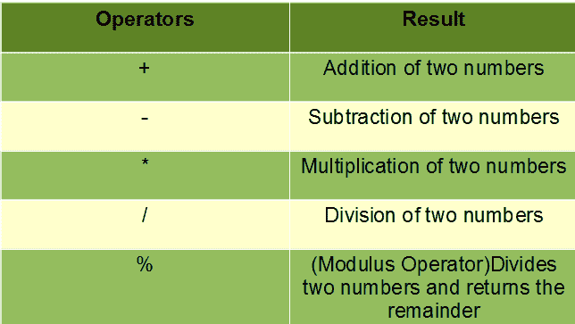

# Java 算术运算符示例

> 原文:[https://www . geesforgeks . org/Java-算术-运算符-带示例/](https://www.geeksforgeeks.org/java-arithmetic-operators-with-examples/)

**运算符**构成了任何编程语言的基本构件。Java 也提供了许多类型的运算符，可以根据执行各种计算和函数的需要来使用，包括逻辑、算术、关系等。它们根据提供的功能进行分类。以下是几种类型:

1.  算术运算符
2.  [一元运算符](https://www.geeksforgeeks.org/java-unary-operator-with-examples/)
3.  [赋值运算符](https://www.geeksforgeeks.org/java-assignment-operator-with-examples/)
4.  [关系运算符](https://www.geeksforgeeks.org/java-relational-operators-with-examples/)
5.  [逻辑运算符](https://www.geeksforgeeks.org/java-logical-operators-with-examples/)
6.  [三元运算符](https://www.geeksforgeeks.org/java-ternary-operator-with-examples/)
7.  [按位运算符](https://www.geeksforgeeks.org/bitwise-operators-in-java/)
8.  [轮班操作员](https://www.geeksforgeeks.org/shift-operator-in-java/?ref=gcse)

这篇文章解释了所有关于算术运算符的知识。

### **算术运算符**

这些运算符包括数学运算符，可用于对称为操作数的原始数据类型执行各种简单或高级的算术运算。这些运算符由各种一元和二元运算符组成，可以应用于单个或两个操作数。让我们看看 Java 在算术运算符下必须提供的各种运算符。



现在让我们看看 Java 中的每一个算术运算符:

**1。加法(+):** 这个运算符是一个二元运算符，用于将两个操作数相加。

**语法:**

```java
num1 + num2
```

**示例:**

```java
num1 = 10, num2 = 20
sum = num1 + num2 = 30
```

## Java 语言(一种计算机语言，尤用于创建网站)

```java
// Java code to illustrate Addition operator

import java.io.*;

class Addition {
    public static void main(String[] args)
    {
        // initializing variables
        int num1 = 10, num2 = 20, sum = 0;

        // Displaying num1 and num2
        System.out.println("num1 = " + num1);
        System.out.println("num2 = " + num2);

        // adding num1 and num2
        sum = num1 + num2;
        System.out.println("The sum = " + sum);
    }
}
```

**Output**

```java
num1 = 10
num2 = 20
The sum = 30
```

**2。减法(-):** 这个运算符是二元运算符，用于减去两个操作数。

**语法:**

```java
num1 - num2
```

**示例:**

```java
num1 = 20, num2 = 10
sub = num1 - num2 = 10
```

## Java 语言(一种计算机语言，尤用于创建网站)

```java
// Java code to illustrate Subtraction operator

import java.io.*;

class Subtraction {
    public static void main(String[] args)
    {
        // initializing variables
        int num1 = 20, num2 = 10, sub = 0;

        // Displaying num1 and num2
        System.out.println("num1 = " + num1);
        System.out.println("num2 = " + num2);

        // subtracting num1 and num2
        sub = num1 - num2;
        System.out.println("Subtraction = " + sub);
    }
}
```

**Output**

```java
num1 = 20
num2 = 10
Subtraction = 10
```

**3。乘法(*):** 此运算符是二进制运算符，用于乘法两个操作数。

**语法:**

```java
num1 * num2
```

**示例:**

```java
num1 = 20, num2 = 10
mult = num1 * num2 = 200
```

## Java 语言(一种计算机语言，尤用于创建网站)

```java
// Java code to illustrate Multiplication operator

import java.io.*;

class Multiplication {
    public static void main(String[] args)
    {
        // initializing variables
        int num1 = 20, num2 = 10, mult = 0;

        // Displaying num1 and num2
        System.out.println("num1 = " + num1);
        System.out.println("num2 = " + num2);

        // Multiplying num1 and num2
        mult = num1 * num2;
        System.out.println("Multiplication = " + mult);
    }
}
```

**Output**

```java
num1 = 20
num2 = 10
Multiplication = 200
```

**4。除法(/:**这是一个二进制运算符，用于将第一个操作数(被除数)除以第二个操作数(除数)，并得出商。

**语法:**

```java
num1 / num2
```

**示例:**

```java
num1 = 20, num2 = 10
div = num1 / num2 = 2
```

## Java 语言(一种计算机语言，尤用于创建网站)

```java
// Java code to illustrate Division operator

import java.io.*;

class Division {
    public static void main(String[] args)
    {
        // initializing variables
        int num1 = 20, num2 = 10, div = 0;

        // Displaying num1 and num2
        System.out.println("num1 = " + num1);
        System.out.println("num2 = " + num2);

        // Dividing num1 and num2
        div = num1 / num2;
        System.out.println("Division = " + div);
    }
}
```

**Output**

```java
num1 = 20
num2 = 10
Division = 2
```

**5。模数(%):** 这是一个二进制运算符，用于在第一个操作数(被除数)除以第二个操作数(除数)时返回余数。

**语法:**

```java
num1 % num2
```

**示例:**

```java
num1 = 5, num2 = 2
mod = num1 % num2 = 1
```

## Java 语言(一种计算机语言，尤用于创建网站)

```java
// Java code to illustrate Modulus operator

import java.io.*;

class Modulus {
    public static void main(String[] args)
    {
        // initializing variables
        int num1 = 5, num2 = 2, mod = 0;

        // Displaying num1 and num2
        System.out.println("num1 = " + num1);
        System.out.println("num2 = " + num2);

        // Remaindering num1 and num2
        mod = num1 % num2;
        System.out.println("Remainder = " + mod);
    }
}
```

**Output**

```java
num1 = 5
num2 = 2
Remainder = 1
```