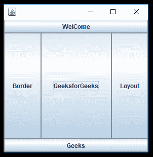
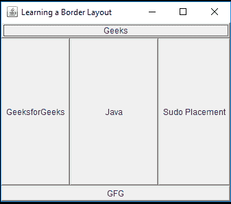

# Java AWT | BorderLayout 类

> 原文:[https://www.geeksforgeeks.org/java-awt-borderlayout-class/](https://www.geeksforgeeks.org/java-awt-borderlayout-class/)

边框布局是窗口对象的默认布局，如 JFrame、JWindow、JDialog、JInternalFrame 等。边框布局在五个区域中排列组件。四个面被称为北、南、东和西。中间部分称为中心。每个区域只能包含一个组件，并由相应的常数标识为 *NORTH* 、 *SOUTH* 、 *EAST* 、 *WEST* 和 *CENTER* 。

**施工人员:**

1.  **BorderLayout():** 它将构建一个新的组件之间没有间隙的 BorderLayout。
2.  **边框布局(int，int):** 它将构建一个带有组件之间指定间隙的边框布局。

**常用方法:**

1.  **toString()** :返回一个表示边框布局状态的字符串。
2.  **getLayoutAlignmentX(容器父级)**:返回沿 X 轴的布局对齐。
3.  **getLayoutAlignmentY(容器父对象)**:它将返回沿 Y 轴的布局对齐。
4.  **removeLayoutComponent(Component comp)**:此方法用于从边框布局中移除指定的组件。
5.  **getVgap()** :返回组件之间的垂直间隙。
6.  **getHgap()** :返回组件之间的水平间隙。
7.  **setHgap(int hgap)** :用于设置组件之间的水平间隙。
8.  **setVgap(int vgap)** :用于设置组件之间的垂直间隙。

以下程序将说明边界布局类:

*   **程序 1:** 以下程序在一个 *JFrame* 中创建 JButton 组件，其实例类为“*borderayoutemo*”。我们创建 5 个 JButton，然后使用 *add()* 方法将它们添加到 *JFrame* 中。我们将分别使用 *setSize()* 和 *setVisible()* 方法设置框架的大小和可见性。布局使用*设置布局()*方法设置。

## Java 语言(一种计算机语言，尤用于创建网站)

```java
// Java program to illustrate the BorderLayout
import java.awt.*;
import java.awt.event.*;
import javax.swing.*;

// class extends JFrame
class BoderLayoutDemo extends JFrame {

    BoderLayoutDemo()
    {

        // Creating Object of Jpanel class
        JPanel pa = new JPanel();

        // set the layout
        pa.setLayout(new BorderLayout());

        // add a new JButton with name "wel" and it is
        // lie top of the container
        pa.add(new JButton("WelCome"), BorderLayout.NORTH);

        // add a new JButton with name "come" and it is
        // lie button of the container
        pa.add(new JButton("Geeks"), BorderLayout.SOUTH);

        // add a new JButton with name "Layout" and it is
        // lie left of the container
        pa.add(new JButton("Layout"), BorderLayout.EAST);

        // add a new JButton with name "Border" and it is
        // lie right of the container
        pa.add(new JButton("Border"), BorderLayout.WEST);

        // add a new JButton with name "hello everybody" and it is
        // lie center of the container
        pa.add(new JButton("GeeksforGeeks"), BorderLayout.CENTER);

        // add the pa object which refer to the Jpanel
        add(pa);

        // Function to close the operation of JFrame.
        setDefaultCloseOperation(JFrame.EXIT_ON_CLOSE);

        // Function to set size of JFrame.
        setSize(300, 300);

        // Function to set visible status of JFrame.
        setVisible(true);
    }
}

class MainFrame {

    // Driver code
    public static void main(String[] args)
    {

        // calling the constructor
        new BoderLayoutDemo();
    }
}
```

**输出:**



*   **程序 2:** 这个程序将展示如何在 BorderLayout 中传递参数。使用**设置背景()**方法设置背景颜色。我们创建了 5 个名为“ *btn1* ”、“ *btn2* ”、“ *btn3* ”、“ *btn4* ”、“ *btn5* ”的 JButton 组件，然后使用 *add()* 方法将其添加到 JFrame 中。我们分别使用 *setTitle()* 、 *setSize()* 和 *setVisible()* 方法设置框架的标题、大小和可见性。布局通过*设置布局()*的方法设置。

## Java 语言(一种计算机语言，尤用于创建网站)

```java
// Java program to illustrate the BorderLayout
import java.awt.*;
import java.awt.event.*;
import javax.swing.*;
import java.awt.BorderLayout;
import java.awt.Frame;
import java.awt.Button;
import java.awt.Color;

// class extends JFrame
public class BorderDemo extends JFrame {

    // Constructor of BorderDemo class.
    public BorderDemo()
    {

        // set the layout
        setLayout(new BorderLayout());

        // set the background
        setBackground(Color.red);

        // creates Button (btn1)
        Button btn1 = new Button("Geeks");

        // creates Button (btn2)
        Button btn2 = new Button("GFG");

        // creates Button (btn3)
        Button btn3 = new Button("Sudo Placement");

        // creates Button (btn4)
        Button btn4 = new Button("GeeksforGeeks");

        // creates Button (btn5)
        Button btn5 = new Button("Java");

        // Adding JButton "btn1" on JFrame.
        add(btn1, "North");

        // Adding JButton "btn2" on JFrame.
        add(btn2, "South");

        // Adding JButton "btn3" on JFrame.
        add(btn3, "East");

        // Adding JButton "btn4" on JFrame.
        add(btn4, "West");

        // Adding JButton "btn5" on JFrame.
        add(btn5, "Center");

        // function to set the title
        setTitle("Learning a Border Layout");

        // Function to set size of JFrame.
        setSize(350, 300);

        // Function to set visible status of JFrame
        setVisible(true);
    }

    // Main Method
    public static void main(String args[])
    {

        // calling the constructor
        new BorderDemo();
    }
}
```

**输出:**



**注意:**上述程序可能无法在在线 IDE 中运行。请使用离线编译器。

**参考:**T2T4】