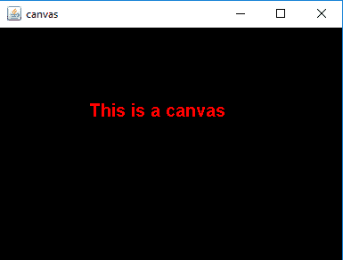
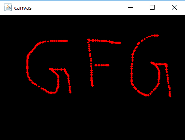

# Java AWT |画布类

> 原文:[https://www.geeksforgeeks.org/java-awt-canvas-class/](https://www.geeksforgeeks.org/java-awt-canvas-class/)

Canvas 类是 Java AWT 的一部分。画布是一个空白的矩形区域，用户可以在其中绘制或捕捉来自用户的输入。画布类继承组件类。
**画布类的构造函数有:**

1.  **画布()**:创建新的空白画布。
2.  **画布(GraphicsConfiguration c)** :用指定的图形配置创建一个新的画布。

画布类中常用的方法

<figure class="table">

| 方法 | 说明 |
| --- | --- |
| **附注()** | 创建画布的对等体。 |
| **createBufferStrategy(int n)** | 为此组件创建一个新的多缓冲策略。 |
| **createBufferStrategy(int n，BufferCapabilities c)** | 在此组件上创建具有所需缓冲能力的多缓冲新策略 |
| **getBufferStrategy()** | 返回此组件使用的缓冲策略。 |
| **油漆(图形 g)** | 油漆这个组件。 |
| **更新(图形 g)** | 更新此画布。 |

</figure>

以下程序说明了画布类的使用:

*   **程序 1:** 创建画布并绘制画布。

## Java 语言(一种计算机语言，尤用于创建网站)

```java
// Java Program to create a to create
// a canvas and paint the canvas
import java.awt.*;
import javax.swing.*;
class canvas extends JFrame {

    // constructor
    canvas()
    {
        super("canvas");

        // create a empty canvas
        Canvas c = new Canvas() {

            // paint the canvas
            public void paint(Graphics g)
            {
                // set color to red
                g.setColor(Color.red);

                // set Font
                g.setFont(new Font("Bold", 1, 20));

                // draw a string
                g.drawString("This is a canvas", 100, 100);
            }
        };

        // set background
        c.setBackground(Color.black);

        add(c);
        setSize(400, 300);
        show();
    }

    // Main Method
    public static void main(String args[])
    {
        canvas c = new canvas();
    }
}
```

*   **输出:**



*   **程序 2:** 创建一个画布，并将鼠标监听器添加到画布上(在画布上鼠标被点击或拖动的点会出现一个半径为 5 的圆)。

## Java 语言(一种计算机语言，尤用于创建网站)

```java
// Java Program to create a
// canvas and mouse listener to the
// canvas ( a circle of radius 5 will appear
// at the points where mouse are clicked or
//  dragged on the canvas)
import java.awt.*;
import javax.swing.*;
import java.awt.event.*;

class canvas extends JFrame implements MouseListener, MouseMotionListener {

    // create a canvas
    Canvas c;

    // constructor
    canvas()
    {
        super("canvas");

        // create a empty canvas
        c = new Canvas() {
            public void paint(Graphics g)
            {
            }
        };

        // set background
        c.setBackground(Color.black);

        // add mouse listener
        c.addMouseListener(this);
        c.addMouseMotionListener(this);

        add(c);
        setSize(400, 300);
        show();
    }

    // mouse listener  and mouse motion listener methods
    public void mouseClicked(MouseEvent e)
    {
        Graphics g = c.getGraphics();

        g.setColor(Color.red);

        // get X and y position
        int x, y;
        x = e.getX();
        y = e.getY();

        // draw a Oval at the point
        // where mouse is moved
        g.fillOval(x, y, 5, 5);
    }

    public void mouseMoved(MouseEvent e)
    {
    }

    public void mouseDragged(MouseEvent e)
    {
        Graphics g = c.getGraphics();

        g.setColor(Color.red);

        // get X and y position
        int x, y;
        x = e.getX();
        y = e.getY();

        // draw a Oval at the point where mouse is moved
        g.fillOval(x, y, 5, 5);
    }

    public void mouseExited(MouseEvent e)
    {
    }

    public void mouseEntered(MouseEvent e)
    {
    }

    public void mouseReleased(MouseEvent e)
    {
    }

    public void mousePressed(MouseEvent e)
    {
    }
    // main class
    public static void main(String args[])
    {
        canvas c = new canvas();
    }
}
```

*   **输出:**



**参考:**T2T4】