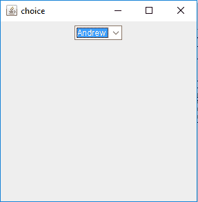
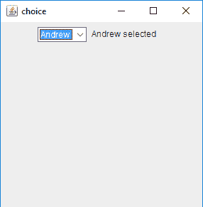
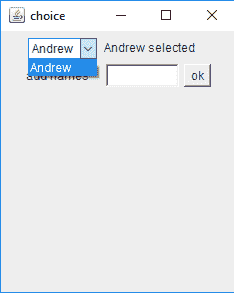

# Java AWT |选择类

> 原文:[https://www.geeksforgeeks.org/java-awt-choice-class/](https://www.geeksforgeeks.org/java-awt-choice-class/)

Choice 类是 Java 抽象窗口工具包(AWT)的一部分。Choice 类为用户提供了一个弹出菜单，用户可以从弹出菜单中选择一个项目。选定的项目出现在顶部。选择类继承了组件。

**选择类的构造函数**

*   **选择()**:创建一个新的空选择菜单。

#### 

选择类的不同方法

| 方法 | 说明 |
| --- | --- |
| **添加(字符串)** | 向此选择菜单添加一个项目。 |
| **addItemListener（ItemListener l）** | 添加指定的项目侦听器，以从该选项菜单接收项目事件。 |
| **附注()** | 创建选择的对等项。 |
| **getAccessibleContext()** | 获取与此选项关联的 AccessibleContext。 |
| **getItem(int i)** | 获取此选择菜单中指定索引处的字符串 |
| getitem count() | 返回此选项菜单中的项目数。 |
| **获取项目听筒（）** | 返回在此选项上注册的所有项目侦听器的数组。 |
| **获取监听器(l 类)** | 返回一个数组，其中包含当前在此选项中注册为愚人的所有对象。 |
| **getSelectedIndex（）** | 返回当前选定项的索引。 |
| **getSelectedItem()** | 获取当前选择的字符串表示形式。 |
| **插入(字符串 s，int i)** | 将项目插入此选项的指定位置。 |
| **paramString()** | 返回表示此选项菜单状态的字符串。 |
| **过程事件(awteve e)** | 根据此选择处理事件。 |
| **加工事件(ItemEvent e)** | 通过将选项菜单上发生的项目事件分派到任何已注册的项目侦听器对象来处理它们。 |
| **移除(int p)** | 从选项菜单的指定位置移除一个项目。 |
| **移除(串)** | 从“选择”菜单中删除第一个出现的项目。 |
| **全部移除()** | 从选项菜单中删除所有项目。 |
| **选择(int p)** | 将此“选择”菜单中的选定项目设置为指定位置的项目。 |

下面的程序说明了 Java AWT 中的 Choice 类:

*   **Program to create a simple choice and add elements to it**:

    ```
    // Java Program to create a simple 
    // choice and add elements to it .
    import java.awt.*;
    import javax.swing.*;

    class choice {

        // choice
        static Choice c;

        // frame
        static JFrame f;

        // default constructor
        choice()
        {
        }

        // Main Method
        public static void main(String args[])
        {

            // create a frame
            f = new JFrame("choice");

            // create e panel
            JPanel p = new JPanel();

            // create a choice
            c = new Choice();

            // add element to the list
            c.add("Andrew");
            c.add("Arnab");
            c.add("Ankit");

            // add choice to panel
            p.add(c);

            // add panel to the frame
            f.add(p);

            // show the frame
            f.show();
            f.setSize(300, 300);
        }
    }
    ```

    **输出:**
    

*   **Program to create a simple choice and add ItemListener to it**:

    ```
    // Java  Program to create a simple
    // choice and add ItemListener to it
    import java.awt.*;
    import javax.swing.*;
    import java.awt.event.*;

    class choice implements ItemListener {

        // choice
        static Choice c;

        // frame
        static JFrame f;

        // label
        static Label l;

        // default constructor
        choice()
        {
        }

        // Main Method
        public static void main(String args[])
        {

            // create a frame
            f = new JFrame("choice");

            // object
            choice ch = new choice();

            // create e panel
            JPanel p = new JPanel();

            // create a choice
            c = new Choice();

            // add element to the list
            c.add("Andrew");
            c.add("Arnab");
            c.add("Ankit");

            // add itemListener to it
            c.addItemListener(ch);

            // create a label
            l = new Label();

            // set the label text
            l.setText(c.getSelectedItem() + " selected");

            // add choice to panel
            p.add(c);
            p.add(l);

            // add panel to the frame
            f.add(p);

            // show the frame
            f.show();
            f.setSize(300, 300);
        }

        // if an item is selected
        public void itemStateChanged(ItemEvent e)
        {
            l.setText(c.getSelectedItem() + " selected");
        }
    }
    ```

    **输出:**

    

*   **用于创建选项并手动添加元素的程序(使用添加(字符串)功能)**:

    ```
    // Java Program to create a choice and
    // manually add elements to it 
    // (using add(String s) function)
    import java.awt.*;
    import javax.swing.*;
    import java.awt.event.*;

    class choice implements ItemListener, ActionListener {

        // choice
        static Choice c;

        // frame
        static JFrame f;

        // label
        static Label l;

        // textfield
        static TextField tf;

        // default constructor
        choice()
        {
        }

        // Main Method
        public static void main(String args[])
        {

            // create a frame
            f = new JFrame("choice");

            // object
            choice ch = new choice();

            // create e panel
            JPanel p = new JPanel();

            // create a choice
            c = new Choice();

            // add element to the list
            c.add("Andrew");

            // create a textfield
            tf = new TextField(7);

            // create a button
            Button b = new Button("ok");

            // add actionListener
            b.addActionListener(ch);

            // add itemListener to it
            c.addItemListener(ch);

            // create a label
            l = new Label();
            Label l1 = new Label("add names");

            // set the label text
            l.setText(c.getSelectedItem() + " selected");

            // add choice to panel
            p.add(c);
            p.add(l);
            p.add(l1);
            p.add(tf);
            p.add(b);

            // add panel to the frame
            f.add(p);

            // show the frame
            f.show();
            f.setSize(250, 300);
        }

        // if an item is selected
        public void itemStateChanged(ItemEvent e)
        {
            l.setText(c.getSelectedItem() + " selected");
        }

        // if button is pressed
        public void actionPerformed(ActionEvent e)
        {
            // add item to the choice
            c.add(tf.getText());
        }
    }
    ```

    **输出:**

     

**注意:**程序可能无法在联机 IDE 中运行，请使用脱机 IDE。

**参考:**[https://docs . Oracle . com/javase/7/docs/API/Java/awt/choice . html](https://docs.oracle.com/javase/7/docs/api/java/awt/Choice.html)