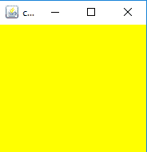
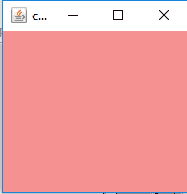
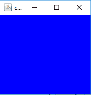
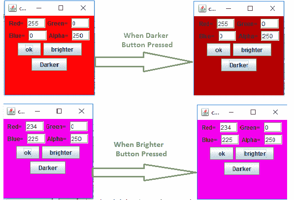
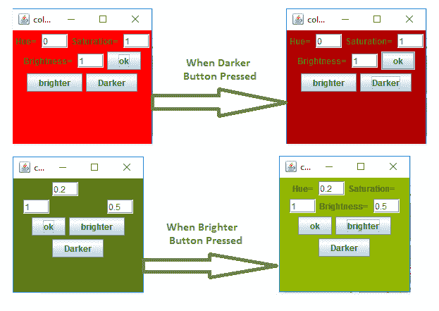

# Java AWT |颜色类

> 原文:[https://www.geeksforgeeks.org/java-awt-color-class/](https://www.geeksforgeeks.org/java-awt-color-class/)

颜色类是 Java 抽象窗口工具包的一部分。颜色类通过使用给定的 RGBA 值创建颜色，其中 **RGBA** 代表红色、绿色、蓝色、阿尔法，或者使用 **HSB** 值，其中 HSB 代表色调、饱和度、颜色。单个分量 RGBA 值的范围为 0 到 255 或 0.0 到 0.1。alpha 的值决定了颜色的不透明度，其中 0 或 0.0 代表完全透明，255 或 1.0 代表不透明。

颜色类的构造函数

1.  **颜色(ColorSpace c，float[] co，float a)** :在指定的 ColorSpace 中使用 float 数组中指定的颜色分量和指定的 alpha 创建颜色。
2.  **颜色(浮动 r、浮动 g、浮动 b)** :创建具有指定 RGB 分量的不透明颜色(值在 0.0–0.1 范围内)
3.  **颜色(浮点 r、浮点 g、浮点 b、浮点 a)** :创建具有指定 RGBA 分量的颜色(值在 0.0–0.1 范围内)
4.  **Color(int rgb)** :用指定的组合 rgb 值创建不透明的 RGB 颜色，该值由第 16-23 位的红色分量、第 8–15 位的绿色分量和第 0-7 位的蓝色分量组成。
5.  **颜色(int rgba，boolean b)** :创建具有指定组合 rgba 值的 sRGB 颜色，该值由位 24-31 中的 alpha 分量、位 16–23 中的红色分量、位 8
    –15 中的绿色分量和位 0–7 中的蓝色分量组成。
6.  **颜色(int r，int g，int b)** :用指定的 RGB 分量创建不透明颜色(值在 0–255 范围内)
7.  **颜色(int r，int g，int b，int a)** :创建具有指定 RGBA 分量的颜色(值在 0–255 范围内)

色彩课中常用的方法

<figure class="table">

| law | explain |
| --- | --- |
| **Brighter ()** | Create a new Color, which is a brighter version of this Color. |
| **哼哼哼哼哼哼哼哼哼哼哼哼哼哼哼哼哼哼哼哼哼哼哼哼哼哼哼哼哼哼哼哼哼哼哼哼哼哼哼哼哼哼哼哼哼哼哼哼哼哼哼哼哼哼哼哼哼哼哼哼哼哼哼(ColorModel cm、Rectangle r、Rectangle2D r2d、仿射变换 x、渲染提示 h)** | And returns a PaintContext for generating solid color field patterns. |
| **维琪·维琪·维琪·维琪·维琪·维琪·维琪·维琪·维琪·维琪·维琪·维琪·维琪·维琪·维琪·维琪·维琪·维琪·维琪()** /td >
 | Create a new Color, which is a darker version of this Color. |
| **解码(字符串 nm)** | Converts a string to an integer and returns the specified opaque Color. |
| **等于(对象对象)** | Determines whether another Color object is equal to this Color. |
| **getAlpha()** | Returns the Alpha component in the range of 0-255. |
| **getBlue()** | Returns the blue component in the range of 0-255. |
| **getColor(字串 nm)** | Look up the color in the system properties. |
| **getColor(字符串 nm，颜色 v)** | Look up the color in the system properties. |
| **getColor(String nm，int v)** | Look up the color in the system properties. |
| **获取颜色成分(colorSpace cspace，float[]comparative)** | Returns a float array that contains only the Color components of the color in the Color space specified by the cspace parameter. |
| **get color component(浮动[]比较)** | Returns a float array containing only the Color components of Color in the ColorSpace of color. |
| **getColorSpace（）** | Returns the ColorSpace of this color. |
| get green() | Returns the green component in the range of 0-255 in the default sRGB space. |
| **getRed()** | Returns the red component in the range of 0-255 in the default sRGB space. |
| **饮酒()** | Returns the RGB value representing the color in the default sRGB color model. |
| **getHSBColor(浮点 h，浮点 s，浮点 b)** | Creates a Color object based on the specified value of the HSB color model. |
| 投透明度() | Returns the transparency mode of the color. |
| **Hash code ()** | Calculate the hash code for this color. |
| **HSBtoRGB(浮子 h、浮子 s、浮子 b)** | Convert HSB value to RGB value |
| **Convert RGB value to HSB value** |

</figure>

下面的程序说明了 Java AWT 中的颜色类:

*   **使用类**的常量中指定的颜色设置面板背景颜色的程序

## Java 语言(一种计算机语言，尤用于创建网站)

```
// Java program to set the background color of panel
// using the color specified in the constants
// of the class.
import java.awt.*;
import javax.swing.*;

class color extends JFrame {

    // constructor
    color()
    {
        super("color");

        // create a new Color
        Color c = Color.yellow;

        // create a panel
        JPanel p = new JPanel();

        // set the background of the frame
        // to the specified Color
        p.setBackground(c);

        setSize(200, 200);
        add(p);
        show();
    }

    // Main Method
    public static void main(String args[])
    {
        color c = new color();
    }
}
```

**输出:**



*   **通过陈述 RGB 值并将其设置为面板背景来创建新颜色的程序**

## Java 语言(一种计算机语言，尤用于创建网站)

```
// Java program to create a new Color by stating
// the RGB value and set it as background of panel
import java.awt.*;
import javax.swing.*;

class color extends JFrame {

    // constructor
    color()
    {
        super("color");

        // create a new Color
        // RGB value of Yellow is 225, 255, 0
        Color c = new Color(255, 255, 0);

        // create a panel
        JPanel p = new JPanel();

        // set the background of the
        // frame to the specified Color
        p.setBackground(c);

        setSize(200, 200);
        add(p);
        show();
    }

    // Main Method
    public static void main(String args[])
    {
        color c = new color();
    }
}
```

**输出:**


*   **通过陈述 RGB 值和 alpha 值来创建新颜色的程序，将其设置为面板的背景**

## Java 语言(一种计算机语言，尤用于创建网站)

```
// Java program to create a new Color by stating the
// RGB value and alpha value, set it as background
// of panel .
import java.awt.*;
import javax.swing.*;

class color extends JFrame {

    // constructor
    color()
    {
        super("color");

        // create a new Color
        // RGB value of red is 225, 0, 0
        // and set its alpha value as
        // 100 out of 255
        Color c = new Color(255, 0, 0, 100);

        // create a panel
        JPanel p = new JPanel();

        // set the background of the
       // frame to the specified Color
        p.setBackground(c);

        setSize(200, 200);
        add(p);
        show();
    }

    // Main Method
    public static void main(String args[])
    {
        color c = new color();
    }
}
```

**输出:**



*   **程序使用 Color(int rgb)方法新建一个颜色，设置为面板背景**

## Java 语言(一种计算机语言，尤用于创建网站)

```
// Java program to create a new Color by using
// Color(int rgb) method, set it as background
// of panel .
import java.awt.*;
import javax.swing.*;

class color extends JFrame {

    // constructor
    color()
    {
        super("color");

        // create a new Color
        // RGB value of blue is 255
        // and set its alpha value as
        // 200 out of 255
        Color c = new Color(255);

        // create a panel
        JPanel p = new JPanel();

        // set the background of the
       // frame to the specified Color
        p.setBackground(c);

        setSize(200, 200);
        add(p);
        show();
    }

    // Main Method
    public static void main(String args[])
    {
        color c = new color();
    }
}
```

**输出:**



*   **从用户处获取 RGBA 值并将其设置为面板背景的程序**

## Java 语言(一种计算机语言，尤用于创建网站)

```
// Java Program to take RGBA value from
// user and set it as background of panel
import java.awt.*;
import javax.swing.*;
import java.awt.event.*;

class color extends JFrame implements ActionListener {

    // textfield to enter RGBA value
    JTextField R, G, B, A;

    // panel
    JPanel p;

    // constructor
    color()
    {
        super("color");

        // create textfield
        R = new JTextField(3);
        G = new JTextField(3);
        B = new JTextField(3);
        A = new JTextField(3);

        // create labels
        JLabel l = new JLabel("Red= ");
        JLabel l1 = new JLabel("Green= ");
        JLabel l2 = new JLabel("Blue= ");
        JLabel l3 = new JLabel("Alpha= ");

        // create a panel
        p = new JPanel();

        // create button
        JButton b = new JButton("ok");
        JButton b1 = new JButton("brighter");
        JButton b2 = new JButton("Darker");

        // add ActionListener
        b.addActionListener(this);
        b2.addActionListener(this);
        b1.addActionListener(this);

        // add components to panel
        p.add(l);
        p.add(R);
        p.add(l1);
        p.add(G);
        p.add(l2);
        p.add(B);
        p.add(l3);
        p.add(A);
        p.add(b);
        p.add(b1);
        p.add(b2);

        setSize(200, 200);
        add(p);
        show();
    }

    // if button is pressed
    public void actionPerformed(ActionEvent evt)
    {
        String s = evt.getActionCommand();
        if (s.equals("ok")) {
            int r, g, b, a;

            // get rgba value
            r = Integer.parseInt(R.getText());
            g = Integer.parseInt(G.getText());
            b = Integer.parseInt(B.getText());
            a = Integer.parseInt(A.getText());

            // create a new Color
            Color c = new Color(r, g, b, a);

            // set the color as background of panel
            p.setBackground(c);
        }
        else if (s.equals("brighter")) {

            // getBackgroundColor
            Color c = p.getBackground();

            // make the color brighter
            c = c.brighter();

            // set the color as background of panel
            p.setBackground(c);
        }
        else {

            // getBackgroundColor
            Color c = p.getBackground();

            // make the color brighter
            c = c.darker();

            // set the color as background of panel
            p.setBackground(c);
        }
    }

    // Main Method
    public static void main(String args[])
    {
        color c = new color();
    }
}
```

**输出:**



*   **从用户处获取 HSB 值并将其设置为面板背景的程序**

## Java 语言(一种计算机语言，尤用于创建网站)

```
// Java Program to take HSB value from
// user and set it as background of panel
import java.awt.*;
import javax.swing.*;
import java.awt.event.*;

class color extends JFrame implements ActionListener {
    // textfield to enter RGBA value
    JTextField H, S, B;

    // panel
    JPanel p;

    // constructor
    color()
    {
        super("color");

        // create textfield
        H = new JTextField(3);
        S = new JTextField(3);
        B = new JTextField(3);

        // create labels
        JLabel l = new JLabel("Hue= ");
        JLabel l1 = new JLabel("Saturation= ");
        JLabel l2 = new JLabel("Brightness= ");

        // create a panel
        p = new JPanel();

        // create button
        JButton b = new JButton("ok");
        JButton b1 = new JButton("brighter");
        JButton b2 = new JButton("Darker");

        // add ActionListener
        b.addActionListener(this);
        b2.addActionListener(this);
        b1.addActionListener(this);

        // add components to panel
        p.add(l);
        p.add(H);
        p.add(l1);
        p.add(S);
        p.add(l2);
        p.add(B);
        p.add(b);
        p.add(b1);
        p.add(b2);

        setSize(200, 200);
        add(p);
        show();
    }

    // if button is pressed
    public void actionPerformed(ActionEvent evt)
    {
        String st = evt.getActionCommand();
        if (st.equals("ok")) {
            float h, s, b;

            // get rgba value
            h = Float.parseFloat(H.getText());
            s = Float.parseFloat(S.getText());
            b = Float.parseFloat(B.getText());

            // create a new Color
            Color c = Color.getHSBColor(h, s, b);

            // set the color as background of panel
            p.setBackground(c);
        }
        else if (st.equals("brighter")) {

            // getBackgroundColor
            Color c = p.getBackground();

            // make the color brighter
            c = c.brighter();

            // set the color as background of panel
            p.setBackground(c);
        }
        else {

            // getBackgroundColor
            Color c = p.getBackground();

            // make the color brighter
            c = c.darker();

            // set the color as background of panel
            p.setBackground(c);
        }
    }

    // Main Method
    public static void main(String args[])
    {
        color c = new color();
    }
}
```

**输出:**



**参考:**T2