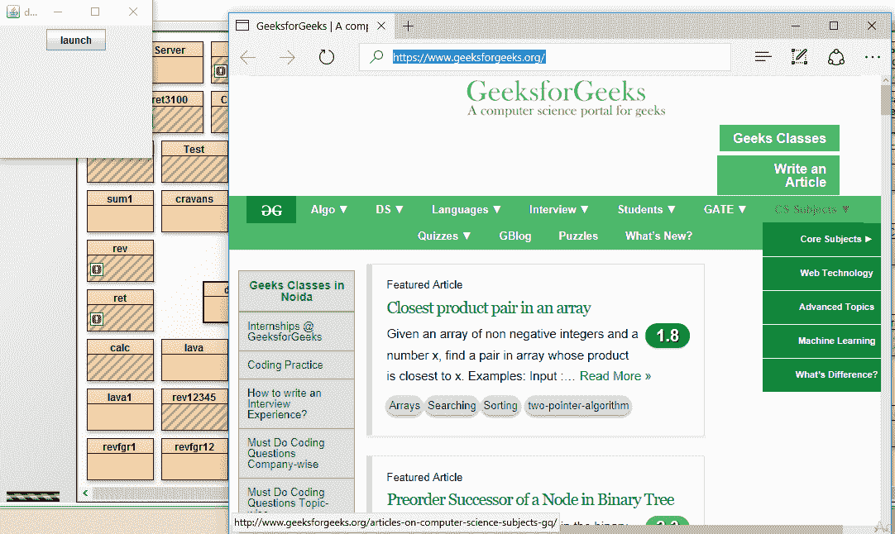
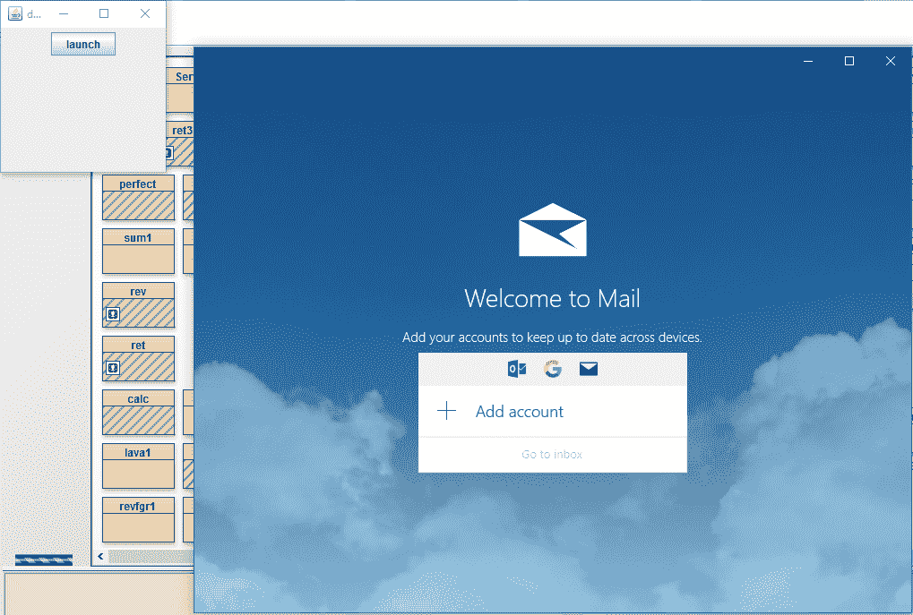
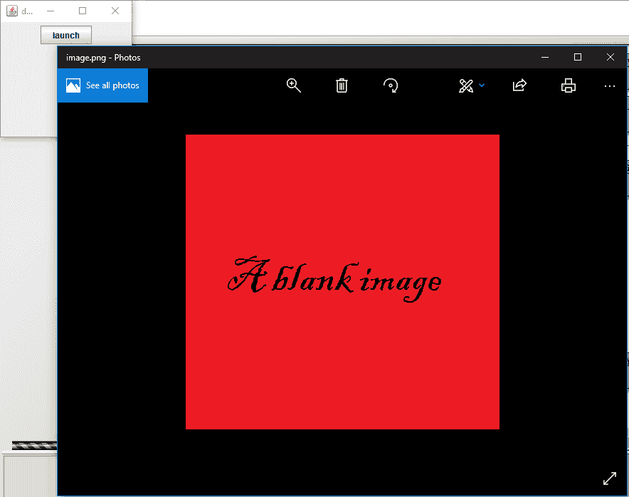
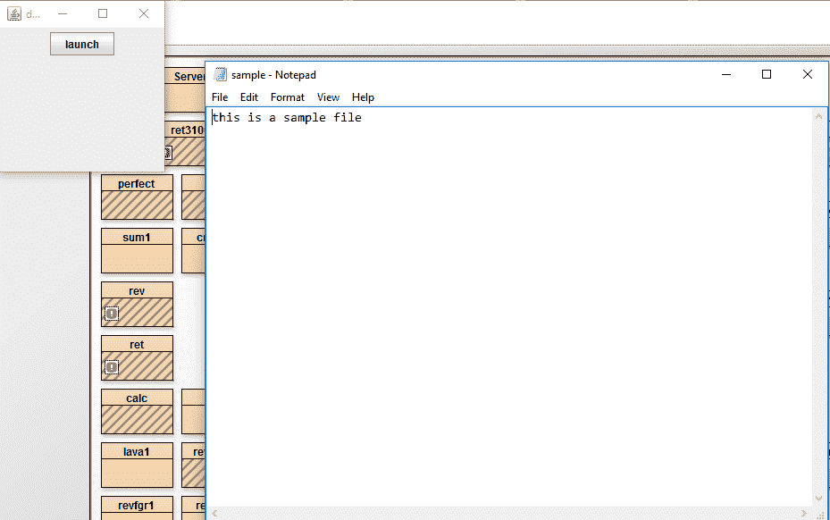
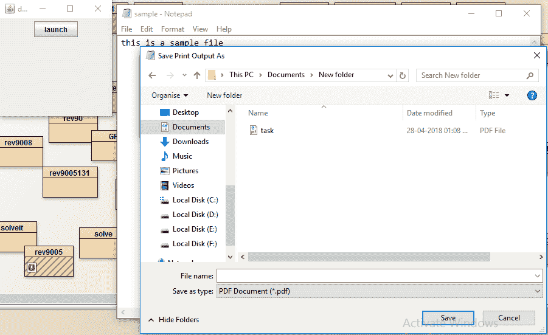

# Java AWT |桌面类

> 原文:[https://www.geeksforgeeks.org/java-awt-desktop-class/](https://www.geeksforgeeks.org/java-awt-desktop-class/)

桌面类是 Java AWT 包的一部分。此类用于启动在本机桌面上注册的相关应用程序，以处理一个 [URI](https://www.geeksforgeeks.org/java-net-uri-class-java/) 或一个文件。

**关于桌面类的要点:**

*   它可以打开一个默认的网络浏览器，显示一个特定的 [URI](https://www.geeksforgeeks.org/java-net-uri-class-java/)
*   它可以启动默认邮件客户端，可选邮件到 [URI](https://www.geeksforgeeks.org/java-net-uri-class-java/)
*   它可以启动注册的应用程序来打开、编辑或打印特定的文件。

#### 

桌面类中的不同方法

| 方法 | 说明 |
| --- | --- |
| **浏览(URI u)** | 启动默认浏览器以显示特定的 URI。 |
| **编辑(文件 f)** | 启动关联的编辑器应用程序并打开一个文件。 |
| get esktop() | 返回当前浏览器上下文的桌面实例。 |
| **isDesktopSupported()** | 返回当前平台是否支持此类。 |
| **问题支持(桌面。动作动作)** | 返回当前平台是否支持某个操作。 |
| **邮件()** | 启动用户默认邮件客户端的邮件撰写窗口。 |
| **邮件(URI mailtoURI)** | 启动用户默认邮件客户端的邮件撰写窗口，填写由 mailto: URI 指定的邮件字段。 |
| **打开(文件 f)** | 启动关联的应用程序以打开文件 |
| **打印(文件 f)** | 使用相关应用程序的打印命令，使用本机桌面打印工具打印文件。 |

下面的程序说明了 Java AWT 中的桌面类:

*   **Program to Launch the browser and open a specific URI**

    ```java
    // Java Program to Launch the browser
    // and open a specific URI
    import java.awt.*;
    import javax.swing.*;
    import java.awt.event.*;
    import java.net.*;

    class desk extends JFrame implements ActionListener {

        // frame
        static JFrame f;

        // Main Method 
        public static void main(String args[])
        {
            desk d = new desk();

            // create a frame
            f = new JFrame("desktop");

            // create a panel
            JPanel p = new JPanel();

            // create a button
            JButton b = new JButton("launch");

            // add Action Listener
            b.addActionListener(d);

            p.add(b);
            f.add(p);
            f.show();
            f.setSize(200, 200);
        }

        // if button is pressed
        public void actionPerformed(ActionEvent e)
        {
            try {

                // create a URI
                URI u = new URI("www.geeksforgeeks.org");

                Desktop d = Desktop.getDesktop();
                d.browse(u);
            }
            catch (Exception evt) {
            }
        }
    }
    ```

    **输出:**

    

*   **Program to Launch the mail to a specific URI**

    ```java
    // Java Program to Launch the
    // mail to a specific URI
    import java.awt.*;
    import javax.swing.*;
    import java.awt.event.*;
    import java.net.*;

    class desk extends JFrame implements ActionListener {

        // frame
        static JFrame f;

        // Main Method
        public static void main(String args[])
        {
            desk d = new desk();

            // create a frame
            f = new JFrame("desktop");

            // create a panel
            JPanel p = new JPanel();

            // create a button
            JButton b = new JButton("launch");

            // add Action Listener
            b.addActionListener(d);

            p.add(b);
            f.add(p);
            f.show();
            f.setSize(200, 200);
        }

        // if button is pressed
        public void actionPerformed(ActionEvent e)
        {
            try {
                URI u = new URI("mailto:contribute@geeksforgeeks.org");

                Desktop d = Desktop.getDesktop();
                d.mail(u);
            }
            catch (Exception evt) {
                JOptionPane.showMessageDialog(this, evt.getMessage());
            }
        }
    }
    ```

    **输出:**

    

*   **Program to open a file**

    ```java
    // Java Program to open a file
    import java.awt.*;
    import javax.swing.*;
    import java.awt.event.*;
    import java.io.*;
    import java.net.*;
    class desk extends JFrame implements ActionListener {
        // frame
        static JFrame f;

        // Main Method
        public static void main(String args[])
        {
            desk d = new desk();

            // create a frame
            f = new JFrame("desktop");

            // create a panel
            JPanel p = new JPanel();

            // create a button
            JButton b = new JButton("launch");

            // add Action Listener
            b.addActionListener(d);

            p.add(b);
            f.add(p);
            f.show();
            f.setSize(200, 200);
        }

        // if button is pressed
        public void actionPerformed(ActionEvent e)
        {
            try {

                // create a file
                File u = new File("f:\\image.png");

                Desktop d = Desktop.getDesktop();
                d.open(u);
            }
            catch (Exception evt) {
                JOptionPane.showMessageDialog(this, evt.getMessage());
            }
        }
    }
    ```

    **输出:**
    

*   **Program to open a file for editing**

    ```java
    // Java Program to open a file for editing
    import java.awt.*;
    import javax.swing.*;
    import java.awt.event.*;
    import java.io.*;
    import java.net.*;

    class desk extends JFrame implements ActionListener {

        // frame
        static JFrame f;

        // Main Method
        public static void main(String args[])
        {
            desk d = new desk();

            // create a frame
            f = new JFrame("desktop");

            // create a panel
            JPanel p = new JPanel();

            // create a button
            JButton b = new JButton("launch");

            // add Action Listener
            b.addActionListener(d);

            p.add(b);
            f.add(p);
            f.show();
            f.setSize(200, 200);
        }

        // if button is pressed
        public void actionPerformed(ActionEvent e)
        {
            try {

                // create a file
                File u = new File("f:\\sample.txt");

                Desktop d = Desktop.getDesktop();
                d.edit(u);
            }
            catch (Exception evt) {
                JOptionPane.showMessageDialog(this, evt.getMessage());
            }
        }
    }
    ```

    **输出:**

    

*   **Program to open a file for printing**

    ```java
    // Java Program to open a file for printing
    import java.awt.*;
    import javax.swing.*;
    import java.awt.event.*;
    import java.io.*;
    import java.net.*;

    class desk extends JFrame implements ActionListener {

        // frame
        static JFrame f;

        // Main Method
        public static void main(String args[])
        {
            desk d = new desk();

            // create a frame
            f = new JFrame("desktop");

            // create a panel
            JPanel p = new JPanel();

            // create a button
            JButton b = new JButton("launch");

            // add Action Listener
            b.addActionListener(d);

            p.add(b);
            f.add(p);
            f.show();
            f.setSize(200, 200);
        }

        // if button is pressed
        public void actionPerformed(ActionEvent e)
        {
            try {

                // create a file
                File u = new File("f:\\sample.txt");

                Desktop d = Desktop.getDesktop();
                d.print(u);
            }
            catch (Exception evt) {
                JOptionPane.showMessageDialog(this, evt.getMessage());
            }
        }
    }
    ```

    **输出:**
    

**参考:**[https://docs . Oracle . com/javase/7/docs/API/Java/awt/desktop . html](https://docs.oracle.com/javase/7/docs/api/java/awt/Desktop.html)