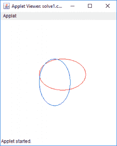
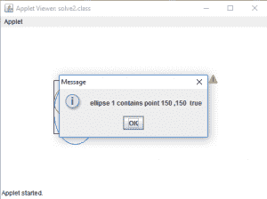
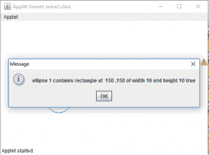
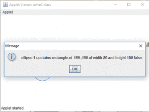
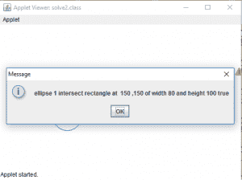
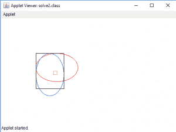

# Java AWT | Ellipse2D

> 原文:[https://www.geeksforgeeks.org/java-awt-ellipse2d/](https://www.geeksforgeeks.org/java-awt-ellipse2d/)

Ellipse2D 类存在于 java.awt.geom 包中，它用于通过声明椭圆的框架矩形来定义椭圆。这个类只是存储 2D 椭圆的所有对象的抽象超类。

*   Ellipse2D。Double 以双倍精度定义椭圆。
*   Ellipse2D。浮动以浮动精度定义椭圆。

**该类的构造函数为:**

1.  **ellips2d。Double()** :在位置 0，0 和大小 0，0 处创建一个椭圆。
2.  **ellips2d。Double(双 x，双 y，双 w，双 h)** :在 x，y 位置以及宽度 w 和高度 h 创建一个椭圆。
3.  **ellips2d。Float()** :在位置 0，0 和大小 0，0 处创建一个椭圆。
4.  **ellips2d。浮动(浮动 x，浮动 y，浮动 w，浮动 h)** :在位置 x，y，宽度 w 和高度 h 创建一个椭圆。

**常用方法**:

| 方法 | 说明 |
| --- | --- |
| **包含(双 x，双 y)** | 返回该点是否在椭圆内 |
| **包含(双 x，双 y，双 w，双 h)** | 返回矩形是否在椭圆内 |
| **等于(对象 o)** | 确定指定的对象是否等于此椭圆 2D。 |
| **相交(双 x，双 y，双 w，双 h)** | 返回矩形是否与椭圆相交 |
| **setFrame(双 x，双 y，双 w，双 h)** | 将此形状的框架矩形的位置和大小设置为指定的矩形值。 |

下面的程序说明了 Ellipse2D 类:

1.  **Java program to create two ellipses and draw them to a java applet**: To create ellipse shape on Java applet, we will initialize Ellipse2d class objects named “ed” and “ed1”. The 4 parameters passed in the constructor of the “ed” object are the X coordinate of the upper-left corner of the framing rectangle, the Y coordinate of the upper-left corner of the framing rectangle, the width of the framing rectangle and the height of the framing rectangle. In the constructor of “ed”, we pass nothing, which means the ellipse is initialized to location (0, 0) and size (0, 0). To show them on screen, we create an object of Graphics2d class “g1” and call g1.draw() method.

    ```
    // java program to create two ellipse and 
    // draw them to a java applet
    import java.awt.*;
    import javax.swing.*;
    import java.awt.geom.*;
    public class solve1 extends JApplet {
        public void init()
        {
            setSize(300, 300);
        }

        // paint the applet
        public void paint(Graphics g)
        {
            // create a ellipse2d
            Ellipse2D ed = new Ellipse2D.Double(100.0d, 100.0d, 
                                                 120.0d, 80.0d);

            // create another ellipse2d
            Ellipse2D ed1 = new Ellipse2D.Double();

            // set framing rectangle of ellipse
            ed1.setFrame(100.0d, 100.0d, 80.0d, 120.0d);

            Graphics2D g1 = (Graphics2D)g;

            g1.setColor(Color.red);

            // draw the first ellipse
            g1.draw(ed);

            g1.setColor(Color.blue);

            // draw the first ellipse
            g1.draw(ed1);
        }
    }
    ```

    **输出:**
    

2.  **Java program to create two ellipse and check whether a point or a rectangle is contained in that ellipse or intersected by it**: To check whether a point or a rectangle is contained in that ellipse or intersected by the 2 ellipses, we first create the 2 ellipses in the similar way we created above. Then we create 2 rectangles, by calling the method drawRect() on Graphics2d object “g1”. The parameters in drawRect() method specify the x coordinate of the rectangle to be drawn, the y coordinate of the rectangle to be drawn, the width of the rectangle to be drawn and the height of the rectangle to be drawn. To check whether they contain it or not, we call ed.contains() method and pass the coordinate of the point or rectangle in it, and show the results on a message dialog.

    ```
    // java program to create two ellipse and check whether
    // a point or a rectangle is contained in that ellipse
    // or intersected by it
    import java.awt.*;
    import javax.swing.*;
    import java.awt.geom.*;
    public class solve2 extends JApplet {
        public void init()
        {
            setSize(300, 300);
        }

        // paint the applet
        public void paint(Graphics g)
        {
            // create a ellipse2d
            Ellipse2D ed = new Ellipse2D.Double(100.0d, 100.0d,
                                                 120.0d, 80.0d);

            // create another ellipse2d
            Ellipse2D ed1 = new Ellipse2D.Double();

            // set framing rectangle of ellipse
            ed1.setFrame(100.0d, 100.0d, 80.0d, 120.0d);

            Graphics2D g1 = (Graphics2D)g;

            g1.setColor(Color.red);

            // draw the first ellipse
            g1.draw(ed);

            g1.setColor(Color.blue);

            // draw the first ellipse
            g1.draw(ed1);

            g1.setColor(Color.black);

            // draw a rectangle
            g.drawRect(100, 100, 80, 100);

            g1.setColor(Color.orange);

            // draw a rectangle
            g.drawRect(150, 150, 10, 10);

            // does it contain point
            JOptionPane.showMessageDialog(this, "ellipse 1 contains point 150, 150  " 
                                                            + ed.contains(150, 150));

            // does it contain rectangle
            JOptionPane.showMessageDialog(this, "ellipse 1 contains rectangle at" +
            "  150, 150 of width 10 and height 10 " + ed.contains(150, 150, 10, 10));

            // does it contain rectangle
            JOptionPane.showMessageDialog(this, "ellipse 1 contains rectangle at "+
             " 150, 150 of width 80 and height 100 " + ed.contains(150, 150, 80, 100));

            // does it  intersect rectangle
            JOptionPane.showMessageDialog(this, "ellipse 1 intersect rectangle at "+
            " 150, 150 of width 80 and height 100 " + ed.intersects(150, 150, 80, 100));
        }
    }
    ```

    **输出:**
    

    

    

    

    

**注**:以上程序可能无法在在线 IDE 中运行，请使用离线编译器。

**参考:**[https://docs . Oracle . com/javase/7/docs/API/Java/awt/geom/ellipse2d . html](https://docs.oracle.com/javase/7/docs/api/java/awt/geom/Ellipse2D.html)