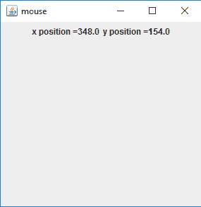

# Java AWT | MouseInfo 和 PointerInfo

> 原文:[https://www . geesforgeks . org/Java-awt-mouse info-and-pointerinfo/](https://www.geeksforgeeks.org/java-awt-mouseinfo-and-pointerinfo/)

MouseInfo 和 PointerInfo 是 Java AWT 的一部分。MouseInfo 提供了有关指针位置和鼠标上按钮数量的信息。指针信息提供信息返回指针和图形设备的位置信息。

#### 

鼠标信息的方法

| 方法 | 说明 |
| --- | --- |
| **get numerofbuttons()** | 返回鼠标上的按钮数量。 |
| **get point info()** | 返回一个指针信息对象，该对象表示指针的当前位置和图形设备。 |

#### 

指针法

| 方法 | 说明 |
| --- | --- |
| **获取设备（）** | 返回创建对象时鼠标所在的图形设备。 |
| **getLocation()** | 返回给出鼠标指针位置的 point 对象。 |

*   **Example Program to find the number of buttons on the Mouse**

    ```
    // Java Program to find the number of
    // buttons on the mouse
    import java.awt.*;
    import javax.swing.*;

    class numberofbuttons {

        // Main Method
        public static void main(String args[])
        {
            int numberofbuttons;

            // number of buttons in the mouse
            numberofbuttons = MouseInfo.getNumberOfButtons();

            // print the number of buttons
            System.out.println("Number of buttons on the mouse =" 
                                               + numberofbuttons);
        }
    }
    ```

    **输出:**

    ```
    Number of buttons on the mouse = 5

    ```

*   **Example Program to show the Position of Mouse**

    ```
    // Java Program to show the
    // position of mouse
    import java.awt.*;
    import java.awt.event.*;
    import javax.swing.*;

    class mouse extends JFrame {

        boolean b;

        // label
        JLabel l, l1;

        // Main Method
        public static void main(String args[])
        {

            // create object
            mouse m = new mouse();
        }

        // default constructor
        mouse()
        {
            super("mouse");

            // create labels
            l = new JLabel("");
            l1 = new JLabel("");

            // create a panel
            JPanel p = new JPanel();

            // add labels to panel
            p.add(l);
            p.add(l1);

            add(p);
            show();
            setSize(300, 300);

            b = true;
            execute();
        }

        public void execute()
        {
            while (b) {
                // get the pointer info object from the mouseInfo
                PointerInfo pi = MouseInfo.getPointerInfo();

                // get the location of mouse
                Point p = pi.getLocation();

                // set the text of labels
                l.setText("x position =" + p.getX());
                l1.setText("y position =" + p.getY());
            }
        }
    }
    ```

    **输出:**
    

**参考文献:**

*   [https://docs . Oracle . com/javase/7/docs/API/Java/awt/MouseInfo . html](https://docs.oracle.com/javase/7/docs/api/java/awt/MouseInfo.html)
*   [https://docs . Oracle . com/javase/7/docs/API/Java/awt/pointerinfo . html](https://docs.oracle.com/javase/7/docs/api/java/awt/PointerInfo.html)