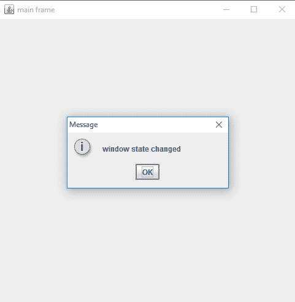
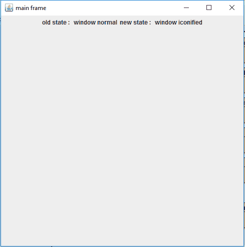
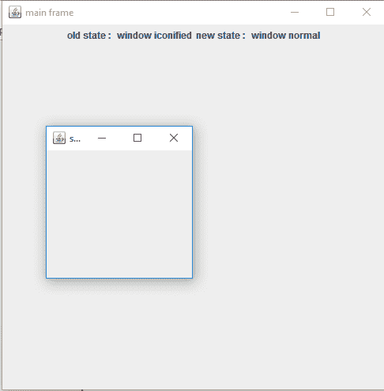
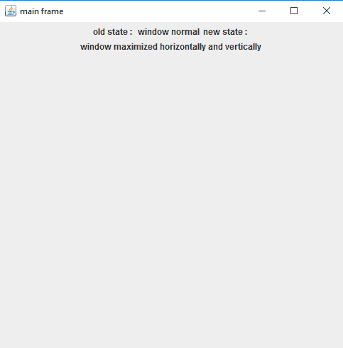
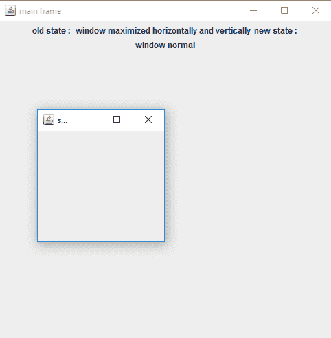

# Java awt | windows state listener

> 哎哎哎:# t0]https://www . geeksforgeeks . org/Java-awt-windowstatlistener/

WindowStateListener 是 java.awt.event 包的一部分。它是一个处理窗口状态事件的接口。当与之关联的框架或窗口被图标化或最大化时，此接口返回一个事件。
**抽象函数类** :

*   **WindowStateChanged(WindowEvent e)**:当窗口状态发生变化时调用。

下面的程序说明了窗口状态列表器:

1.  **处理窗口事件的 Java 程序**

## Java 语言(一种计算机语言，尤用于创建网站)

```java
// Java Program to handle window events
import java.awt.*;
import java.awt.event.*;
import javax.swing.*;
class listener1 extends JFrame implements WindowStateListener {
    listener1()
    {
        super("main frame");
        setSize(500, 500);

        // create a sub frame
        JFrame f = new JFrame("sub");

        // add window state listener
        f.addWindowStateListener(this);

        // set size of window
        f.setSize(200, 200);

        show();
        f.show();
    }

    // if state of window is changed
    public void windowStateChanged(WindowEvent e)
    {
        JOptionPane.showMessageDialog(this, "window state changed");
    }
    // main class
    public static void main(String args[])
    {
        listener1 l = new listener1();
    }
}
```

1.  **输出:**



1.  **处理窗口事件并识别它们的 Java 程序** :

## Java 语言(一种计算机语言，尤用于创建网站)

```java
// Java Program to handle window events and identify them
import java.awt.*;
import java.awt.event.*;
import javax.swing.*;
class listener extends JFrame implements WindowStateListener {
    // label
    JLabel l;
    JLabel l1;

    listener()
    {
        super("main frame");
        setSize(500, 500);

        // create a sub frame
        JFrame f = new JFrame("sub");

        // add window state listener
        f.addWindowStateListener(this);

        // set size of window
        f.setSize(200, 200);

        // create a label
        JLabel lo = new JLabel("old state : ");
        JLabel lo1 = new JLabel("new state : ");

        l = new JLabel("");
        l1 = new JLabel("");

        // create a panel
        JPanel p = new JPanel();

        p.add(lo);
        p.add(l);
        p.add(lo1);
        p.add(l1);
        add(p);

        show();
        f.show();
    }

    // if state of window is changed
    public void windowStateChanged(WindowEvent e)
    {
        int s = e.getOldState(), s1 = e.getNewState();

        // for old state
        if (s == Frame.ICONIFIED)
            l.setText("window iconified");

        if (s == Frame.MAXIMIZED_BOTH)
            l.setText("window maximized horizontally and vertically");

        if (s == Frame.MAXIMIZED_HORIZ)
            l.setText("window maximized horizontally");

        if (s == Frame.MAXIMIZED_VERT)
            l.setText("window maximized vertically");

        if (s == Frame.NORMAL)
            l.setText("window normal");

        // for new state

        if (s1 == Frame.ICONIFIED)
            l1.setText("window iconified");

        if (s1 == Frame.MAXIMIZED_BOTH)
            l1.setText("window maximized horizontally and vertically");

        if (s1 == Frame.MAXIMIZED_HORIZ)
            l1.setText("window maximized horizontally");

        if (s1 == Frame.MAXIMIZED_VERT)
            l1.setText("window maximized vertically");

        if (s1 == Frame.NORMAL)
            l1.setText("window normal");
    }

    // main class
    public static void main(String args[])
    {
        listener l = new listener();
    }
}
```

1.  **输出:**









**注意:以下程序不会在在线编译器中运行请使用离线 IDE**
**参考**:[https://docs . Oracle . com/javase/7/docs/API/Java/awt/event/windowstatestiner . html](https://docs.oracle.com/javase/7/docs/api/java/awt/event/WindowStateListener.html)