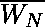
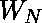
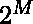

# Java | CDMA(码分多址)

> 原文:[https://www . geesforgeks . org/Java-CDMA-码分多址/](https://www.geeksforgeeks.org/java-cdma-code-division-multiple-access/)

码分多址是[多址](https://www.geeksforgeeks.org/computer-network-multiple-access-protocols/)的一种信道化协议，其中信息可以通过单个通信信道上的几个发射机同时发送。

它通过以下步骤实现:

*   会产生一个信号，该信号会扩展到很宽的带宽。
*   执行此操作的代码称为扩频码。
*   稍后，即使存在许多其他信号，也可以用给定的代码选择特定的信号。

主要用于 2G、3G 等移动网络。

【CDMA 是如何工作的？

要了解码分多址是如何工作的，我们必须了解正交序列(也称为码片)。

设 N 为在公共信道上建立多址的站数。

那么正交序列的性质可以表述如下:

1.  一个正交序列可以被认为是一个 1xN 矩阵。
    **例如:**【+1-1+1-1】为 N = 4。
2.  Scalar multiplication and matrix addition rules follow as usual.
    **Eg:** 3**.**[+1 -1 +1 -1] = [+3 -3 +3 -3]

    **Eg:**[+1-1+1-1]+[-1-1-1-1]=[0-2 0-2]

3.  **内积:**通过将两个序列元素乘以一个元素，然后将结果列表的所有元素相加来计算。
    *   序列与自身的内积等于 N
        [+1 -1 +1 -1] **。** [+1 -1 +1 -1] = 1 + 1 + 1 + 1 = 4
    *   两个不同序列的内积为零
        [+1 -1 +1 -1] **。** [+1 +1 +1 +1] = 1-1+1-1 = 0

要生成有效的正交序列，使用如下的**沃尔什表**:

*   **Rule 1:**

    ![\[ W_1 =\begin{bmatrix} +1 \end{bmatrix} \] ](img/c8214b52ded5263a11e20559e2c867c3.png "Rendered by QuickLaTeX.com")

*   **规则 2:**

![  \[ W_{2N} = \begin{bmatrix}  W_N {\:}{\:} W_N{\:}{\:}\\W_N {\:}{\:} \overline{W_N} \end{bmatrix} \] ](img/7f0ba72cbfb0beb9a1894af770e1d58c.png "Rendered by QuickLaTeX.com")

其中=的补码(用-1 替换+1，用+1 替换-1)

**示例:**

![ \[ W_2 = \begin{bmatrix}+1{\:}+1{\:} \\+1{\:}-1\\ \end{bmatrix}\] ](img/30bc06d7742959e9a45f2a6ce2cc31df.png "Rendered by QuickLaTeX.com")

![  \[ W_4 = \begin{bmatrix}+1{\:}+1{\:}+1{\:}+1{\:} \\+1{\:}-1{\:}+1{\:}-1{\:} \\+1{\:}+1{\:}-1{\:}-1{\:} \\+1{\:}-1{\:}-1{\:}+1{\:}\\ \end{bmatrix}\] ](img/118b50c34fde76b8d5963273b4281b44.png "Rendered by QuickLaTeX.com")

矩阵的每一行代表一个正交序列。因此，我们可以为 N = 构建序列。现在让我们看看码分多址是如何使用正交序列工作的。

**程序:**

1.  该站将其数据位编码如下。
    *   如果位= 1，则+1
    *   -1(如果位= 0)
    *   如果电台空闲，则无信号(解释为 0)
2.  每个站被分配一个唯一的正交序列(码)，该序列对于 N 个站是 N 比特长的
3.  每个站对其编码的数据位和代码序列进行标量乘法运算。
4.  然后将结果序列放在通道上。
5.  由于通道是公共的，振幅相加，因此合成的通道序列是所有通道序列的总和。
6.  如果站 1 想要收听站 2，它将信道序列与站 S2 的代码相乘(内积)。
7.  内积然后除以 N，得到从站 2 发送的数据位。

**例:**假设 4 站 S1、S2、S3、S4。我们将使用 4×4 沃尔什表为它们分配代码。

```java
C1 = [+1 +1 +1 +1]
C2 = [+1 -1 +1 -1]
C3 = [+1 +1 -1 -1]
C4 = [+1 -1 -1 +1]

Let their data bits currently be: 
D1 = -1
D2 = -1
D3 = 0 (Silent)
D4 = +1

Resultant channel sequence = C1.D1 + C2.D2 + C3.D3 + C4.D4 
                           = [-1 -1 -1 -1] + [-1 +1 -1 +1] + [0 0 0 0]
                                                       + [+1 -1 -1 +1]
                           = [-1 -1 -3 +1]

Now suppose station 1 wants to listen to station 2\. 
Inner Product = [-1 -1 -3 +1] x C2
              = -1 + 1 - 3 - 1 = -4

Data bit that was sent = -4/4 = -1.

```

下面程序说明了一个简单的码分多址信道的实现:

```java
// Java code illustrating a simple implementation of CDMA

import java.util.*;

public class CDMA {

    private int[][] wtable;
    private int[][] copy;
    private int[] channel_sequence;

    public void setUp(int[] data, int num_stations)
    {

        wtable = new int[num_stations][num_stations];
        copy = new int[num_stations][num_stations];

        buildWalshTable(num_stations, 0, num_stations - 1, 0,
                                        num_stations - 1, false);

        showWalshTable(num_stations);

        for (int i = 0; i < num_stations; i++) {

            for (int j = 0; j < num_stations; j++) {

                // Making a copy of walsh table
                // to be used later
                copy[i][j] = wtable[i][j]; 

                // each row in table is code for one station. 
                // So we multiply each row with station data
                wtable[i][j] *= data[i];
            }
        }

        channel_sequence = new int[num_stations];

        for (int i = 0; i < num_stations; i++) {

            for (int j = 0; j < num_stations; j++) {
                // Adding all sequences to get channel sequence
                channel_sequence[i] += wtable[j][i]; 
            }
        }
    }

    public void listenTo(int sourceStation, int num_stations)
    {
        int innerProduct = 0;

        for (int i = 0; i < num_stations; i++) {

            // multiply channel sequence and source station code
            innerProduct += copy[sourceStation][i] * channel_sequence[i];
        }

        System.out.println("The data received is: " + 
                            (innerProduct / num_stations));
    }

    public int buildWalshTable(int len, int i1, int i2, int j1, 
                                            int j2, boolean isBar)
    {
        // len = size of matrix. (i1, j1), (i2, j2) are
        // starting and ending indices of wtable.

        // isBar represents whether we want to add simple entry
        // or complement(southeast submatrix) to wtable.

        if (len == 2) {

            if (!isBar) {

                wtable[i1][j1] = 1;
                wtable[i1][j2] = 1;
                wtable[i2][j1] = 1;
                wtable[i2][j2] = -1;
            }
            else {

                wtable[i1][j1] = -1;
                wtable[i1][j2] = -1;
                wtable[i2][j1] = -1;
                wtable[i2][j2] = +1;
            }

            return 0;
        }

        int midi = (i1 + i2) / 2;
        int midj = (j1 + j2) / 2;

        buildWalshTable(len / 2, i1, midi, j1, midj, isBar);
        buildWalshTable(len / 2, i1, midi, midj + 1, j2, isBar);
        buildWalshTable(len / 2, midi + 1, i2, j1, midj, isBar);
        buildWalshTable(len / 2, midi + 1, i2, midj + 1, j2, !isBar);

        return 0;
    }

    public void showWalshTable(int num_stations)
    {

        System.out.print("\n");

        for (int i = 0; i < num_stations; i++) {
            for (int j = 0; j < num_stations; j++) {
                System.out.print(wtable[i][j] + " ");
            }
            System.out.print("\n");
        }
        System.out.println("-------------------------");
        System.out.print("\n");
    }

    // Driver Code
    public static void main(String[] args)
    {
        int num_stations = 4;

        int[] data = new int[num_stations];

        //data bits corresponding to each station
        data[0] = -1;
        data[1] = -1;
        data[2] = 0;
        data[3] = 1;

        CDMA channel = new CDMA();

        channel.setUp(data, num_stations);

        // station you want to listen to
        int sourceStation = 3;

        channel.listenTo(sourceStation, num_stations);
    }
}
```

**输出**:

```java
1  1  1  1 
1 -1  1 -1 
1  1 -1 -1 
1 -1 -1  1 

The data received is: -1

```

**码分多址的优势**:与 FDMA 或时分多址等根据频率或时隙划分信道的其他信道化方案不同，码分多址允许所有站在整个持续时间内访问信道的全部带宽。