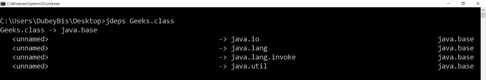
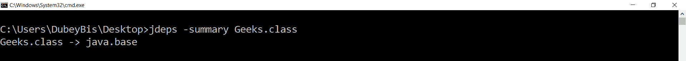
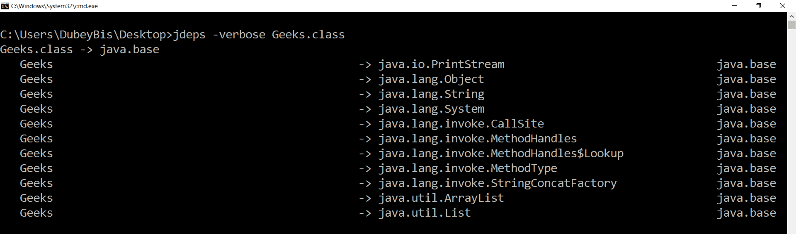
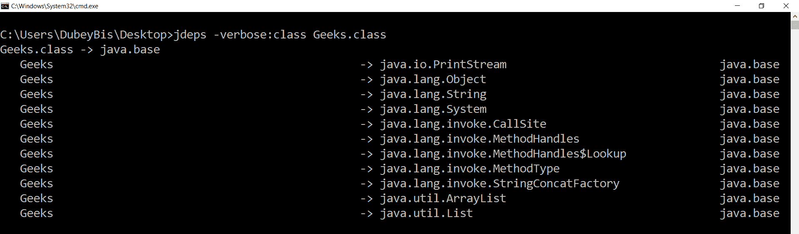

# Java 8 中的 Java 类依赖分析器，示例

> 原文:[https://www . geesforgeks . org/Java-class-dependency-analyzer-in-Java-8-with-examples/](https://www.geeksforgeeks.org/java-class-dependency-analyzer-in-java-8-with-examples/)

**Java 类依赖分析器** : **jdeps** 是在 **JDK 8** 中引入的一个新的命令行工具，用于理解应用程序的静态依赖关系和库，即 jdeps 命令显示 Java 类文件的包级或类级依赖关系。jdeps 的输入可以是一个. class 文件路径名，一个 [JAR 文件](https://www.geeksforgeeks.org/jar-files-java/)或者可以是一个全限定类名来分析所有的类文件。每当我们向 jdeps 命令行工具提供任何输入时，它都会生成系统控制台的依赖项。jdeps 引入了影响输出的各种选项。根据选项，jdeps 命令行工具生成输出。

**示例:**

```java
// Simple Java program to see the jdeps
// generated output with various options

import java.util.List;
import java.util.ArrayList;

class Geeks {
    public static void main(String args[])
    {

        List<String> list1 = new ArrayList<>();
        List<String> list2 = new ArrayList<>();
        List<String> list3 = new ArrayList<>();

        list1.add("Geeks");
        list2.add("for");
        list3.add("geeks");

        System.out.println(list1);
        System.out.println(list2);
        System.out.println(list3);
    }
}
```

**注意:**我们必须编译上面的 Geeks.class 文件，编译器会生成 Geeks.class 文件，我们必须使用这个文件作为 jdeps 的输入。在这里，我运行的是 Java 9，我们将看到 jdeps 的输出，按照 Java 9，这个 Geeks.class 文件有不同的选项。

**输出:**

```java
jdeps Geeks.class
```

[](https://media.geeksforgeeks.org/wp-content/uploads/20200128155055/Capture338.png)

【jdeps 有多种选择:

*   **-dotoutput directoryPath**: If we will use this option, then jdeps will generate one dot file into the directory per each analyzed archive named .dot listing the dependencies. It will also generate a summary file named summary.dot specifying the dependencies among the archives.

    **输出:**

    ```java
    jdeps -dotoutput C:\Users\DubeyBis\Desktop\jdeps Geeks.class
    ```

    它会在 C:\ Users \ DubeyBis \ Desktop \ jdeps 文件夹内生成两个文件，名称分别为 **Geeks.class.dot** 和 **summary.dot** ，这些文件的内容如下:

    **极客.类.点**

    ```java
    digraph "Geeks.class" {
        // Path: Geeks.class
       ""                  -> "java.io (java.base)";
       ""                  -> "java.lang (java.base)";
       ""                  -> "java.lang.invoke (java.base)";
       ""                  -> "java.util (java.base)";
    }

    ```

    **小结点**

    ```java
    digraph "summary" {
      "Geeks.class"        -> "rt.jar";
    }

    ```

*   **-summary**: It will print only the summary. Instead of -summary, we can use -s also.

    **输出:**

    ```java
    jdeps -summary Geeks.class
    ```

    [](https://media.geeksforgeeks.org/wp-content/uploads/20200128155256/Capture339.png)

*   **-verbose**: It will print all class-level dependencies. Instead of -verbose, we can use -v also.

    **输出:**

    ```java
    jdeps -verbose Geeks.class
    ```

    [](https://media.geeksforgeeks.org/wp-content/uploads/20200128155439/Capture340.png)

*   **-详细:包**:打印包级依赖关系，不包括同一归档内的依赖关系。
*   **-verbose:class**: Prints class-level dependencies excluding dependencies within the same archive.

    **输出:**

    ```java
    jdeps -verbose:class Geeks.class
    ```

    [](https://media.geeksforgeeks.org/wp-content/uploads/20200128155613/Capture341.png)