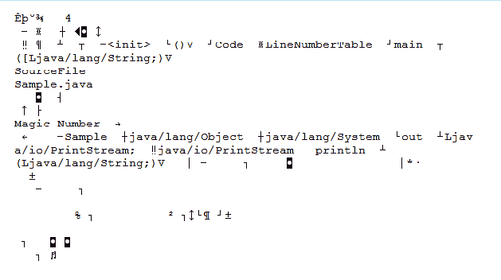
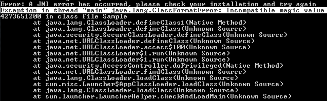
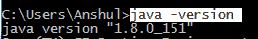
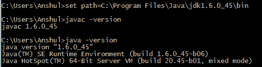
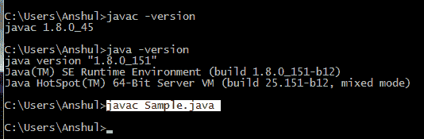
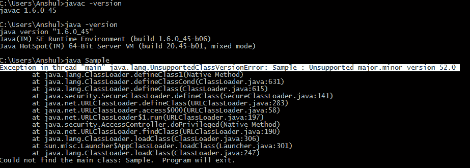

# Java 类文件

> 原文:[https://www.geeksforgeeks.org/java-class-file/](https://www.geeksforgeeks.org/java-class-file/)

一个 **Java 类文件**是一个包含 Java 字节码并且有**的文件。可以由 [JVM](https://www.geeksforgeeks.org/jvm-works-jvm-architecture/) 执行的类扩展**。一个 Java 类文件是由一个 Java 编译器从*创建的。java* 文件作为成功编译的结果。正如我们所知，单一的 Java 编程语言源文件(*或者我们可以说。java 文件*)可能包含一个类或多个类。所以如果一*。java* 文件有多个类那么每个类都会编译成一个单独的类文件。
**例如:**将下面的代码保存为系统上的**Test.java**。

```
// Compiling this Java program would
// result in multiple class files.

class Sample
{

}

// Class Declaration
class Student
{

}
// Class Declaration
class Test
{
       public static void main(String[] args)   
       {
           System.out.println("Class File Structure");
       }
} 
```

**用于编译:**

> 贾维克·Test.java

编译后相应文件夹中会有 **3 类**文件，命名为:

*   样本类
*   学生班
*   测试类

**单个类文件结构**包含描述类文件的属性。
**表示类文件结构**

```
ClassFile 
{
     magic_number;
     minor_version;
     major_version;
     constant_pool_count;
     constant_pool[];
     access_flags;
     this_class;
     super_class;
     interfaces_count;
     interfaces[];
     fields_count;
     fields[];
     methods_count;
     methods[];
     attributes_count;
     attributes[];
}

```

**类文件的元素如下:**

1.  **magic_number:** The first 4 bytes of class file are termed as magic_number. This is a predefined value which the JVM use to identify whether the *.class* file is generated by valid compiler or not. The predefined value will be in hexadecimal form i.e. **0xCAFEBABE**.
    Now let’s see what happen when JVM will not find valid magic number. Suppose we have a *.java* file named as *Sample.java* as follows and follow step by step process on your system.

    ```
    // class Declaration
    class Sample
    {
       public static void main(String[] args)
       {
           System.out.println("Magic Number");           
       }
    }

    ```

    **第 1 步:**使用 javac Sample.java
    **编译第 2 步:**现在打开 Sample.class 文件。看起来像是在跟踪。

    

    **第三步:**现在从文件开始，从这个*样本类*文件中删除至少一个符号并保存。
    **第 4 步:**现在尝试使用 java Sample 命令运行该命令，并看到神奇之处，即您将获得运行时异常(*参见下图中突出显示的文本* ):
    

    **注意:**这取决于你移除*的程度。类*文件数据。

2.  **minor_version & major_version:** These both together represents *.class* file version. JVM will use these versions to identify which version of the compiler generates the current .class file. We denotes the version of class file as M.m where M stands for major_version and m stands for minor_version

    **注**:生成较低版本编译器。类文件可以由高版本 JVM 执行，但会生成更高版本的编译器。类文件不能由较低版本的 JVM 执行。如果我们试图执行，我们会得到运行时异常。

    **本次演示针对 Windows 操作系统，具体如下:**

    **第一步:**打开命令提示窗口，分别使用以下命令尝试检查 java 编译器版本和 JVM 版本(图中高亮显示的文本是命令)
    1.8 版本的输出将是:
    
    

    **步骤 2:** 现在检查另一个版本，该版本可能比已经安装的版本更高或更低。[此](http://www.oracle.com/technetwork/java/javase/downloads/index.html)下载链接。
    将此安装到您的电脑或笔记本电脑上，并记下安装地址。
    **第三步:**打开第二个命令提示窗口，设置第二步安装的已安装 jdk 的 bin 文件夹路径。并检查 Java 编译器版本 ad JVM 版本。
    
    **第四步:**现在在第一个命令提示符下编译任意有效的*。java 文件*。例如:见上图*Sample.java*文件。编译为:
    
    **第五步:**现在在第二个命令提示符窗口尝试运行上面编译的代码类文件，看看会发生什么。有一个运行时异常，我已经在下图中突出显示了它。

    

    **注:**内部 jdk 1.5 版本表示 49.0，1.6 表示 50.0，1.7 表示 51.0 等。类文件版本，其中小数点前的数字代表主版本，小数点后的数字代表次版本。

    1.  **constant_pool_count:** 它表示常量池*中存在的常量数量(当编译一个 Java 文件时，对变量和方法的所有引用都作为符号引用存储在类的常量池中)*。
    2.  **常量池[]:** 表示常量池文件中存在的常量信息。
    3.  **access_flags:** 它提供关于声明到类文件的修饰符的信息。
    4.  **this_class:** 表示类文件的全限定名。
    5.  **super_class:** 表示当前类的直属超类的全限定名。考虑以上*Sample.java*文件。当我们编译它时，我们可以说*这个 _ 类*将是**样本类**，*超 _ 类*将是**对象类。**
    6.  **interface_count:** 返回当前类文件实现的接口数。
    7.  **接口[]:** 返回当前类文件实现的接口信息。
    8.  **field _ count:**表示当前类文件中存在的字段数量*(静态变量)*。
    9.  **字段[]:** 表示当前类文件中存在的字段(静态变量)信息。
    10.  **method_count:** 表示当前类文件中存在的方法数。
    11.  **方法[]:** 返回当前类文件中存在的所有方法的信息。
    12.  **attributes_count:** 返回当前类文件中存在的属性数量*(实例变量)*。
    13.  **属性[]:** 提供当前类文件中存在的所有属性的信息。