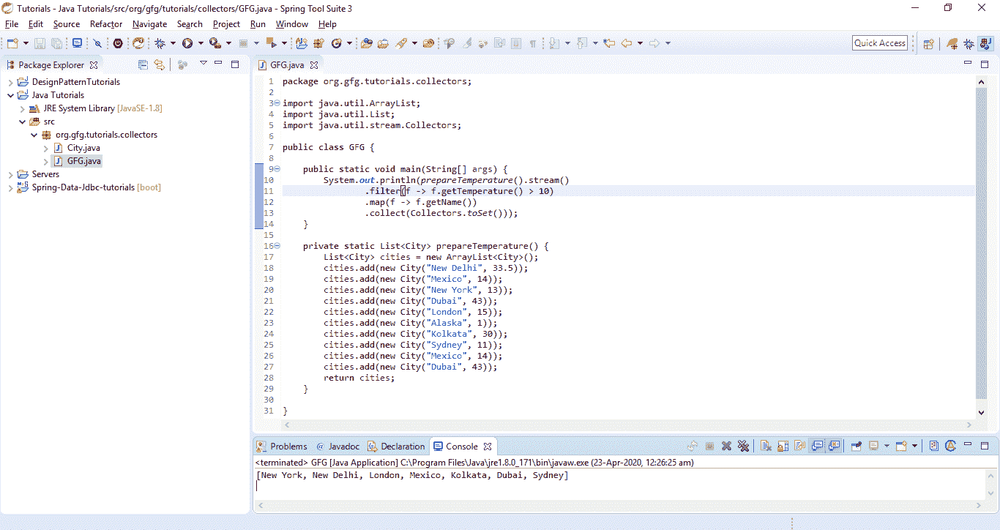

# Java 收集器

> 原文:[https://www.geeksforgeeks.org/java-collectors/](https://www.geeksforgeeks.org/java-collectors/)

**Collectors** 是 [JDK](https://www.geeksforgeeks.org/differences-jdk-jre-jvm/) 中包含大量效用函数的效用类之一。最常用的是[流 API](https://www.geeksforgeeks.org/stream-in-java/) 作为最后一步。在本文中，我们将研究收集器类中的不同方法。

说到 Java 编程的函数风格，我们通常很少有广泛使用的函数，这些函数是 **filter()** 、 **map()** 、 **reduce()** 、属于 [Streams API](https://www.geeksforgeeks.org/stream-in-java/) 的 **collect()** 。 **collect()** 和 **reduce()** 方法被称为终端方法，因为在这里，操作会因某种结果而终止。与 Collectors 相关联的函数通常在 collect()方法中使用。收集器类是流包的一部分，可以导入为:

```java
import static java.util.stream.Collectors.*;

```

**等级等级:**

```java
java.lang.Object
    ↳ java.util.stream
        ↳ class Collectors

```

**语法:**

```java
public final
  class Collectors
    extends Object

```

### 收集器类中的方法

让我们考虑一个**城市**类，它有像*名称*和*温度*这样的属性，这些属性正在用参数化构造函数初始化。我们将使用这个例子观察收集器类中可用的不同方法。

下面是城市类的实现:

```java
// Java program to implement a
// City class

// Defining a city class
public class City {

    // Initializing the properties
    // of the city class
    private String name;
    private double temperature;

    // Parameterized constructor to
    // initialize the city class
    public City(String name, double temperature)
    {
        this.name = name;
        this.temperature = temperature;
    }

    // Getters to get the name and
    // temperature
    public String getName()
    {
        return name;
    }

    public Double getTemperature()
    {
        return temperature;
    }

    // Overriding the toString method
    // to return the name and temperature
    @Override
    public String toString()
    {
        return name + " --> " + temperature;
    }
}
```

在进入不同的方法之前，让我们创建一个有名称和温度的城市列表。下面是创建带有名称和温度的城市列表的方法的实现:

```java
// Java program to create a list
// of cities with name and
// temperature

// Function to create a list of
// cities with name and temperature
private static List<City> prepareTemperature()
{
    List<City> cities = new ArrayList<>();
    cities.add(new City("New Delhi", 33.5));
    cities.add(new City("Mexico", 14));
    cities.add(new City("New York", 13));
    cities.add(new City("Dubai", 43));
    cities.add(new City("London", 15));
    cities.add(new City("Alaska", 1));
    cities.add(new City("Kolkata", 30));
    cities.add(new City("Sydney", 11));
    cities.add(new City("Mexico", 14));
    cities.add(new City("Dubai", 43));
    return cities;
}
```

以下是对上述城市执行操作的各种方法:

**1。[收集器< T，？，List<T>>to List():](https://www.geeksforgeeks.org/collectors-tolist-method-in-java-with-examples/)**将输入元素转换为新的 List 并返回一个 Collector。这里， **T** 是输入元素的类型。在下面的例子中，我们试图处理温度超过 10 的城市列表，只得到城市名称。

为此，我们使用**滤镜()**对温度进行滤镜检查，使用**地图()**变换城市名称，使用**采集()**采集这些城市名称。现在这个 **collect()** 方法基本上是用来收集通过 stream 及其各种函数传递的元素，并返回一个[列表实例](https://www.geeksforgeeks.org/list-interface-java-examples/)。

```java
// Java program to implement the 
// toList() method 
import java.util.ArrayList; 
import java.util.List; 
import java.util.stream.Collectors; 

public class GFG { 

    public static void main(String[] args) 
    { 

        // The following statement filters 
        // cities having temp > 10 
        // The map function transforms only 
        // the names of the cities 
        // The collect function collects the 
        // output as a List 
        System.out.println(prepareTemperature().stream()
                 .filter(f -> f.getTemperature() > 10)
                 .map(f -> f.getName())
                 .collect(Collectors.toList())); 
    } 
} 
```

**输出:**

> [新德里、墨西哥、纽约、迪拜、伦敦、加尔各答、悉尼、墨西哥、迪拜]

[](https://media.geeksforgeeks.org/wp-content/uploads/20200423003256/CollectorsOutput.png)

这里，输出中没有阿拉斯加这个城市，因为它的温度被初始化为 1。

**2。[收集器< T，？，Set<T>>toSet():](https://www.geeksforgeeks.org/collectors-toset-in-java-with-examples/)**将输入元素转换为新的 Set 并返回一个 Collector。该方法将返回[集合](https://www.geeksforgeeks.org/set-in-java/)实例，并且不包含任何重复。

```java
// Java program to implement the
// toSet() method
import java.util.ArrayList;
import java.util.List;
import java.util.stream.Collectors;

public class GFG {

    public static void main(String[] args)
    {

        // Here, we have applied the filter
        // to get the set of the names
        // of the cities whose temperature
        // is greater than 10
        System.out.println(prepareTemperature()
                .stream()
                .filter(f -> f.getTemperature() > 10)
                .map(f -> f.getName())
                .collect(Collectors.toSet()));
        }
}
```

**输出:**

> [纽约、新德里、伦敦、墨西哥、加尔各答、迪拜、悉尼]

在这里，我们可以在输出中注意到，墨西哥和迪拜没有重复。

**3。[收藏家< T，？，C >到集合(供应商< C >集合工厂):](https://www.geeksforgeeks.org/java-stream-collectors-tocollection-in-java/)** 将输入元素转换为新的集合，并返回一个集合。如果我们观察上面讨论的 toList()和 toSet()方法，我们就无法控制它们的实现。因此，使用 toCollection()我们可以实现自定义实现，其中 C 是结果集合的类型，T 是输入元素的类型。

```java
// Java program to implement the
// toCollection() method
import java.util.ArrayList;
import java.util.LinkedList;
import java.util.List;
import java.util.stream.Collectors;

public class GFG {

    public static void main(String[] args)
    {

        // Here, a list of all the names
        // have been returned
        System.out.println(prepareTemperature()
                .stream()
                .map(f -> f.getName())
                .collect(Collectors.toCollection(List::new)));
    }
}
```

**输出:**

> [新德里、墨西哥、纽约、迪拜、伦敦、阿拉斯加、加尔各答、悉尼、墨西哥、迪拜]

同样，我们可以使用所有其他实现类，如[数组列表](https://www.geeksforgeeks.org/arraylist-in-java/)、[哈希集](https://www.geeksforgeeks.org/hashset-in-java/)、[树集](https://www.geeksforgeeks.org/treeset-in-java-with-examples/)等。

**4。[收集器< T，？，Map < K，U>>to Map(Function key mapper，Function valueMapper):](https://www.geeksforgeeks.org/collectors-tomap-method-in-java-with-examples/)** 将元素转换为 [Map](https://www.geeksforgeeks.org/map-interface-java-examples/) ，其键和值是将传递的映射函数应用于输入元素的结果，并返回一个 Collector。toMap()用于收集元素的输入，并将其转换为 Map 实例。toMap()方法要求以下参数:

```java
K - Key function
U - Value Function
BinaryOperator(optional)
Supplier(Optional)

```

让我们试着用一个例子来理解这一点。对于上面讨论的城市和温度列表，我们希望在地图中获取带有温度的城市名称。

> 准备温度()。流()。过滤器(city-> city . gettemperature()> 10)
> 。collect(collectors . tomap(City::getName，City::getTemperature))；

如果列表中没有重复项，上述语句可以完美地工作。因为我们的列表包含重复项，所以它不会像 toSet()那样默默过滤掉。相反，它会抛出一个 IllegalStateException。我们可以通过使用第三个参数 BinaryOperator 来避免密钥冲突(在密钥重复的情况下)，从而避免并解决这个问题。例如:

```java
// Java program to implement the
// Map() method

import java.util.ArrayList;
import java.util.List;
import java.util.stream.Collectors;

public class GFG {

    public static void main(String[] args)
    {
        // Here, the name and the temperature
        // are defined as the type City
        System.out.println(prepareTemperature()
                .stream()
                .filter(city -> city.getTemperature() > 10)
                .collect(Collectors.toMap(
                            City::getName,
                            City::getTemperature,
                            (key, identicalKey) -> key)));
    }
}
```

**输出:**

> {纽约=13.0，新德里=33.5，伦敦=15.0，墨西哥=14.0，加尔各答=30.0，迪拜=43.0，悉尼=11.0}

二元运算符指定，我们如何处理冲突。上面的语句选择了其中一个冲突元素。

**5。[收集器收集(收集器下游，功能整理器):](https://www.geeksforgeeks.org/collectors-collectingandthen-method-in-java-with-examples/)** 此方法允许我们在收集收集的输入元素后对结果执行另一个操作。

```java
// Java program to implement the
// collectingAndThen() method
import java.util.ArrayList;
import java.util.List;
import java.util.stream.Collectors;

public class GFG {

    public static void main(String[] args)
    {
        // Collects the elements and
        // counts the occurrences
        System.out.println(prepareTemperature()
                .stream()
                .collect(Collectors.groupingBy(
                            City::getName,
                            Collectors.collectingAndThen(
                                    Collectors.counting(),
                                    f -> f.intValue()))));
    }
}
```

**输出:**

> {纽约=1，新德里=1，伦敦=1，阿拉斯加=1，墨西哥=2，加尔各答=1，迪拜=2，悉尼=1}

**6。 [Collector counting():](https://www.geeksforgeeks.org/java-8-collectors-counting-with-examples/)** 对 T 类型的输入元素个数进行计数，返回一个 Collector。此方法用于我们希望对元素集合中每个城市的出现次数进行分组和计数的情况。

```java
// Java program to implement the
// counting() method
import java.util.ArrayList;
import java.util.List;
import java.util.stream.Collectors;

public class GFG {

    public static void main(String[] args)
    {
        System.out.println(prepareTemperature()
                .stream()
                .collect(Collectors.groupingBy(
                            City::getName,
                            Collectors.counting())));
    }
}
```

**输出:**

> {纽约=1，新德里=1，伦敦=1，阿拉斯加=1，墨西哥=2，加尔各答=1，迪拜=2，悉尼=1}

我们可以看到墨西哥和迪拜这两个城市的计数是 2，其余的都是一次可用。并且，groupingBy 的返回类型是 **[地图](https://www.geeksforgeeks.org/map-interface-java-examples/)** 。

**7。[收藏家< T，？，Map < K，List>>group bingby(函数分类器):](https://www.geeksforgeeks.org/collectors-groupingby-method-in-java-with-examples/)** 对类型 t 的输入元素执行分组操作。元素的分组是根据传递的分类器函数进行的，并在 Map 中返回带有结果的 Collector。

```java
// Java program to implement the
// groupingBy() method
import java.util.ArrayList;
import java.util.List;
import java.util.stream.Collectors;

public class GFG {

    public static void main(String[] args)
    {
        System.out.println(prepareTemperature()
                .stream()
                .collect(Collectors.groupingBy(City::getName)));
    }
}
```

**输出:**

> {纽约=[纽约–> 13.0]，新德里=[新德里–> 33.5]，伦敦=[伦敦–> 15.0]，阿拉斯加=[阿拉斯加–> 1.0]，墨西哥=[墨西哥–> 14.0，墨西哥–> 14.0]，加尔各答=[加尔各答–> 30.0]，迪拜=[迪拜–> 43.0，迪拜–> 43.0]，悉尼=[悉尼–> 11.0]}

在上面的例子中，像墨西哥和迪拜这样的城市已经被分组，其余的组只包含一个城市，因为它们都是单独的。以上分组的返回类型为**地图<字符串，列表>T1。**

**8。[收藏家< T，？，Map>group binby(函数分类器，收集器下游):](https://www.geeksforgeeks.org/collectors-groupingby-method-in-java-with-examples/)** 对类型为 t 的输入元素执行分组操作。元素的分组是根据传递的分类器函数进行的，然后根据指定的下游收集器对与给定键相关联的值执行约简操作，并将结果返回给收集器。

**9。[收集器分组 By(函数分类器，供应商映射工厂，收集器下游):](https://www.geeksforgeeks.org/collectors-groupingby-method-in-java-with-examples/)** 对类型为 T 的输入元素执行分组操作，根据传递的分类器函数对元素进行分组，然后根据指定的下游收集器对与给定关键字相关联的值执行约简操作，并返回收集器。

**10。[收集器连接():](https://www.geeksforgeeks.org/java-8-streams-collectors-joining-method-with-examples/)** 将输入元素连接成一个字符串并返回一个收集器。

**11 时。[收集器连接(字符序列分隔符):](https://www.geeksforgeeks.org/java-8-streams-collectors-joining-method-with-examples/)** 连接由指定分隔符分隔的输入元素，并返回收集器。

```java
// Java program to implement the
// joining() method
import java.util.ArrayList;
import java.util.List;
import java.util.stream.Collectors;

public class GFG {

    public static void main(String[] args)
    {
        // Concatenate the collection with
        // comma
        System.out.println(prepareTemperature()
                .stream()
                .filter(city -> city.getTemperature() > 10)
                .map(f -> f.getName())
                .collect(Collectors.joining(", ")));
    }
}
```

**输出:**

> 新德里、墨西哥、纽约、迪拜、伦敦、加尔各答、悉尼、墨西哥、迪拜

**12 时。[收集器连接(字符序列分隔符、字符序列前缀、字符序列后缀):](https://www.geeksforgeeks.org/java-8-streams-collectors-joining-method-with-examples/)** 根据指定的前缀和后缀，连接由指定分隔符分隔的输入元素，并返回收集器。

```java
// Java program to implement the
// joining() method
import java.util.ArrayList;
import java.util.List;
import java.util.stream.Collectors;

public class GFG {

    public static void main(String[] args)
    {
        System.out.println(prepareTemperature()
                .stream()
                .filter(city -> city.getTemperature() > 10)
                .map(f -> f.getName())
                .collect(Collectors.joining(" ", 
                "Prefix:", ":Suffix")));
    }
}
```

**输出:**

> 前缀:新德里墨西哥纽约迪拜伦敦加尔各答悉尼墨西哥迪拜:后缀

**13。收集器映射(函数映射器，收集器下游):**通过在转换前对每个输入元素应用映射函数，将一个 U 型输入元素的收集器转换为一个 T 型输入元素。

```java
// Java program to implement the
// mapping() method
import java.util.ArrayList;
import java.util.List;
import java.util.stream.Collectors;

public class GFG {

    public static void main(String[] args)
    {
        System.out.println(prepareTemperature()
                .stream()
                .collect(Collectors.groupingBy(
                            City::getName,
                            Collectors.mapping(
                                City::getTemperature,
                                Collectors.toList()))));
    }
}
```

**输出:**

> {纽约=[13.0]，新德里=[33.5]，伦敦=[15.0]，阿拉斯加=[1.0]，墨西哥=[14.0，14.0]，加尔各答=[30.0]，迪拜=[43.0，43.0]，悉尼=[11.0]}

在上面的输出中，每个城市组只包含温度，这是借助
**mapping()** 方法完成的，该方法采用类型函数和收集器两个函数参数。上面的映射方法返回一个列表，最后上面 groupingBy()方法的返回类型变成**映射<字符串，List>T4。我们还可以使用 toSet()方法来获取元素集，而不是列表，如下所示:**

```java
// Java program to implement the
// joining() method

import java.util.ArrayList;
import java.util.List;
import java.util.stream.Collectors;

public class GFG {

    public static void main(String[] args)
    {
        System.out.println(prepareTemperature()
                .stream()
                .collect(Collectors.groupingBy(
                            City::getName,
                            Collectors.mapping(
                                    City::getTemperature,
                                    Collectors.toSet()))));
    }
}
```

**输出:**

> {纽约=[13.0]，新德里=[33.5]，伦敦=[15.0]，阿拉斯加=[1.0]，墨西哥=[14.0]，加尔各答=[30.0]，迪拜=[43.0]，悉尼=[11.0]}

如果我们观察输出并将其与前一个进行比较，重复项已经被删除，因为它现在是一个集合。以上组的返回类型由()变为**地图<字符串，设置>T1。**

**14。[收藏家< T，？，Map < Boolean，List > > partitioningBy(谓词谓词):](https://www.geeksforgeeks.org/collectors-partitioningby-method-in-java/)** 根据传递的谓词对输入元素进行分区，并将它们转换为 Map 并返回 Collector。

```java
// Java program to implement the
// partitioningBy() method
import java.util.ArrayList;
import java.util.List;
import java.util.stream.Collectors;

public class GFG {

    public static void main(String[] args)
    {
        // Here, we are partitioning the list
        // in two groups i.e., Cities having
        // temperatures more than 15
        // and other than that.
        System.out.println(prepareTemperature()
                .stream()
                .collect(Collectors.partitioningBy(
                            city -> city.getTemperature() > 15)));
    }
}
```

**输出:**

> { false =[墨西哥–> 14.0，纽约–> 13.0，伦敦–> 15.0，阿拉斯加–> 1.0，悉尼–> 11.0，墨西哥–> 14.0]，true =[新德里–> 33.5，迪拜–> 43.0，加尔各答–> 30.0，迪拜–> 43.0]}

**15。[收集器分区 By(谓词，收集器下游):](https://www.geeksforgeeks.org/collectors-partitioningby-method-in-java/)** 根据传递的谓词对输入元素进行分区，并根据另一个收集器收集每个分区的值，并将它们转换为一个映射，该映射的值是下游缩减的结果，然后返回收集器。

**16。[收集器平均双精度(到双精度函数映射器):](https://www.geeksforgeeks.org/java-collectors-averagingdouble-with-examples/)** 对双精度类型的输入元素执行平均，并返回收集器结果。

**17。[收集器平均整数(到函数映射器):](https://www.geeksforgeeks.org/java-8-collectors-averagingint-in-java-with-examples/)** 对整数类型的输入元素进行平均，并返回收集器结果。

**18。[收集器平均 Long(ToLongFunction mapper):](https://www.geeksforgeeks.org/java-collectors-averaginglong-tolongfunction-mapper-with-examples/)**对 Long 类型的输入元素执行平均，并返回收集器结果。

**19。收藏家< T，？，ConcurrentMap < K，List>>group bingbyconcurrent(函数分类器):**对类型 T 的输入元素执行分组操作，元素的分组按照传递的分类器函数进行，并返回 concurrent Collector。

**20。收藏家< T，？，ConcurrentMap>group bingbyconcurrent(函数分类器，收集器下游):**对类型 T 的输入元素执行分组操作，根据传递的分类器函数对元素进行分组，然后根据指定的下游收集器对与给定键相关联的值执行约简操作，并返回并发收集器。

**21。收集器分组当前(函数分类器，供应商映射工厂，收集器下游):**对类型为 T 的输入元素执行分组操作，根据传递的分类器函数对元素进行分组，然后根据指定的下游收集器对与给定键相关联的值执行缩减操作，并返回一个并发收集器。

**22。收集器缩减(二进制运算符操作):**根据传递的二进制运算符对其输入元素执行缩减，并返回一个收集器。

**23。收集器缩减(T 标识，BinaryOperator 操作):**根据传递的 BinaryOperator 和传递的标识对其输入元素执行缩减，并返回收集器。

**24。[收藏家< T，？，可选>最大比(比较器比较器):](https://www.geeksforgeeks.org/java-collectors-maxbycomparator-comparator-with-examples/)** 根据给定的比较器产生最大元素，返回可选的收集器。

**25。[收藏家< T，？可选>比较器(比较器):](https://www.geeksforgeeks.org/java-collectors-minbycomparator-comparator-with-examples/)** 根据给定的比较器产生最小元素，返回可选的收集器。

**26。收藏家< T，？，ConcurrentMap >到 ConcurrentMap(Function key mapper，Function valueMapper)** :将元素转换为 ConcurrentMap，其键和值是传递给输入元素的映射函数的结果，并返回一个并发收集器。

**参考:**[https://docs . Oracle . com/javase/8/docs/API/Java/util/stream/collectors . html](https://docs.oracle.com/javase/8/docs/api/java/util/stream/Collectors.html)