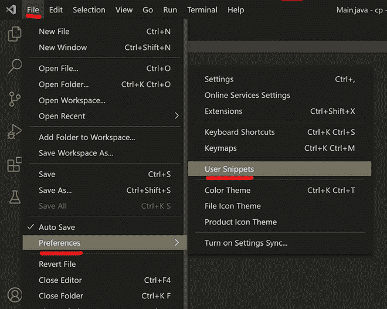
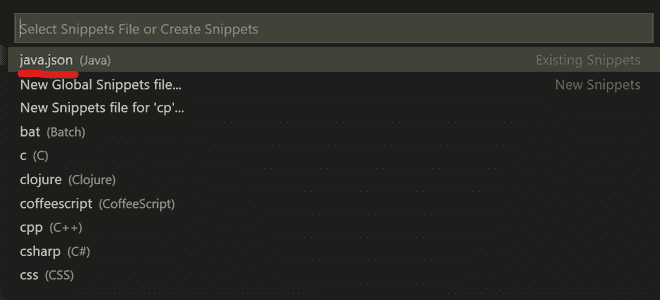
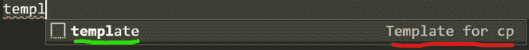
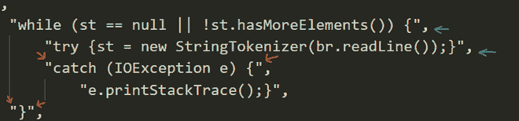
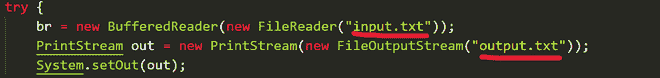
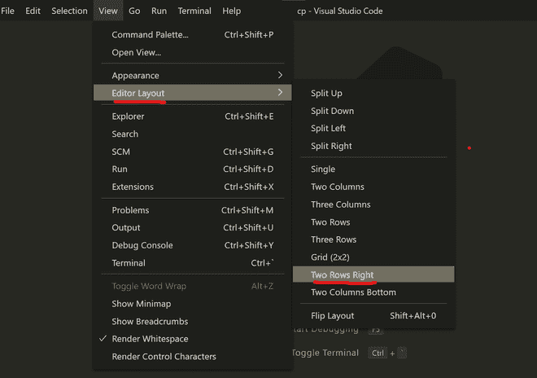
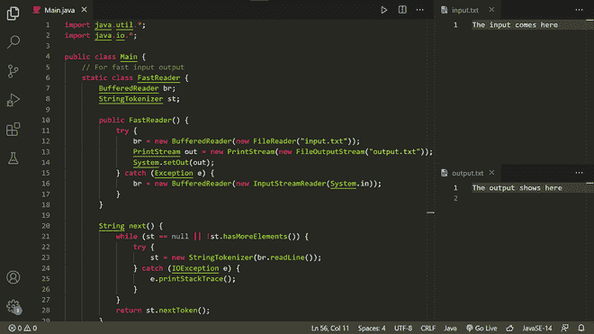

# VS 代码中带有快速输入输出和代码片段的 Java 竞争性编程设置

> 原文:[https://www . geesforgeks . org/Java-competitive-programming-setup-in-vs-code-with-fast-I-o-and-snippets/](https://www.geeksforgeeks.org/java-competitive-programming-setup-in-vs-code-with-fast-i-o-and-snippets/)

虽然 C++是竞争编程领域的主导语言，但仍有相当一部分用户继续使用 Java，就像在开发领域看到的那样，同时可以使用竞争编程，因为它可以在动态环境中最慢的 python 在竞争世界中很难看到的地方来回切换。因此，对于只习惯于用 Java 编程并希望用它进行竞争性编程的用户来说，以下是如何在本地计算机上设置您的环境。作为一名编辑器，我们将使用当今最流行的代码编辑器之一，即 VS Code。

**程序:**

按照标准步骤顺序进行设置。需要遵循以下 4 个步骤:

1.  安装 VS 代码并设置 JDK(如果没有安装)。让我们继续。
2.  为快速输入/输出设置一个片段
3.  设置输入和输出文件。
4.  分割你的屏幕。

现在，我们将从一开始就深入到视觉辅助的每一个步骤，以便在极客持续更长时间时获得绝对清晰的理解。

**说明:**

**步骤 1:** 安装 VS 代码并设置 JDK

*   从[官方 VS 代码网站](https://code.visualstudio.com/download)安装 VS 代码
*   之后，进行[安装/更新最新版本的 JDK。](https://www.oracle.com/java/technologies/javase-downloads.html) (Java 开发工具包)

**步骤 2:** 为快速输入/输出设置一个片段

片段对于快速插入大量您经常使用的预写代码非常有用。由于输入和输出代码将用于每一个竞争性的编程问题，一个片段将对我们的事业非常有帮助。

**要设置片段，请遵循以下步骤:**

**2.1** 打开 VS 代码，转到**文件- >偏好设置- >用户片段。**



**2.2** 从如下所示的下拉框中选择 **java.json** 。



**2.3** 你会发现 VS Code 已经提供了一个如何创建自定义代码片段的粗略指南。文本应该如下所示:

```java
{

Place your snippets for java here. Each snippet is defined 
under a snippet name and has a prefix, body and 
description. 

The prefix is what is used to trigger the snippet and
the body will be expanded and inserted. Possible variables are:

$1, $2 for tab stops, $0 for the final cursor position, and ${1:label}, ${2:another} for placeholders.
Placeholders with the 
same ids are connected.

Illustration:

"Print to console": {
"prefix": "log",
"body": [
"console.log('$1');",
"$2"
],
"description": "Log output to console"

}
}
```

**2.4** 在给定的注释下方，花括号内粘贴以下代码:

```java
"Template for CP" : {
        "prefix": "template",
        "body":[
            "import java.util.*;",
            "import java.io.*;",

            "public class Main {",
                "$LINE_COMMENT For fast input output",
                "static class FastReader {",
                    "BufferedReader br;",
                    "StringTokenizer st;",

                    "public FastReader()",
                    "{ try {br = new BufferedReader(",
                        "new FileReader(\"input.txt\"));",
                        "PrintStream out = new PrintStream(new FileOutputStream(\"output.txt\"));",
                        "System.setOut(out);}",
                    "catch(Exception e) { br = new BufferedReader(new InputStreamReader(System.in));}",
                    "}",

                    "String next()",
                    "{",
                        "while (st == null || !st.hasMoreElements()) {",
                            "try {st = new StringTokenizer(br.readLine());}",
                            "catch (IOException e) {",
                                "e.printStackTrace();}",
                        "}",
                        "return st.nextToken();",
                    "}",

                    "int nextInt() { return Integer.parseInt(next()); }",         
                    "long nextLong() { return Long.parseLong(next()); }",         
                    "double nextDouble() {return Double.parseDouble(next()); }",

                    "String nextLine()",
                    "{",
                        "String str = \"\";",
                        "try {",
                        "str = br.readLine();",
                        "}",
                        "catch (IOException e) {",
                            "e.printStackTrace();",
                        "}",
                        "return str;",
                    "}",
                "}",
                "$LINE_COMMENT end of fast i/o code",

                "public static void main(String[] args) {",
                    "FastReader reader = new FastReader();",
                    "$0",
            "}",
        "}"
        ],
        "description": "template for cp in java"
    },

    "For loop":{
        "prefix" : "forl",
        "body" : [
            "for(int i = 0; i < $0; i++)"
        ]
    }                        
```

> **注意:**提供了上述片段的解释，为了理解其用法和进一步的修改，有必要对其进行理解

*   **CP 的模板**是片段的名称。它用于在代码完成时识别代码片段(用红色标记)。



*   **模板**是用于触发代码完成的前缀(用绿色标记)。
*   **正文**是代码片段所在的地方。这里需要注意的一些要点是:
    *   快速输入/输出代码是对《竞争编程中的 Java 快速输入/输出》 一文中快速阅读器代码的轻微修改。
    *   修改在于快速阅读器类的构造函数中的 **try/catch 块**。它用于**连接到我们本地计算机上的输入和输出文件。**我们将在本文后面查看设置输入和输出文件的过程。
    *   主功能中的 **$0** 用作光标的占位符。在代码片段粘贴到您的 Java 文件后，光标将自动放在$0 标记处。
    *   可以在代码片段中添加注释，并将关键字 **$LINE_COMMENT** 放在注释之前。
    *   特殊字符(如引号)必须使用反斜杠( **\** )进行转义；
    *   需要注意的是，代码片段正文中的每一行都必须单独放在引号中，并且每一行后面都必须放一个逗号，如下图所示。



*   **描述**用于对片段留一个简短的备注，以供日后参考。

> **提示:**当代码片段在您的程序中实现时，它会以无格式和无缩进的形式出现。要快速格式化，请按**Shift+Alt+f**

**步骤 3:** 设置输入和输出文件。

在比赛中，粘贴大量输入并从文件中读取相应的输出比在您的终端窗口中手动输入更容易。因此，我们将设置一个输入和输出文件。采取的步骤如下:

*   创建一个单独的文件夹，并在其中创建两个文本文件:“**input . txt”**和“ **output.txt** ”。您的 Java 代码文件必须在同一个文件夹中。这应该足以达到目的。如果您想将输入、输出和 Java 文件放在不同的目录中，请将代码中文件的路径放在下面所示的位置。



> 我们需要仔细查看下面的代码片段，以了解 try/catch 块在这里是如何工作的，这在下面的示例中提供。

**例**

```java
// This code snippet is a part of the FastReader class
// as illustrated above

public FastReader() {

  // The try block runs when both input and output files
  // are present in the specified directory.
  try {

    // We modify the input stream to take input
    //from the  input.txt file
    br = new BufferedReader(new FileReader("input.txt"));

    // We modify the output stream to print the output
    // in the output.txt file
    PrintStream out = new
    PrintStream(new FileOutputStream("output.txt"));

    System.setOut(out);
  }

  // In case the input or the output file is not found,
  // a FileNotFoundException is thrown and we enter the
  // catch block.

  // Catch block to handle th exception
  catch (Exception e) {

    // Since an input file is not present, we take input
    // from the usual system input stream.
    br = new BufferedReader(
      new InputStreamReader(System.in));
  }
}
```

**以上片段解释如下:**

这里基本上我们首先要寻找一个输入和输出文件，它应该出现在我们的本地设备上，并且在那里输入和输出。但是，如果没有找到输入和输出文本文件，就像将代码提交给在线法官时的情况一样，程序将从标准输入流中读取输入，并在标准输出流中输出。

**步骤 3(可选):**设置输入和输出文件。

在比赛中，粘贴大量输入并从文件中读取相应的输出比在您的终端窗口中手动输入更容易。因此，我们将设置一个输入和输出文件。采取的步骤如下:

*   搜索并安装名为**代码生成器**的扩展。
*   使用**用 IO 构建**命令或使用 **CTRL+ALT+K** 运行代码
*   如果未设置，它将在运行时询问您输入和输出文件，否则它将使用以前选择的文件。
*   确保输入和输出文件与源文件在同一驱动器中。
*   然后，您将不必修改输入流和输出流。
*   片段修改将按如下方式进行

**例**

```java
// This code snippet is a part of the FastReader class
// as illustrated above

public FastReader() {

  // The try block runs when both input and output files
  // are present in the specified directory.
  try {

    //The Extension will PIPE the Input and Output Stream to Files at Runtime
    br = new BufferedReader(System.in);
  }

  // In case there is an error input or the output file is not found,
  // Exception is thrown and we enter the
  // catch block.

  // Catch block to handle the exception
  catch (Exception e) {

    // Printing the Stack Trace of Exception
    e.printStackTrace();
  }
}
```

**步骤 4:** 分割屏幕

现在，所有必要的文件都已经创建，让我们设置我们的编码环境:

*   打开 VS 代码，打开包含输入、输出和 Java 程序文件的文件夹。为此，请转到文件->打开文件夹并选择您的文件夹。
*   同时打开所有三个文件，使它们位于不同的选项卡中。
*   转到 ***视图- >编辑器布局- >右两排*** 。



*   根据您的方便，将 **input.txt** 拖动到**右上角窗格**，将 **output.txt** 拖动到**右下角窗格**，反之亦然。将您的 Java 文件保存在**左窗格**中，以提供最大的屏幕覆盖范围。通过拖动每个窗格分区的边框来调整窗格的大小。
*   最终产品应该如下所示:



> **提示:**可以使用 **Ctrl + PgUp** 和 **Ctrl + PgDown** 组合键快速切换窗格。