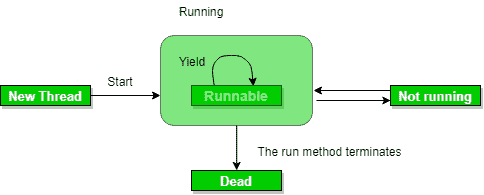

# Java Concurrency–yield()，sleep()和 join()方法

> 原文:[https://www . geesforgeks . org/Java-并发-产出-休眠-连接-方法/](https://www.geeksforgeeks.org/java-concurrency-yield-sleep-and-join-methods/)

我们可以通过使用 thread 类的以下方法之一来阻止线程的执行。

**1。yield():** 假设有三个线程 T1、t2 和 t3。线程 t1 获得处理器并开始执行，线程 t2 和 t3 处于就绪/可运行状态。线程 t1 的完成时间为 5 小时，t2 的完成时间为 5 分钟。由于 t1 将在 5 小时后完成其执行，t2 必须等待 5 小时才能完成 5 分钟的作业。在这样的场景中，一个线程花费了太多的时间来完成它的执行，我们需要一种方法来防止一个线程在重要的事情悬而未决时执行。yield()帮助我们这样做。

**yield()** 基本上是指线程没有做什么特别重要的事情，如果有其他线程或者进程需要运行，就应该运行。否则，当前线程将继续运行。



**产量法的使用:**

*   每当一个线程调用 java.lang.Thread.yield 方法时，它都会提示线程调度器准备暂停其执行。线程调度器可以忽略这个提示。
*   如果任何线程执行 yield 方法，线程调度器将检查是否有任何线程具有与该线程相同或更高的优先级。如果处理器发现任何具有更高或相同优先级的线程，那么它会将当前线程移动到就绪/可运行状态，并将处理器交给其他线程，如果没有，当前线程将继续执行。
*   一旦一个线程已经执行了 yield 方法，并且有许多具有相同优先级的线程正在等待处理器，那么我们就不能指定哪个线程将首先获得执行机会。
*   执行 yield 方法的线程将从 Running 状态进入 Runnable 状态。
*   一旦一个线程暂停了它的执行，我们不能指定它什么时候会再次获得机会，这取决于线程调度器。
*   如果我们使用 yield 方法，底层平台必须支持抢先调度。

**2。sleep():** 此方法使当前正在执行的线程休眠指定的毫秒数，这取决于系统计时器和调度程序的精度和准确性。

**语法:**

```
//  sleep for the specified number of milliseconds
public static void sleep(long millis) throws InterruptedException

//sleep for the specified number of milliseconds plus nano seconds
public static void sleep(long millis, int nanos) 
                         throws InterruptedException
```

## Java 语言(一种计算机语言，尤用于创建网站)

```
// Java program to illustrate
// sleep() method in Java
import java.lang.*;

public class SleepDemo implements Runnable
{
    Thread t;
    public void run()
    {
        for (int i = 0; i < 4; i++)
        {
            System.out.println(Thread.currentThread().getName()
                                                   + "  " + i);
            try
            {
                // thread to sleep for 1000 milliseconds
                Thread.sleep(1000);
            }

            catch (Exception e)
            {
                System.out.println(e);
            }
        }
    }

    public static void main(String[] args) throws Exception
    {
        Thread t = new Thread(new SleepDemo());

        // call run() function
        t.start();

        Thread t2 = new Thread(new SleepDemo());

        // call run() function
        t2.start();
    }
}
```

**输出:**

```
Thread-0  0
Thread-1  0
Thread-0  1
Thread-1  1
Thread-0  2
Thread-1  2
Thread-0  3
Thread-1  3
```

注意:

*   根据需求，我们可以让一个线程在一段指定的时间内处于睡眠状态
*   Sleep()导致线程在给定的时间内明确停止执行；如果没有其他线程或进程需要运行，CPU 将处于空闲状态(可能会进入省电模式)。

**3。**[**join():**](https://www.geeksforgeeks.org/joining-threads-in-java/)Thread 实例的 join()方法用于将一个线程执行的开始连接到另一个线程执行的结束，这样一个线程直到另一个线程结束才开始运行。如果在线程实例上调用 join()，当前运行的线程将阻塞，直到线程实例完成执行。
join()方法最多等待这个线程死亡这么多毫秒。超时 0 意味着永远等待

**语法:**

```
// waits for this thread to die.
public final void join() throws InterruptedException

// waits at most this much milliseconds for this thread to die
public final void join(long millis) 
              throws InterruptedException

// waits at most milliseconds plus nanoseconds for this thread to die.
The java.lang.Thread.join(long millis, int nanos)
```

## Java 语言(一种计算机语言，尤用于创建网站)

```
// Java program to illustrate join() method in Java
import java.lang.*;

public class JoinDemo implements Runnable
{
    public void run()
    {
        Thread t = Thread.currentThread();
        System.out.println("Current thread: "
                               + t.getName());

        // checks if current thread is alive
        System.out.println("Is Alive? "
                               + t.isAlive());
    }

    public static void main(String args[]) throws Exception
    {
        Thread t = new Thread(new JoinDemo());
        t.start();

        // Waits for 1000ms this thread to die.
        t.join(1000);

        System.out.println("\nJoining after 1000"+
                             " milliseconds: \n");
        System.out.println("Current thread: " +
                                    t.getName());

        // Checks if this thread is alive
        System.out.println("Is alive? " + t.isAlive());
    }
}
```

**输出:**

```
Current thread: Thread-0
Is Alive? true

Joining after 1000 milliseconds: 

Current thread: Thread-0
Is alive? false
```

注意:

*   如果任何执行线程 t1 在 t2 上调用 join()，即；t2.join()紧接着 t1 将进入等待状态，直到 t2 完成其执行。
*   在 join()内设置超时将使 join()效果在特定超时后无效。

**参考文献:**T2【斯塔克韦尔弗洛

本文由 **Dharmesh** 供稿。如果你喜欢 GeeksforGeeks 并想投稿，你也可以使用[write.geeksforgeeks.org](https://write.geeksforgeeks.org)写一篇文章或者把你的文章邮寄到 review-team@geeksforgeeks.org。看到你的文章出现在极客博客主页上，帮助其他极客。
如果你发现任何不正确的地方，或者你想分享更多关于上面讨论的话题的信息，请写评论。