# Java 9 中的 Java 弃用 API 扫描器工具(jdepscan)示例

> 原文:[https://www . geesforgeks . org/Java-弃用-API-scanner-tool-jdepscan-in-Java-9-with-examples/](https://www.geeksforgeeks.org/java-deprecated-api-scanner-tool-jdepscan-in-java-9-with-examples/)

**Java 弃用 API Scanner 工具** : Java 弃用 API Scanner 工具即 **jdeprscan** 是一款静态分析命令行工具，在 JDK 9 中推出，用于找出弃用 API 在给定输入中的用途。这里的输入可以是。类文件名、目录或 JAR 文件。每当我们向 jdeprscan 命令行工具提供任何输入时，它都会生成系统控制台的依赖项。jdeprscan 引入了影响输出的各种选项。根据选项，jdeprscan 命令行工具生成输出。jdeprscan 工具识别由 Java SE 不推荐使用的 API 定义的不推荐使用的 API，但它不会列出第三方库使用的不推荐使用的 API。

**使用 jdeprscan 工具的语法:**

```java
jdeprscan [options] {class|dir|jar}

```

**示例:**

```java
// Program to illustrate the output of jdeprscan tool

import java.awt.*;
class Geeks extends Thread {
    public void run()
    {
        System.out.println("Child Thread");
    }

    public static void main(String args[])
    {
        Thread thread = new Thread();
        thread.start();
        thread.stop();

        List list = new List();
        list.addItem("Geeksforgeeks");

        Integer i = new Integer(100);
        System.out.println(i);
    }
}
```

**编译时控制台:**

```java
Note: Geeks.java uses or overrides a deprecated API.
Note: Recompile with -Xlint:deprecation for details.

```

[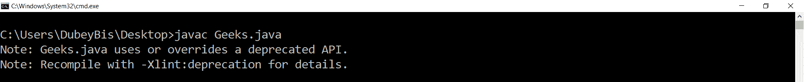](https://media.geeksforgeeks.org/wp-content/uploads/20200128155937/Capture342.png)

**输出:**

```java
jdeprscan Geeks.class
```

[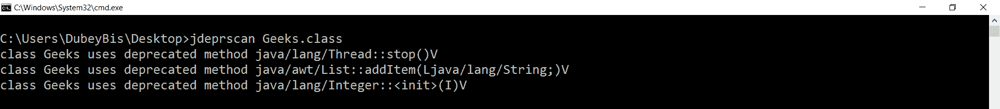](https://media.geeksforgeeks.org/wp-content/uploads/20200128160859/Capture346.png)

【jdeprscan 可用的各种选项:

1.  **–release 6|7|8|9**: It will list out the uses of deprecated APIs in the given argument as per given release. Suppose we are using JDK 9 and we want to list out the deprecated APIs as per Java release 7, then we can use this option.

    **输出:**

    ```java
    jdeprscan --release 6  Geeks.class
    ```

    [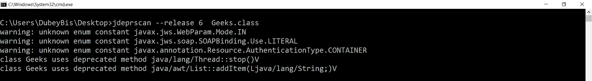](https://media.geeksforgeeks.org/wp-content/uploads/20200128161022/Capture347.png)

    ```java
    jdeprscan --release 7  Geeks.class
    ```

    [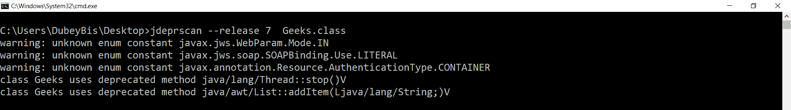](https://media.geeksforgeeks.org/wp-content/uploads/20200128161144/Capture348.png)

2.  **–verbose**: It will enable printing of additional message during listing out deprecated APIs.

    **输出:**

    ```java
    jdeprscan --verbose Geeks.class
    ```

    [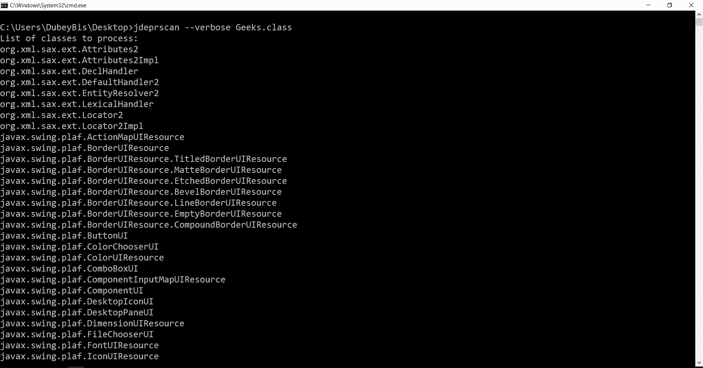](https://media.geeksforgeeks.org/wp-content/uploads/20200128161428/Capture349.png)

    [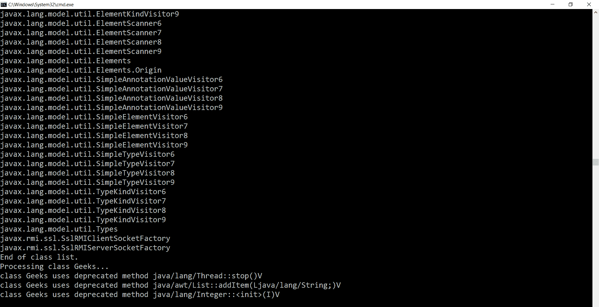](https://media.geeksforgeeks.org/wp-content/uploads/20200128161937/Capture350.png)

3.  **–version**: It will specify the version of jdeprscan.

    **输出:**

    ```java
    jdeprscan --version
    ```

    ```java
    9.0.4

    ```

    [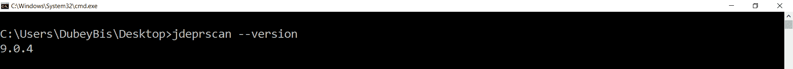](https://media.geeksforgeeks.org/wp-content/uploads/20200128160201/Capture343.png)

4.  **–full-version**: It will print the version of the jdeprscan tool.

    **输出:**

    ```java
    jdeprscan --full-version
    ```

    ```java
    9.0.4+11

    ```

    [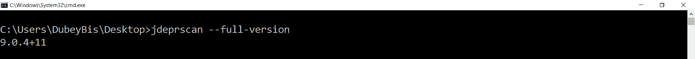](https://media.geeksforgeeks.org/wp-content/uploads/20200128160321/Capture344.png)

5.  **–help**: It will display the help message for user. Instead of using -help, we can use -h also.

    **输出:**

    ```java
    jdeprscan --help
    ```

    [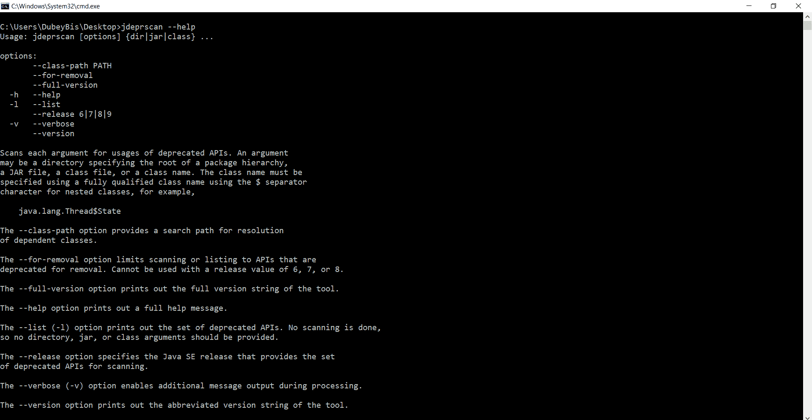](https://media.geeksforgeeks.org/wp-content/uploads/20200128160639/Capture345.png)

6.  **–list**: It will list out the deprecated APIs. Instead of using -list, we can use -l also.

    **输出:**

    ```java
    jdeprscan --list
    ```

    [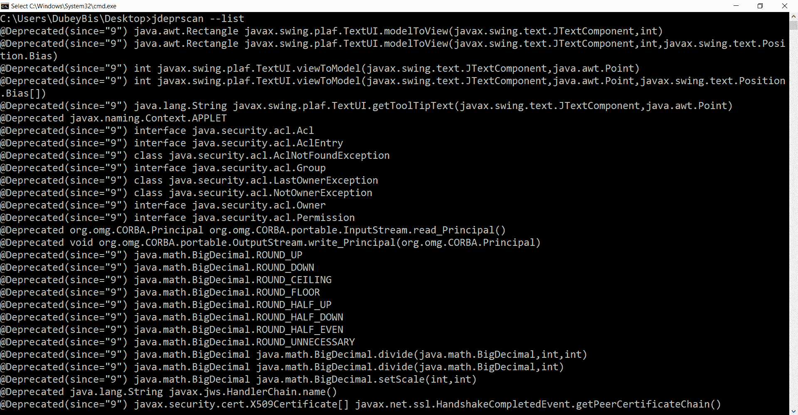](https://media.geeksforgeeks.org/wp-content/uploads/20200130155720/Capture352.png)

    [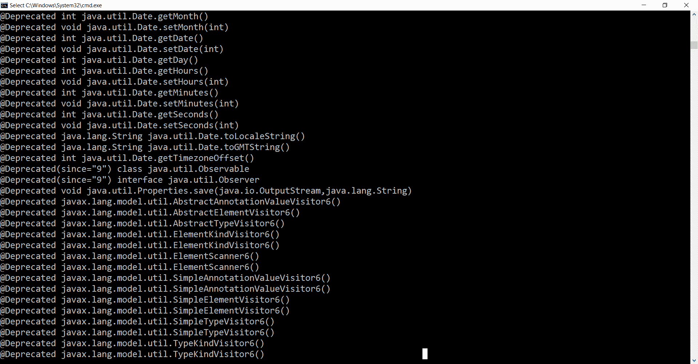](https://media.geeksforgeeks.org/wp-content/uploads/20200130155838/Capture353.png)