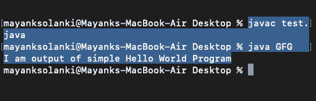
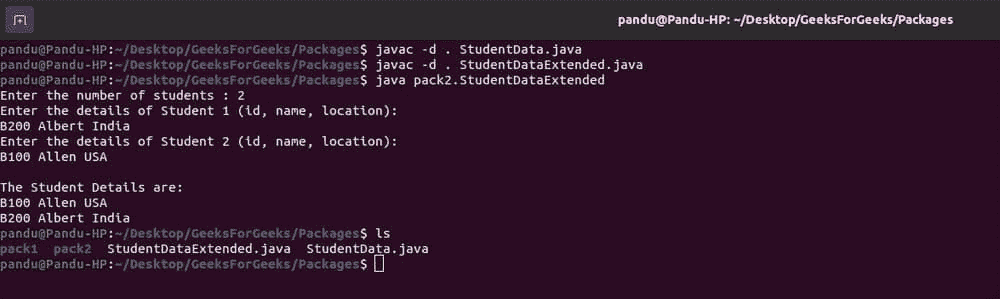

# Java–用示例将类分成包

> 原文:[https://www . geesforgeks . org/Java-用示例将类分成包/](https://www.geeksforgeeks.org/java-divide-the-classes-into-packages-with-examples/)

让我们先了解一下什么是 Java 中的类和包。java 中的**类**是一个创建对象的模型。这意味着对象的属性和动作是在类中编写的。属性由变量表示，对象的动作由方法表示。所以，一个类包含变量和方法。同样的变量在对象中也是可用的，因为它们是从类中创建的。这些变量也被称为 *'* [*实例变量'*](https://www.geeksforgeeks.org/variables-in-java/) ，因为它们是在对象(实例)内部创建的。

插图:

```
class Human 
{
    // Properties --> Instance variables
    String name;
    int age;

    // Actions --> methods
    void speak() 
    {

        System.out.println("Hey there! I am " + name);
        System.out.println("My age is " + age);
    }
}
```

**输出:**

```
Hey there! I am Vasanth Kumar
My age is 20
```

> **注意:**这里关键字 class 是用来声明一个类的。在这之后，我们应该写一个类名。在类中，我们编写实例变量和方法。

**Java 中的包**

在 Java 中，包是类、子包和接口的集合。也就是说，一个包代表一个字典，其中包含一组相关的类和接口。每当我们写一个语句，如下图所示，我们都在导入 *java.io.** 包的所有类。这里，java 是一个目录名， *io 是其中的另一个子目录*。而*代表该 *io 子目录的所有类和接口。*

```
import java.io.*; 
```

我们有很多这样的包，例如 java.lang、java.util，并且确实有更多这样的包，它们的 d 类位于包内。为了使用它，让我们选择最常用的包，即用于 java 设计的“lang”包和用于输入输出操作的“io”包。

让我们讨论一下 java hat 中包的优点如下:

1.  包对于将接口的相关类排列成一组很有用。这将包中执行相同任务的所有类和接口放在一起。例如，在 Java 中，所有执行输入输出操作的类和接口都存储在 *java.io* 包中。
2.  包将类和接口隐藏在单独的子目录中。
3.  一个包的类和接口与另一个包的类和接口是隔离的。

**包装类型**

java 中有两种类型的包，如下所示:

*   内置软件包
*   用户定义的包

**类型 1:** 内置套装

这些是已经在 Java 语言中可用的包。这些包为程序员执行任何任务提供了几乎所有必要的类、接口和方法。它们如下:

*   java.lang
*   java.util
*   java.io
*   java.awt
*   javax.swing
*   java.net
*   java.applet
*   java.text
*   java.sql

**类型 2:** 用户自定义套餐

就像前面显示的内置包一样，java 语言的用户也可以创建自己的包。它们被称为用户定义包。这些包也可以导入到其他类中，并以与内置包完全相同的方式使用。

**语法:**创建包，使用[包关键字](https://www.geeksforgeeks.org/packages-in-java/)

**2.1.1** 创建包

```
package package_name ;  
```

**2.1.2** 在包中创建子包

```
package package_name.subpackagename ;
```

**2.2** 编译

```
C:\> javac -d . classname.java
```

**2.3** 运行程序

```
C:\> java packagename.classname
```

上述语法仅适用于 windows CMD shell，fo rlinux 和 mac zsh shell 指的是下面的媒体，因为它们的感知方式与下面提供的相同



**实施:**

现在让我们把这个类分成包

**第 1 步:**定义一个班级学生数据，包含学生的以下信息:

*   **ID** :是存储每个学生唯一 ID 的字符串
*   **姓名**:表示学生姓名的字符串。

请注意，这些字段应该声明为私有。

**第 2 步:**用名为 location 的私有属性(存储学生位置的字符串)创建另一个 StudentDataExtended 类。

**第三步:**现在在这个类中定义一个方法 *addDetails()方法*存储学生的详细信息；以及一种方法 *printDetails()方法*，该方法按照学生 id 的排序顺序输出学生的详细信息。

> **注意:**两个类应该在不同的包中

插图:

```
Enter the number of students : 2

Enter the details of Student 1 (id, name, location):
B200 Ajay Hyderabad

Enter the details of Student 2 (id, name, location):
B100 Ramesh Hyderabad
```

```
The Student Details are:
B100 Ramesh Hyderabad
B200 Ajay Hyderabad
```

**例**

## Java 语言(一种计算机语言，尤用于创建网站)

```
// Java Program Illustrating Dividion of Classes into
// Packages where Class StudentData
// which creates first package i.e pack1

// Importing package
package pack1;

// Main class
public class StudentData {

    private String id;
    private String name;

    // Method 1
    public void addStudentData(String id, String name)
    {
        // This keyword refers to current instance itself
        this.id = id;
        this.name = name;
    }

    // Getter setters Methods

    // Use getter methods so that we can
    // access private members for other packages
    public String getId() { return id; }
    public String getName() { return name; }
}
```

## Java 语言(一种计算机语言，尤用于创建网站)

```
// Java Program Illustrating Dividion of Classes into
// Packages where Class StudentDataExtended creates
// Second package- pack2 and uses the first package

// Importing packages
package pack2;
// Importing required classes
// from pre-defined packages
import java.io.*;
import java.lang.*;
import java.util.*;
import pack1.*;

// Main class
class StudentDataExtended extends StudentData {

    private String location;
    public void addDetails(String id, String name,
                           String location)
    {
        addStudentData(id, name);

        // This keyword refers to current object itself
        this.location = location;
    }

    // Method 1
    public static void
    printDetails(TreeMap<String, StudentDataExtended> map)
    {

        // Iterating via for each loop
        for (String a : map.keySet()) {

            StudentDataExtended student = map.get(a);

            // Print ID and name of student
            System.out.println(student.getId() + " "
                               + student.getName() + " "
                               + student.location);
        }
    }

    // Method 2
    // Main driver method
    public static void main(String[] args)
    {

        // Display message for asking input from user
        System.out.print("Enter the number of students : ");

        // Scanner class to read user input
        Scanner sc = new Scanner(System.in);
        int n = sc.nextInt();

        String buffer = sc.nextLine();

        int count = 1;
        // Creating a TreeMap
        TreeMap<String, StudentDataExtended> map
            = new TreeMap<>();

        while (n != 0) {

            System.out.println(
                "Enter the details of Student " + count
                + " (id, name, location):");

            count++;

            String details = sc.nextLine();
            String studentInfo[] = details.split(" ");

            StudentDataExtended student
                = new StudentDataExtended();

            student.addDetails(studentInfo[0],
                               studentInfo[1],
                               studentInfo[2]);
            map.put(studentInfo[0], student);
            n--;
        }

        // Display message
        System.out.println("\nThe Student Details are:");

        // Calling above method 1 to
        // print details of the students
        printDetails(map);
    }
}
```

**输出:**

