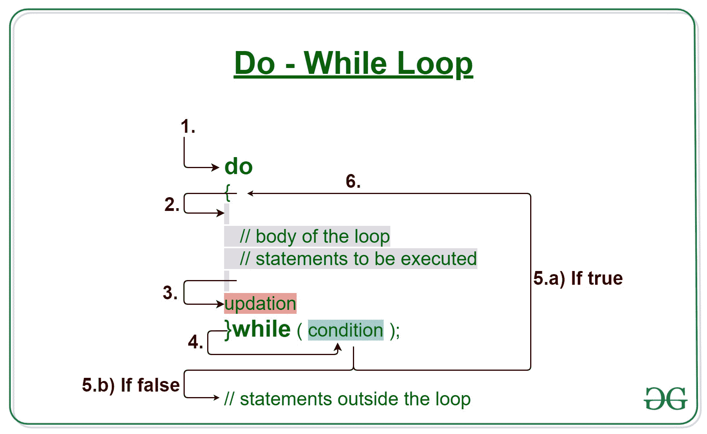

# Java 边做边循环示例

> 原文:[https://www . geesforgeks . org/Java-do-while-loop-with-examples/](https://www.geeksforgeeks.org/java-do-while-loop-with-examples/)

当我们需要重复执行一段语句时，Java 中的 [**循环**](https://www.geeksforgeeks.org/loops-in-java/) 开始使用。

[爪哇](https://www.geeksforgeeks.org/java/) **边做边循环**是**出口控制循环**。因此，与 for 或 while 循环不同的是，在执行语句或循环体之后，执行 while 检查条件。

[](https://media.geeksforgeeks.org/wp-content/uploads/20191118154342/do-while-Loop-GeeksforGeeks2.jpg)

**语法:**

```java
do
{
    // loop body

    update_expression
}
while (test_expression);

```

边做边循环的各个**部分是:**

1.  **测试表达式:**在这个表达式中，我们必须测试条件。如果条件评估为真，那么我们将执行循环体并更新表达式。否则，我们将退出 while 循环。
    **例:**

    ```java
    i <= 10
    ```

2.  **更新表达式**:执行循环体后，该表达式将循环变量增加/减少某个值。
    **例:**

    ```java
    i++;
    ```

**do-While 循环是如何执行的？**

1.  控制落入边做边循环。
2.  循环体内部的语句被执行。
3.  上升发生。
4.  流程跳转到条件
5.  测试条件。
    1.  如果条件为真，转到步骤 6。
    2.  如果条件为假，流程将超出循环
6.  流程返回到步骤 2。

**流程图边做边循环:**
[](https://media.geeksforgeeks.org/wp-content/uploads/20191108131411/java-do-while.png)

**例 1:** 本程序将尝试打印《Hello World》5 次。

```java
// Java program to illustrate the do-while loop

class dowhileloopDemo {
    public static void main(String args[])
    {

        // initialisation expression
        int i = 1;
        do {

            // Print the statement
            System.out.println("Hello World");

            // update expression
            i++;
        }
        // test expression
        while (i < 6);
    }
}
```

**Output:**

```java
Hello World
Hello World
Hello World
Hello World
Hello World

```

**试运行示例 1:** 程序将以以下方式执行。

```java
1\. Program starts.
2\. i is initialized with value 1.
3\. Execution enters the loop
  3.a) "Hello World" gets printed 1st time.
  3.b) Updation is done. Now i = 2.
4\. Condition is checked. 2 < 6 yields true.
5\. Execution enters the loop
  5.a) "Hello World" gets printed 2nd time.
  5.b) Updation is done. Now i = 3.
6\. Condition is checked. 3 < 6 yields true.
7\. Execution enters the loop
  7.a) "Hello World" gets printed 3rd time
  7.b) Updation is done. Now i = 4.
8\. Condition is checked. 4 < 6 yields true.
9\. Execution enters the loop
  9.a) "Hello World" gets printed 4th time
  9.b) Updation is done. Now i = 5.
10\. Condition is checked. 5 < 6 yields true.
11\. Execution enters the loop
  11.a) "Hello World" gets printed 5th time
  11.b) Updation is done. Now i = 6.
12\. Condition is checked. 6 < 6 yields false.
13\. The flow goes outside the loop.

```

**例 2:**

```java
// Java program to illustrate the do-while loop

class dowhileloopDemo {
    public static void main(String args[])
    {

        int x = 21, sum = 0;

        do {

            // The line will be printed even
            // if the condition is false
            sum += x;
            x--;

        } while (x > 10);
        System.out.println("Summation: " + sum);
    }
}
```

**Output:**

```java
Summation: 176

```

**相关文章:**

1.  [Java 中的循环](https://www.geeksforgeeks.org/loops-in-java/)
2.  [Java For 循环示例](https://www.geeksforgeeks.org/java-for-loop-with-examples/)
3.  [Java while 循环示例](https://www.geeksforgeeks.org/java-while-loop-with-examples/)
4.  [C、C++、Java 中 while 和 do-while 循环的区别](https://www.geeksforgeeks.org/difference-between-while-and-do-while-loop-in-c-c-java/)
5.  [C、C++、Java 中 for 和 do-while 循环的区别](https://www.geeksforgeeks.org/difference-between-for-and-do-while-loop-in-c-c-java/)