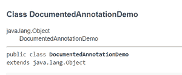
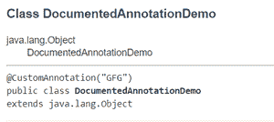

# Java @文档化注释

> 原文:[https://www.geeksforgeeks.org/java-documented-annotations/](https://www.geeksforgeeks.org/java-documented-annotations/)

默认情况下，使用 **Javadoc 工具**创建的文档中不会显示 Java 注释。为了确保我们的自定义注释显示在文档中，我们使用@ Documented 注释来注释我们的自定义注释。@ Documented 是 [java.lang](https://www.geeksforgeeks.org/object-class-in-java/) 中提供的元注释(应用于其他注释的注释)。注释包。

案例:

1.  **不使用@文档注释**
2.  **使用@文档注释**

让我们深入讨论这两种情况。

**情况 1:** 不使用@ Documented 注释

在下面显示的代码示例中，我们创建了一个名为 custom annotation 的自定义注释。之后，我们用它注释了我们的类 DocumentedAnnotationDemo。最后，我们使用 Javadoc 工具创建了文档。下面提到了在命令提示符下使用 Javadoc 实用程序的语法。

```
javadoc NameOfClassFile.java
```

**例**

## Java 语言(一种计算机语言，尤用于创建网站)

```
// Java Program to Illustrate Documented Annotations
// Without using @Documented annotation

// Creating a single value custom annotation
@interface CustomAnnotation {
    String value();
}

@CustomAnnotation("GFG")
public class DocumentedAnnotationDemo {
    public static void main(String[] args) {
        System.out.println("This is the main method");
    }
}
```

**Output**

```
This is the main method
```

当我们为上面显示的代码示例创建文档时，用于注释我们的 DocumentedAnnotationDemo 类的自定义注释没有显示在文档中，而是显示在下面显示的快照中。



不使用@ Documented 注释的文档

**案例 2:** 使用@ Documented 注释

在下面显示的代码示例中，我们再次创建了名为 custom annotation 的同一个自定义注释，但是在本例中，我们使用了@ Documented 来注释我们的自定义注释。之后，我们用它注释了我们的类 DocumentedAnnotationDemo。最后，我们使用 Javadoc 工具创建了文档。

**例**

## Java 语言(一种计算机语言，尤用于创建网站)

```
// Java Program to Illustrate Documented Annotations
// With using @Documented annotation

// Importing the Documented annotation
import java.lang.annotation.Documented;

// Creating a single value custom annotation
// which is annotated using @Documented
// annotation
@Documented @interface CustomAnnotation { String value(); }

// This annotation will be documented
@CustomAnnotation("GFG")

// Main class
public class GFG {

    // Main driver method
    public static void main(String[] args)
    {

        // Print and display statement on the console
        System.out.println("This is the main function");
    }
}
```

**Output**

```
This is the main function
```

当我们现在创建上面显示的代码示例的文档时，由于在创建文档时使用了@ Documented 注释，所以文档中显示了用于注释我们的 DocumentedAnnotationDemo 类的自定义注释。下面显示了在这种情况下创建的文档的快照。



使用@ Documented 注释的文档