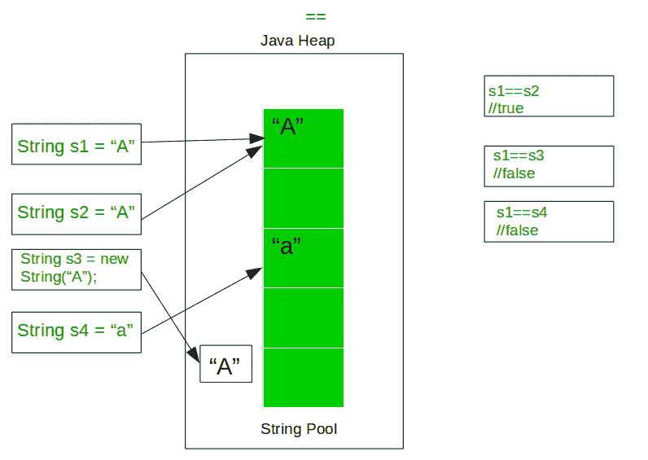
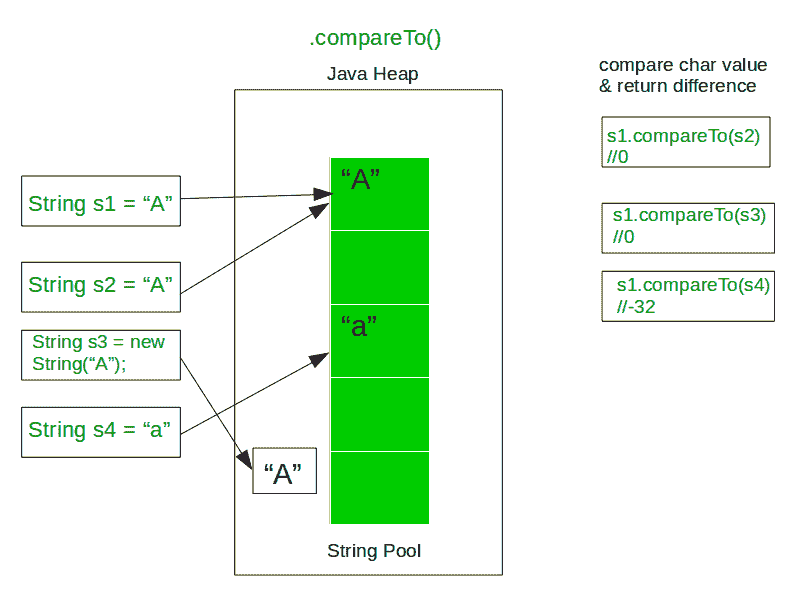
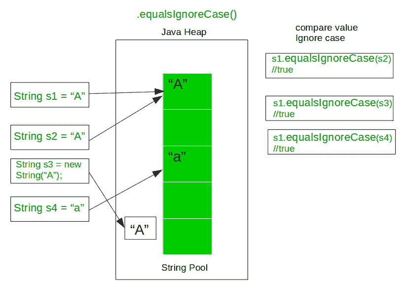
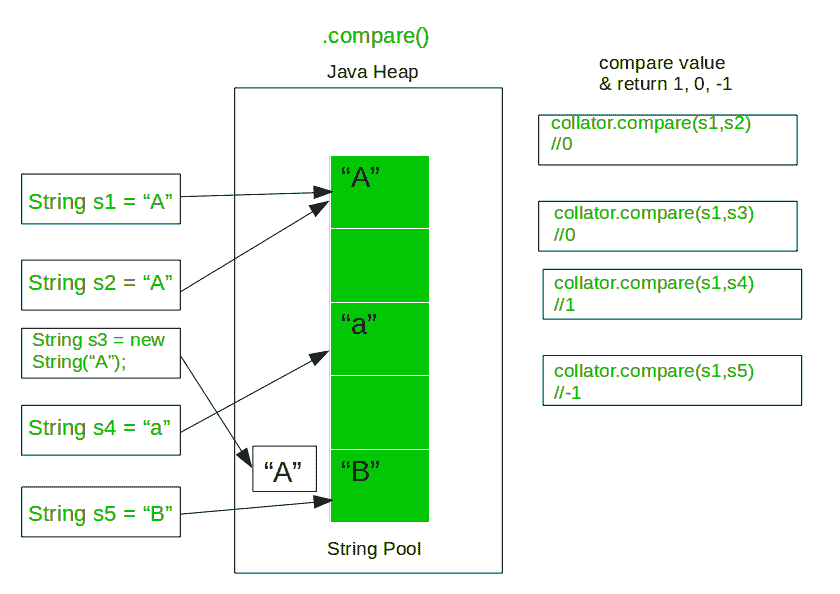

# Java | ==，equals()，compareTo()，equalsIgnoreCase()和 compare()

> 原文:[https://www . geesforgeks . org/Java-equals-compare to-equalsignorecase-and-compare/](https://www.geeksforgeeks.org/java-equals-compareto-equalsignorecase-and-compare/)

Java 中比较两个字符串的方法有很多:

*   使用==运算符
*   使用 equals()方法
*   使用 compareTo()方法
*   使用 compareToIgnoreCase()方法
*   使用 compare()方法
    *   **方法 1:使用==运算符**
        Double equals 运算符用于比较两个或两个以上的对象，如果它们指的是同一个对象，则返回 true，否则返回 false。字符串在 java 中是不可变的。当创建两个或多个没有新关键字的对象时，两个对象引用相同的值。Double equals 运算符实际上比较对象引用。



*   下面的例子说明了在 Java 中使用==进行字符串比较:

## Java 语言（一种计算机语言，尤用于创建网站）

```java
// Java program to demonstrate
// use of == operator in Java

class GFG {
    public static void main(String[] args)
    {

        // Get some Strings to compare
        String s1 = "A";
        String s2 = "A";
        String s3 = "A";
        String s4 = new String("A");

        // Compare s1 and s2
        // It should return true as they both
        // refer to same object in memory
        System.out.println(s1 + " == " + s2
                         + ": " + (s1 == s2));

        // Compare s1 and s3
        // It should return true as they both
        // refer to same object in memory
        System.out.println(s1 + " == " + s3
                         + ": " + (s1 == s3));

        // Compare s2 and s3
        // It should return true as they both
        // refer to same object in memory
        System.out.println(s2 + " == " + s3
                         + ": " + (s2 == s3));

        // Compare s1 and s4
        // It should return false as they both
        // refer to different object in memory
        System.out.println(s1 + " == " + s4
                         + ": " + (s1 == s4));
    }
}
```

**Output:** 

```java
A == A: true
A == A: true
A == A: true
A == A: false
```

*   **方法 2:使用 equals()方法**
    在 Java 中，string equals()方法根据字符串的数据/内容比较两个给定的字符串。如果两个字符串的所有内容都相同，则返回 true。如果所有字符都不匹配，则返回 false。


*   下面的例子说明了。Java 中字符串比较的等于:

## Java 语言（一种计算机语言，尤用于创建网站）

```java
// Java program to demonstrate
// use of .equals operator in Java

class GFG {
    public static void main(String[] args)
    {

        // Get some Strings to compare
        String s1 = "A";
        String s2 = "A";
        String s3 = "a";
        String s4 = new String("A");

        // Compare s1 and s2
        // It should return true as they both
        // have the same content
        System.out.println(s1 + " .equals " + s2
                         + ": " + s1.equals(s2));

        // Compare s1 and s3
        // It should return false as they both
        // have the different content
        System.out.println(s1 + " .equals " + s3
                         + ": " + s1.equals(s3));

        // Compare s2 and s3
        // It should return false as they both
        // have the different content
        System.out.println(s2 + " .equals " + s3
                         + ": " + s2.equals(s3));

        // Compare s1 and s4
        // It should return true as they both
        // have the same content
        System.out.println(s1 + " .equals " + s4
                         + ": " + s1.equals(s4));
    }
}
```

**Output:** 

```java
A .equals A: true
A .equals a: false
A .equals a: false
A .equals A: true
```

*   **方法 3:使用 compareTo()方法**
    在 java Comparable 接口中比较值并返回一个 int，这些 int 值可能小于、等于或大于。java compare two 字符串基于字符串中每个字符的 Unicode 值。如果两个字符串不同，则它们在对两个字符串都有效的某个索引处具有不同的字符，或者它们的长度不同，或者两者都不同。
    假设索引‘I’是字符不同的地方，那么 compareTo()将返回**first string . charat(I)-second string . charat(I)**。



*   下面的例子说明了。Java 中字符串比较的比较对象:

## Java 语言（一种计算机语言，尤用于创建网站）

```java
// Java program to demonstrate
// use of .compareTo operator in Java

class GFG {
    public static void main(String[] args)
    {

        // Get some Strings to compare
        String s1 = "A";
        String s2 = "A";
        String s3 = "a";
        String s4 = new String("A");

        // Compare s1 and s2
        // It should return 0 as they both
        // have the same ASCII value
        System.out.println(s1 + " .compareTo " + s2
                         + ": " + s1.compareTo(s2));

        // Compare s1 and s3
        // It should return -32 as they both
        // have the different ASCII value
        System.out.println(s1 + " .compareTo " + s3
                         + ": " + s1.compareTo(s3));

        // Compare s3 and s2
        // It should return 32 as they both
        // have the different ASCII value
        System.out.println(s3 + " .compareTo " + s2
                         + ": " + s3.compareTo(s2));

        // Compare s1 and s4
        // It should return 0 as they both
        // have the same ASCII value
        System.out.println(s1 + " .compareTo " + s4
                         + ": " + s1.compareTo(s4));
    }
}
```

**Output:** 

```java
A .compareTo A: 0
A .compareTo a: -32
a .compareTo A: 32
A .compareTo A: 0
```

*   **方法 4:使用 equalsignorase()方法**
    Java String equalsignorase()方法与 equals()方法非常相似，除了像上面的示例中一样忽略了这种情况 String 对象 s4 比较 s3 然后 equals()方法返回 false，但是这里在 equalsignorase()的情况下，它将返回 true。因此 equalsIgnoreCase()方法不区分大小写。



*   下面的例子说明了。equalsIgnoreCase 用于 Java 中的字符串比较:

## Java 语言（一种计算机语言，尤用于创建网站）

```java
// Java program to demonstrate
// use of .equalsIgnoreCase operator in Java

class GFG {
    public static void main(String[] args)
    {

        // Get some Strings to compare
        String s1 = "A";
        String s2 = "A";
        String s3 = "a";
        String s4 = new String("A");

        // Compare s1 and s2
        // It should return true as they both
        // have the same content
        System.out.println(s1 + " .equalsIgnoreCase " + s2
                         + ": " + s1.equalsIgnoreCase(s2));

        // Compare s1 and s3
        // It should return true as they both
        // have the same content being case insensitive
        System.out.println(s1 + " .equalsIgnoreCase " + s3
                         + ": " + s1.equalsIgnoreCase(s3));

        // Compare s2 and s3
        // It should return true as they both
        // have the same content being case insensitive
        System.out.println(s2 + " .equalsIgnoreCase " + s3
                         + ": " + s2.equalsIgnoreCase(s3));

        // Compare s1 and s4
        // It should return true as they both
        // have the same content
        System.out.println(s1 + " .equalsIgnoreCase " + s4
                         + ": " + s1.equalsIgnoreCase(s4));
    }
}
```

**Output:** 

```java
A .equalsIgnoreCase A: true
A .equalsIgnoreCase a: true
A .equalsIgnoreCase a: true
A .equalsIgnoreCase A: true
```

*   **方法 5:在 Java 中使用 compare()方法**
    进行区域特定的比较，应该使用 **java.text** 包中的 **Collator 类**。Collator 类最重要的一个特性是能够定义我们自己的自定义比较规则。



*   下面的例子说明了在 Java 中使用 compare()方法来比较字符串:

## Java 语言（一种计算机语言，尤用于创建网站）

```java
// Java program to demonstrate
// use of collator.compare operator in Java

import java.text.Collator;

class GFG {
    public static void main(String[] args)
    {

        // Get Collator instance
        Collator collator = Collator.getInstance();

        // Get some Strings to compare
        String s1 = "A";
        String s2 = "A";
        String s3 = "a";
        String s4 = new String("A");

        // Compare s1 and s2
        // It should return 0 as they both
        // have the same ASCII value
        System.out.println(s1 + " collator.compare " + s2
                         + ": " + collator.compare(s1, s2));

        // Compare s1 and s3
        // It should return 1
        System.out.println(s1 + " collator.compare " + s3
                         + ": " + collator.compare(s1, s3));

        // Compare s3 and s2
        // It should return -1
        System.out.println(s3 + " collator.compare " + s2
                         + ": " + collator.compare(s3, s2));

        // Compare s1 and s4
        // It should return 0 as they both
        // have the same ASCII value
        System.out.println(s1 + " collator.compare " + s4
                         + ": " + collator.compare(s1, s4));
    }
}
```

**Output:** 

```java
A collator.compare A: 0
A collator.compare a: 1
a collator.compare A: -1
A collator.compare A: 0
```